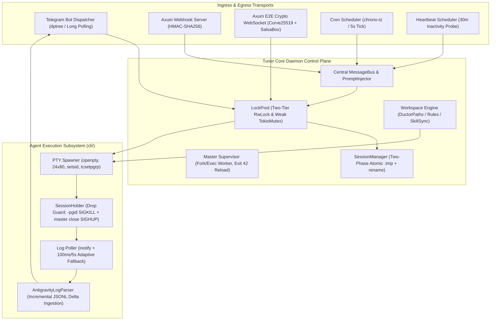

# Tuner System Architecture & Technical Specification

> **Canonical System Specification & Formal Invariant Model**  
> Baseline: `projects/tuner/src` | Target: Industrial Autonomous AI Agent Daemon

---

## 1. Executive Summary & Mental Model

### The Core Problem
Modern interactive LLM coding agent runtimes (Google Antigravity `agy`, Claude Code CLI, etc.) are built strictly for single-user, synchronous POSIX teletype terminals. Exposing them directly to remote multi-channel daemon interfaces (Telegram, Matrix, Webhooks, Cron, Telemetry) precipitates severe operating-system hazards:
1. **C Runtime Stdio Buffering Deadlocks (`_IOFBF`)**: Standard daemons lacking a PTY fall back to anonymous pipes, causing libc to buffer output in 4KB/8KB blocks, which halts real-time token streaming.
2. **Terminal Collapse via `isatty(3)` Failures**: TUI engines and rich progress spinners crash or panic on zero-dimension (`0x0`) headless pipes.
3. **Runaway Process Zombies**: Subprocesses and compiler jobs (`rustc`, `gcc`, `pytest`) spawned by the agent escape standard parent termination signals upon task aborts.
4. **State Corruption & Concurrency Races**: Uncoordinated multi-turn inputs across group topics, webhooks, and autonomous schedulers corrupt on-disk session state.

### The System Mental Model
**Tuner** functions as an **Industrial-Grade Asynchronous Agent Gateway & Virtual TTY Multiplexer**. It bridges remote human and external communication transports to agent execution runtimes by virtualizing a POSIX pseudo-terminal (PTY) environment with non-blocking master I/O, strict echo suppression, transcript-driven turn-state synchronization, and kernel-level process group lifecycle enforcement.



---

## 2. Complete Topographical Census (`src/`)

The Tuner daemon codebase is structured across 10 architectural tiers encompassing 20+ functional directories:

```text
src/
├── main.rs                   # Entry point: Supervisor mode vs Worker mode (--worker <profile>)
├── config.rs                 # Schema definitions, profile merging & placeholder sanitization
├── setup.rs                  # Setup wizard, .env parser, systemd unit file generator
├── supervisor.rs             # Process monitor: fast-crash exponential backoff & hot restarts
├── upgrade.rs                # GitHub semver check, atomic .tar.gz unpack, zero-downtime rename
│
├── bus/                      # Cross-plane event fabric
│   ├── bus.rs                # MessageBus, Transport trait, PromptInjector trait
│   ├── envelope.rs           # Canonical Envelope: 10 Origin variants, DeliveryMode, LockMode
│   ├── lock_pool.rs          # Sharded, weakly-referenced asynchronous LockPool
│   ├── adapters.rs           # Domain event transformers for background/cron outputs
│   └── observers_wire.rs     # ObserverManager automatic bus wiring
│
├── workspace/                # Workspace governance, sandboxing & tool synchronizers
│   ├── paths.rs              # DuctorPaths: Canonical profile-isolated paths single-source-of-truth
│   ├── rules.rs              # RulesSelector: Prompt rule file generation (CLAUDE/AGENTS/GEMINI)
│   ├── rules_check.rs        # CLI credential validators (Claude, Codex, Gemini, Antigravity)
│   ├── sync.rs               # Folder initialization, legacy migration, runtime notice injection
│   ├── sync_helpers.rs       # Tree copy, Zone 2 Python tool protection (.py.bak), mirror sync
│   ├── skills.rs             # YAML frontmatter discovery (---), 4-tier precedence resolution
│   └── skills_helpers.rs     # Cross-platform symlinks, NTFS junctions, .tuner_managed copies
│
├── session/                  # State continuity, metrics & disk serialization
│   ├── manager.rs            # SessionManager: Two-phase atomic write (.tmp + rename), migration
│   ├── data.rs               # SessionData, ProviderSessionData (costs, tokens, message counts)
│   ├── key.rs                # Immutable composite SessionKey (transport, chat_id, topic_id)
│   ├── freshness.rs          # Freshness evaluator: local timezone daily reset & idle timeouts
│   └── named.rs              # NamedSessionRegistry: Mnemonic adjective+noun generation
│
├── cli/                      # Agent substrate abstractions & CLI driver
│   ├── mod.rs                # AgentProvider trait, CliResponse, StreamEvent models
│   └── antigravity/          # Google Antigravity (agy) implementation
│       ├── provider.rs       # Provider implementation, env configuration, oneshot & PTY runs
│       ├── pty_spawner.rs    # openpty (24x80), non-blocking AsyncFd, setsid, SessionHolder
│       ├── session.rs        # In-memory PTY child registry, AskState interactive question cache
│       ├── polling.rs        # notify inotify watcher + adaptive ticker monitoring transcript_full.jsonl
│       ├── log_parser.rs     # Incremental JSONL parser generating TextDelta & AskQuestion
│       ├── log_helpers.rs    # Atomic line-boundary reading & JSON unescaping
│       ├── error_parser.rs   # CLI exit codes & stderr failure diagnostic mapping
│       ├── discovery.rs      # agy binary path resolution & fallback probing
│       └── trust.rs          # Auto-trust workspace injection into ~/.gemini/antigravity-cli/
│
├── messenger/telegram/       # Telegram Bot integration & interactive TUI bridge
│   ├── runner.rs             # Teloxide bot initialization, token sleep guard, restart watcher
│   ├── handler.rs            # Ingress message dispatcher, owner auto-registration, supergroup migration
│   ├── stream.rs             # Real-time streaming consumer, 2.0s edit debouncing, 4000-char chunker
│   ├── reply.rs              # Quoted prompt synthesis (> ), @model / --effort directive parser
│   ├── ask_process.rs        # Interactive ask_question & ask_permission keyboard loop
│   ├── typing.rs             # TelegramTypingGuard (4s ChatAction::Typing + ⏳ reaction)
│   ├── transport.rs          # TelegramTransport implementing bus Transport trait
│   └── formatting/           # Sentinel-based Markdown to Telegram HTML converter & tag balancer
│
├── cron/                     # Autonomous cron engine
│   ├── manager.rs            # CronManager: Job CRUD operations, run history, atomic storage
│   └── scheduler.rs          # CronScheduler: 5-to-6 field parsing, chrono_tz, quiet-hours skip
│
├── heartbeat/                # Autonomous telemetry & health monitoring
│   ├── scheduler.rs          # HeartbeatScheduler: is_chat_busy, is_cooling_down, HEARTBEAT_OK silence
│   └── quiet.rs              # Midnight-crossing quiet hours calculation
│
├── background/               # User-initiated long-running tasks (/goal)
│   ├── observer.rs           # BackgroundObserver: MAX_TASKS_PER_CHAT = 5, TaskGuard RAII abort drop
│   └── models.rs             # BackgroundRequest, BackgroundResult, ExitStatus types
│
├── cleanup/                  # Storage maintenance & purger
│   └── observer.rs           # Daily 3:00 AM sweep: 30-day retention pruning & empty directory reclamation
│
├── webhook/                  # Cryptographic ingress & remote WebSocket API
│   ├── server.rs             # Axum HTTP server hosting /webhook & /health
│   ├── auth.rs               # subtle::ConstantTimeEq HMAC verification, sliding-window RateLimiter
│   └── api/                  # Full-duplex WebSocket streaming & file exchange
│       ├── crypto.rs         # Curve25519 + SalsaBox (XSalsa20-Poly1305 with 24-byte random nonces)
│       ├── handshake.rs      # 10s timeout cryptographic key exchange & token validation
│       └── session_loop.rs   # Encrypted bidirectional message stream & session locking
│
├── security/                 # Ingress & filesystem defense-in-depth
│   ├── paths.rs              # Path traversal protection: canonical root containment checks
│   └── content.rs            # fold_fullwidth character folding against BPE tokenizer injection
│
└── i18n/                     # Thread-safe multi-language localization
    ├── mod.rs                # Context hierarchy: TASK_ACTIVE_LANG -> thread -> global -> "en"
    ├── loader.rs             # TOML catalog loader, dot-notation flattener, traversal safety
    └── locales/              # 9 language catalogs (de, en, es, fr, id, ko, nl, pt, ru)
```

---

## 3. The Shadow Planes

### 3.1 Workspace & Sandbox Provisioning
* **Strict Profile Partitioning (`DuctorPaths`)**: Every profile (`--profile <name>`) operates within an independent root `~/.tuner/profiles/<profile>/` with isolated configuration, memory, sessions, cron tasks, and workspace trees.
* **Environment Notice Injection**: Upon initialization, Tuner inspects the execution environment:
  - *Bare-Metal Substrate*: Injects `HOST_NOTICE` explicitly warning the agent:
    > `"WARNING: YOU ARE RUNNING DIRECTLY ON THE HOST SYSTEM. THERE IS NO SANDBOX. Every file operation... runs on the user's real machine. Be careful with destructive commands."`
  - *Container Substrate*: Injects `DOCKER_NOTICE` outlining filesystem mounts and sandbox boundaries.
* **Zone 2 Python Tool Protection**: User-customized scripts inside `workspace/tools/` are preserved during updates; existing scripts are backed up to `.py.bak` prior to applying non-destructive template patches.
* **Mirror Synchronization (`sync_group`)**: Updates to any prompt rule file (`CLAUDE.md`, `AGENTS.md`, `GEMINI.md`) are automatically synchronized across all three files using file modification timestamp tracking (`filetime`).

### 3.2 Skill & Rule Synchronization
* **YAML Frontmatter Enforcement**: Skills inside `workspace/skills/` are scanned; only directories containing a valid `SKILL.md` with opening/closing `---` frontmatter, `name:`, and `description:` are loaded.
* **4-Tier Canonical Precedence**:
  $$\text{Tuner (Ductor)} \succ \text{Claude} \succ \text{Codex} \succ \text{Gemini}$$
  Non-symlinked local definitions override external provider symlinks.
* **Substrate-Aware Link Builder**:
  - *Unix Host*: Standard POSIX relative/absolute symlinks.
  - *Windows Host*: NTFS directory junctions (`mklink /J`).
  - *Docker Container*: Switches to managed physical copies tagged with `.tuner_managed` markers, bypassing broken cross-container symlinks.

### 3.3 Cryptographic Bastions
* **End-to-End WebSocket Encryption (`E2ESession`)**:
  - Key Agreement: Curve25519 ECDH via `crypto_box::SecretKey::generate(&mut OsRng)`.
  - Cipher: XSalsa20 stream cipher with Poly1305 MAC (`SalsaBox`).
  - Packet Framing: Every transmitted JSON payload is framed with a fresh 24-byte cryptographic random nonce:
    $$\text{Packet} = \text{Base64}\Big(\text{Nonce}_{24} \,\|\, \text{XSalsa20-Poly1305}(\text{Payload}_{\text{JSON}})\Big)$$
* **Constant-Time Verification**: Webhook bearer tokens and HMAC digests (`sha256`, `sha512`, `sha1`) are validated using `subtle::ConstantTimeEq`, eliminating timing side-channel attacks.
* **Anti-Replay Protection**: Webhook headers enforce an RFC-compliant $\pm 300$-second timestamp tolerance window combined with an in-memory sliding nonce cache to reject captured replays.

### 3.4 Context-Aware Dynamic Localization (`i18n`)
Language resolution traverses a 4-tier task-local fallback hierarchy:
$$\text{TASK\_ACTIVE\_LANG (tokio task-local)} \longrightarrow \text{ACTIVE\_LANG (thread-local)} \longrightarrow \text{GLOBAL\_ACTIVE\_LANG (RwLock)} \longrightarrow \text{"en"}$$
By scoping `TASK_ACTIVE_LANG.scope(lang, ...)` around the root `Future` prior to dispatching via `tokio::spawn`, the user's active locale travels seamlessly across multi-threaded Tokio work-stealing executor migrations.

---

## 4. Concurrency Model & Lifecycle Topography

### 4.1 Turn Genesis & Two-Tier Locking Hierarchy
To resolve concurrency contention in multi-topic environments (such as Telegram Forum Supergroups) without throughput collapse, Tuner implements a **Two-Tier Synchronization Hierarchy**:

```text
                             [ Chat Umbrella RwLock ]
                                        │
          ┌─────────────────────────────┴─────────────────────────────┐
          ▼ (ReadLock: Concurrent Readers)                            ▼ (WriteLock: Exclusive Writer)
[ Topic 101 Mutex ]   [ Topic 102 Mutex ]   [ Topic 103 Mutex ]    [ Global Broadcast / Autonomous Cron ]
(Turn A executes)     (Turn B executes)     (Turn C executes)      (Waits for all active topics to drain)
```

1. **Independent Topic Turns ($O(1)$ Parallelism)**:
   When an event targets a specific forum topic (`(chat_id, Some(topic_id))`):
   - Acquires `chat_rwlock.read()`.
   - Acquires the specific `topic_mutex.lock()`.
   - Multiple topics within the same supergroup execute concurrently with zero cross-topic lock contention.
2. **Chat-Wide Broadcasts (Single-Writer Barrier)**:
   When an autonomous notification arrives without a topic target (`(chat_id, None)`, e.g. system heartbeat, global cron alert):
   - Requests `chat_rwlock.write()`.
   - Awaits active in-flight topic turns to complete, then cleanly emits the broadcast without interleaving messages.

### 4.2 Zero-Queue Handle Decoupling with Cancellation Tokens
To prevent map mutex contention during terminal input pacing:
1. `SessionManager::write_to_session` acquires the global `holders` map mutex for **$< 2$ microseconds** purely to extract `(master_fd, cancel_token)`.
2. The map lock is immediately released.
3. Character-by-character pacing (100ms per character) proceeds directly against `master_fd`.
4. The write loop checks `cancel_token.is_cancelled()` before every single byte. When `/abort` or `/stop` is received, the token cancels, the holder closes `master_fd`, and the write loop aborts instantly with zero lingering keystrokes.

### 4.3 Autonomous Background Schedulers
```
+────────────────────+────────────────────────+──────────────────────+─────────────────────────+
| Scheduler          | Trigger Cadence        | Collision Guard      | Output Routing          |
+────────────────────+────────────────────────+──────────────────────+─────────────────────────+
| CronScheduler      | Ticks every 5s         | Quiet Hours Skip     | MessageBus Envelope     |
|                    | (chrono-tz validation) | (Path traversal safe)| (lock_mode: Required)   |
+────────────────────+────────────────────────+──────────────────────+─────────────────────────+
| HeartbeatScheduler | Default every 30m      | is_chat_busy() &     | Suppressed if           |
|                    |                        | is_cooling_down()    | HEARTBEAT_OK detected   |
+────────────────────+────────────────────────+──────────────────────+─────────────────────────+
| BackgroundObserver | User-triggered (/goal) | MAX_TASKS_PER_CHAT=5 | TaskGuard RAII Drop     |
|                    |                        | throttle             | (emits Aborted status)  |
+────────────────────+────────────────────────+──────────────────────+─────────────────────────+
| CleanupObserver    | Daily 3:00 AM          | Non-blocking async   | Prunes files > 30 days; |
|                    |                        | file walk            | removes empty folders   |
+────────────────────+────────────────────────+──────────────────────+─────────────────────────+
```

---

## 5. The 5 Supreme Invariant Defenses

```
+─────────────────────────────────────────────────────────────────────────────────────────+
|                                SYSTEM INVARIANT MATRIX                                  |
|  Invariant I:   Deadlock Immunity via Single-Lock Discipline                            |
|  Invariant II:  Host Substrate Invariance & Opportunistic Pipe Degradation               |
|  Invariant III: Liveness Verification & The Silence Contract                            |
|  Invariant IV:  Stream Integrity, Tag Balancing & Process-Guarded Ingestion             |
|  Invariant V:   Deterministic Teardown & POSIX Storage Atomicity                        |
+─────────────────────────────────────────────────────────────────────────────────────────+
```

### Invariant I: Deadlock Immunity via Single-Lock Discipline
* **Mathematical Invariant**: Let $L = \{l_{(c, t)} \mid c \in \text{Chats}, t \in \text{Topics}\}$ be the set of chat locks. Every interactive turn $T_i$ requests at most one lock from the pool:
  $$|L(T_i)| \le 1$$
* **Proof**: Under Coffman's conditions for resource deadlock, circular wait requires $T_1$ holding $l_A$ while requesting $l_B$, and $T_2$ holding $l_B$ while requesting $l_A$. Because no turn ever requests a secondary lock while holding a primary lock, circular wait is mathematically impossible:
  $$\forall i, j: \quad P(\text{Circular Wait}) = 0 \implies P(\text{Deadlock}) = 0$$
* **Weak-Reference Auto-Pruning**: Locks are cached as `Weak<TokioMutex<()>>`. A synchronous `std::sync::Mutex` critical section encapsulates lookup, garbage collection (`retain`), allocation, and downgrade insertion, eliminating split-brain races and memory leaks.

### Invariant II: Host Substrate Invariance & Pipe Degradation
* **Substrate Capability Probe**: Pseudo-terminal allocation is treated as a capability query, not an axiom:
  ```text
  Check /dev/ptmx permissions & probe openpty
       ├── Success ──► Full Interactive PTY Engine (SessionHolder, 24x80, setsid)
       └── Failure ──► Piped Headless Fallback (run_oneshot via standard POSIX pipes)
  ```
* **Immunity to Libc Block Buffering (`_IOFBF`)**: Because streaming deltas are tailed directly from the disk transcript (`transcript_full.jsonl`) generated by the CLI agent, anonymous pipe buffering semantics have zero effect on real-time text delivery.
* **Supervisory Resilience**:
  - Exit code 42 enforces a minimum reboot floor ($T_{\text{floor}} \ge 2.0\text{s}$) with a sliding-window rate limit (max 5 restarts per 60s) to prevent CPU fork-bombs.
  - The supervisor retries indefinitely with an exponential backoff ceiling of 30s; transient network drops during boot sleep internally rather than killing the cluster node.

### Invariant III: Liveness Verification & The Silence Contract
* **The Fallacy of Wall-Clock Guillotines**: A fixed timeout prematurely kills legitimate long-running tasks (e.g. 10-minute Rust compilations or containerized test suites).
* **The Sliding Inactivity Contract**:
  $$\Delta t_{\text{silence}} = t_{\text{now}} - t_{\text{last\_disk\_write}}$$
  Liveness is maintained as long as $\Delta t_{\text{silence}} < 180\text{ seconds}$. Any incremental append to `transcript_full.jsonl` (tool output, compiler line, or reasoning token) refreshes the liveness timer.
* **Two-Phase Signal Escalation**: When true silence occurs, Tuner issues `SIGTERM` followed by a 5-second grace period before escalating to `SIGKILL`, allowing compilers and tools to release filesystem locks cleanly.
* **Bi-Directional Diagnostic Truncation Buffer**: The captured terminal output buffer retains the first 32 KB (root error preamble and compiler invocation flags) and the trailing 32 KB (final panic stacktrace), eliding intermediary bulk output with an exact byte count marker:
  $$\text{Memory Bound} = O(1) \le 64 \text{ KiB}$$

### Invariant IV: Stream Integrity, Tag Balancing & Line Horizons
* **Process-State Guarded Log Ingestion**: When parsing `transcript_full.jsonl`, the file read pointer advances **strictly to the last confirmed newline byte (`\n`)** while the child process is active:
  $$\text{valid\_bytes} = \max \{ i \mid \text{buffer}[i] == \text{'\textbackslash n'} \}$$
  $$\text{effective\_advance} = \text{start\_pos} + \text{valid\_bytes} + 1$$
  Trailing partial JSON fragments are buffered until the subsequent flush, preventing severed multi-byte UTF-8 sequences and dropped tool calls. When the process terminates (EOF), all trailing bytes are flushed unconditionally.
* **Atomic Telegram HTML Tokenizer**:
  - Intermediate streaming updates are delivered as raw plaintext (2.0s debounce, 0ms initial token latency).
  - Rich formatting is applied upon completion via `split_html_message` (4,000-character ceiling).
  - HTML entities (`&(?:[a-zA-Z]+|#\d+|#x[0-9a-fA-F]+);`) are treated as atomic tokens alongside opening and closing tags, preventing entity bisection (`&qu` / `ot;`) and Telegram HTTP 400 rejections.
  - An explicit `open_tags` stack closes open tags at chunk tails and rehydrates them at chunk headers, ensuring every delivered message is a balanced DOM fragment.

### Invariant V: Deterministic Teardown & POSIX Storage Atomicity
* **Process Group Annihilation (`-pgid SIGKILL`)**: In child `pre_exec`, Tuner sets `setsid()` and foreground process group leadership (`tcsetpgrp`). Upon drop, `SessionHolder` delivers `SIGKILL` to `-pgid` (`Pid::from_raw(-(pid as i32))`), terminating the entire child and compiler process tree.
* **TTY Hangup Cascade (`SIGHUP`)**: Closing `master_fd` prompts the Linux TTY driver (`drivers/tty/pty.c`) to synthesize a hardware hangup signal (`SIGHUP`) across the slave foreground group, terminating any detached grandchildren.
* **Same-Directory Inode Atomic Persistence**:
  In `SessionManager::save` and `CronManager::save`, temporary files are written as siblings in the identical profile folder (`path.with_extension("tmp")`).
  $$\text{Mount}(\text{path.tmp}) \equiv \text{Mount}(\text{path.json})$$
  POSIX `rename(2)` is guaranteed to execute as an atomic single-inode directory swap. Cross-device link failures (`EXDEV`) are structurally impossible. Data is committed via `file.sync_all()` prior to namespace renaming to guarantee durability against sudden host power loss.

---

## 6. Verification & Mathematical Invariants Summary

| Invariant | Mathematical / POSIX Guarantee | Enforcement Mechanism | Failure Mode Prevented |
| :--- | :--- | :--- | :--- |
| **Deadlock Freedom** | $P(\text{Deadlock}) = 0$ via $|L(T_i)| \le 1$ | Two-Tier `RwLock` + Weak `LockPool` | Circular wait across topics and background schedulers |
| **Process Reclamation** | $\forall p \in \text{Tree}(\text{PID}): \text{Terminated}$ | `setsid()` + `-pgid SIGKILL` + `close(master)` | Rogue compiler zombies and orphaned background processes |
| **Storage Atomicity** | $\text{Mount}(\text{src}) = \text{Mount}(\text{dst})$ | Sibling `.tmp` path + `rename(2)` + `sync_all()` | `EXDEV` failures and 0-byte state files on power loss |
| **Liveness Contract** | $\Delta t_{\text{silence}} < 180\text{s}$ | Inotify sliding activity deadline | False timeouts killing 10-minute compilation tasks |
| **Stream Atomicity** | $\text{Bal}(\text{Chunk}_k) = \text{True}$ | Tokenizer tag stack + entity atomicity | Telegram HTTP 400 Bad Request entity errors |
| **Ingress Integrity** | $\Delta t_{\text{req}} \le 300\text{s} \land \text{Unique}(\text{Nonce})$ | RFC timestamp tolerance + Nonce LRU cache | Webhook replay attacks and forged signature replay |

---

*This specification serves as the formal architectural blueprint and compliance baseline for the Tuner daemon engine.*
