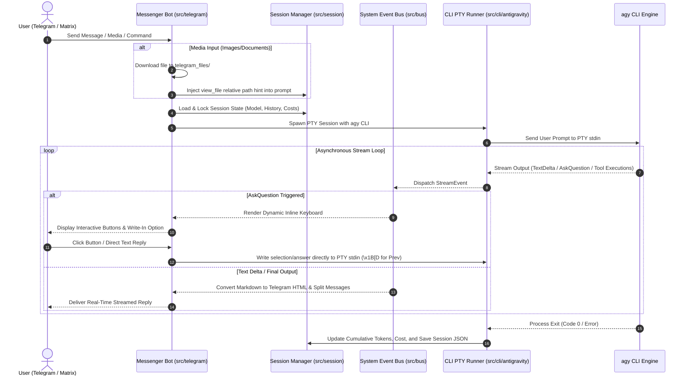

# tuner (Wooductor)

[](https://github.com/imwoo90/tuner/actions)
[](https://opensource.org/licenses/MIT)

`tuner` is a Rust-based **Agent Supervisor and Automation Runtime** for the Antigravity ecosystem. Built from the ground up, it replaces the legacy Python `ductor_for_agy` service to deliver high performance, safety, and strict compile-time check limits.

It manages and monitors the execution of the Antigravity CLI (`agy`), providing multi-platform messaging integration (Telegram, Matrix), webhook reception, background task supervision, and multi-language localized sessions.

---

## 🔑 Key Features

- **Multi-Platform Messenger Integration**: Native support for Telegram and Matrix protocols. Chat with AI agents and control background runs directly using interactive UI components.
- **Interactive Inline Keyboard Loops (`ask_question`)**: Converts agent `ask_question` prompts into real-time Telegram Inline Keyboards. Supports direct write-in text responses without extra confirmation, and seamless `Prev` option navigation via ANSI arrow key sequence (`\x1B[D`) injection to PTY stdin.
- **Automatic Media Ingestion & Multimodal Support**: Automatically downloads incoming Telegram images/documents into workspace `telegram_files/` and injects `view_file` prompt hints for native LLM multimodal analysis.
- **Session & Chat Persistence**: Structured JSON-based session storage tracks per-topic message history, LLM model state, token usage, and cumulative API costs (USD).
- **Webhook & API Servers (Axum)**: Features a robust Axum-based async web server with HMAC-SHA256 signature verification, Bearer Token authentication, and built-in Rate Limiting.
- **Background Task Management**: Launches long-running agent tasks in virtual PTY sessions. Supports real-time stdout/stderr streaming, log redirection, and execution timeout constraints.
- **DAG Task Runner**: Analyzes and schedules task dependency graphs (DAG) inside the workspace, allowing parallel/sequential execution on the host machine.
- **Workspace & Skill Initialization**: Automatically synchronizes workspace rules (`CLAUDE.md`, `GEMINI.md`, `AGENTS.md`) and symlinks custom skill directories on startup.
- **Cron Job Scheduler**: Manages periodic check-ins, telemetry reporting, and scheduled tasks. Respects configurable system-wide Quiet Hours constraints.
- **Dynamic Localization (i18n)**: Out-of-the-box support for 9 languages (including English as default and Korean). Chat language can be changed dynamically on a per-session basis via the `/lang` slash command.

---

## 🛠️ Architecture

`tuner` is structured into isolated, compile-time verified modules:

- `src/cli/antigravity`: Wraps `agy` CLI execution, spawns PTYs, streams stderr/stdout events, and discovers available models.
- `src/session`: Manages session keys, state serialization, cumulative costs/tokens, and daily resets.
- `src/telegram`: Telegram bot event handler, message parser, interactive inline keyboard generator, and Markdown-to-HTML parser.
- `src/background`: PTY executor wrapping spawned CLI processes with safe async cancellation and SIGKILL cleanup.
- `src/security`: Content filtering, path traversal protection, and allowed root constraints.
- `src/webhook` & `src/tasks`: Axum API endpoints and task registry DAG coordinator.
- `src/i18n`: TOML localization file loader and translation macros.
- `src/messenger/matrix`: Matrix client SDK integration and room event routing.

---

## 🔄 Dynamic Data Flow & Event Lifecycle

Below is the end-to-end asynchronous event flow between Telegram, the System Bus, the Session Manager, and the underlying `agy` CLI PTY runner:



---

## 🚀 Getting Started

### Prerequisites
- **Rust & Cargo**: Rust 1.75+ is recommended.
- **Antigravity CLI (`agy`)**: The `agy` executable must be installed and available in your system `$PATH`.

### Build & Compile
```bash
# Check compilation
cargo check

# Compile production release binary
cargo build --release
```

### Deployment (Systemd User Service)
For convenience, `tuner` supports automatic registration as a systemd user daemon:
```bash
# Register tuner as a systemd user service
./target/release/tuner --install-systemd
```

Manage the user service daemon using systemctl:
```bash
# Reload, enable, and restart the service
systemctl --user daemon-reload
systemctl --user enable tuner.service
systemctl --user restart tuner.service

# Inspect live service logs
journalctl --user -u tuner.service -f
```

---

## ⚙️ Configuration (`config.json`)

On the first run of the `tuner` daemon, a default configuration template is automatically initialized and written to `~/.tuner/config/config.json`. 

You can then customize this configuration to fit your environment (such as setting your `telegram_token` and `allowed_user_ids`). The supported JSON schema is as follows:

```json
{
  "telegram_token": "YOUR_TELEGRAM_BOT_TOKEN",
  "allowed_user_ids": [123456789],
  "allowed_group_ids": [-100123456789],
  "provider": "antigravity",
  "model": "gemini-3.5-flash",
  "language": "en",
  "timezone": "Asia/Seoul",
  "matrix": {
    "homeserver_url": "https://matrix.org",
    "username": "@tuner_bot:matrix.org",
    "password": "YOUR_MATRIX_PASSWORD",
    "room_whitelist": ["!room_id:matrix.org"]
  }
}
```

---

## 🤖 Telegram Slash Commands

Type `/` in your Telegram chat to trigger autocomplete and descriptions. Below is the list of supported slash commands:

| Command | Description |
|---|---|
| `/new` \| `/reset` | Clear the current conversation and start a fresh session. |
| `/status` | Generate bot health reports, agy CLI installation info, and active session model. |
| `/model` | Toggle the active LLM model for the current topic via an inline selector. |
| `/lang` | Select the active session language (English, Korean, etc.) via an inline keyboard. |
| `/memory` | Output the current content of the workspace `MAINMEMORY.md` file. |
| `/stop` | Gracefully cancel active agent CLI processes running in the current chat topic. |
| `/abort` | Forcefully terminate all running workers and background tasks. |
| `/restart` | Request a clean restart of the `tuner` bot daemon process. |
| `/plan` | Prompt the agent to generate a structured execution plan before running. |
| `/grill_me` | Launch an interactive interview to align requirements and refine plans. |
| `/goal` | Launch a long-running, thorough task (e.g. overnight thorough execution). |
| `/learn` | Capture behavioral corrections or feedback and bind them to agent memory. |
| `/teamwork_preview` | Run a collaborative multi-agent simulation workflow. |

---

## 🧪 Testing

`tuner` features an extensive test suite verifying 460+ assertions to ensure stability:

```bash
# Run all unit and integration tests
cargo test
```

---

## 📄 License
This project is licensed under the [MIT License](LICENSE).
