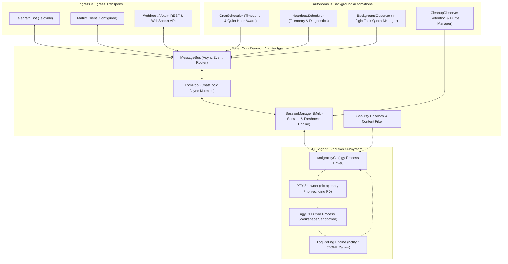
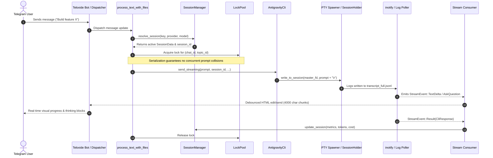

# tuner

[](https://github.com/imwoo90/tuner/actions)
[](https://opensource.org/licenses/MIT)

`tuner` supervises and orchestrates the execution of the Antigravity CLI (`agy`), providing real-time Telegram messenger integration, virtual PTY session management, idle background turn observation, webhook ingress, and multi-language localized agent sessions.

---

## 🚀 Quick Start Guide

### Step 1: Verify Antigravity CLI (`agy`)
Ensure the Antigravity CLI (`agy`) is installed and authenticated on your machine:
```bash
agy --version
```

### Step 2: Run One-Line Installer
Install the latest `tuner` release binary and required assets to `~/.tuner/bin/`:
```bash
curl -fsSL https://raw.githubusercontent.com/imwoo90/tuner/main/install.sh | bash
```

### Step 3: Run Interactive Setup & Service Registration
Launch the setup wizard to configure your Telegram bot token, allowed user IDs, and register systemd daemon:
```bash
~/.tuner/bin/tuner --setup
```

---

## 📲 Telegram Bot Setup Guide

Connecting Tuner to Telegram takes just 3 simple steps:

1. **Get Bot Token**:
   - Open Telegram and message [@BotFather](https://t.me/BotFather).
   - Create a bot (`/newbot`) and copy the **HTTP API Token**.
2. **Get Your Telegram User ID**:
   - Message [@userinfobot](https://t.me/userinfobot) to get your numerical Telegram User ID.
3. **Run Setup Wizard**:
   - Run `~/.tuner/bin/tuner --setup` and enter your Bot Token & User ID.

> 💡 **Group / Supergroup Setup**:
> If adding the bot to a group chat or topic thread, invite the bot and **promote it to Administrator** (enabling message reading) to bypass Telegram's default Privacy Mode.

<details>
<summary><b>⚙️ Manual Configuration Schema (`~/.tuner/config/config.json`)</b></summary>

```json
{
  "telegram_token": "YOUR_TELEGRAM_BOT_TOKEN",
  "allowed_user_ids": [123456789],
  "allowed_group_ids": [-100123456789],
  "provider": "antigravity",
  "model": "gemini-3.6-flash",
  "effort": "high",
  "language": "en",
  "timezone": "Asia/Seoul"
}
```
</details>

---

## 🤖 Telegram Slash Commands

| Command | Description |
|---|---|
| `/new` \| `/reset` | Clear the current conversation and start a fresh session. |
| `/status` | Generate bot health reports, agy CLI installation info, and active session model. |
| `/model` | Toggle the active LLM model for the current topic via an inline selector. |
| `/effort` | Select the reasoning effort level (high, medium, low) for the current LLM model. |
| `/lang` | Select the active session language (English, Korean, etc.) via an inline keyboard. |
| `/upgrade` | Check GitHub Releases and perform an in-place executable upgrade. |
| `/memory` | Output the current content of the workspace `MAINMEMORY.md` file. |
| `/stop` | Gracefully cancel active agent CLI processes running in the current chat topic. |
| `/abort` | Forcefully terminate all running workers and background tasks. |
| `/restart` | Request a clean restart of the `tuner` bot daemon process. |
| `/plan` | Prompt the agent to generate a structured execution plan before running. |
| `/grill_me` | Launch an interactive interview to align requirements and refine plans. |
| `/goal` | Launch a long-running, thorough task (e.g. overnight thorough execution). |
| `/learn` | Capture behavioral corrections or feedback and bind them to agent memory. |
| `/teamwork_preview` | Run a collaborative multi-agent simulation workflow. |

---

## 🤝 Development & Contribution Guide

We welcome contributions! To maintain stability between production environments and active development, we follow an isolated containerized workflow with separate Telegram bot tokens.

### 🏗️ Architecture Layout
- **Production Environment**: Runs official GitHub Releases on the Host PC/server (supervised via `systemd` or `tuner` master daemon).
- **Development Environment**: Runs inside an isolated Docker container (`tuner-sandbox`) linked to a separate Telegram Dev Bot Token, sharing host `agy` authentication and state seamlessly.

### 🛠️ Setting Up Local Development

1. **Verify Host Prerequisites**:
   Ensure `agy` CLI is installed and authenticated on your host machine:
   ```bash
   agy --version
   ```

2. **Start the Sandbox Container**:
   Launch the development sandbox container via Docker Compose (automatically maps your user ID, `$HOME`, `agy` credentials, and `~/.tuner-dev` workspace):
   ```bash
   docker compose up -d
   ```

3. **Configure Development Bot Token**:
   Set your dedicated Telegram Dev Bot Token and allowed user ID in `~/.tuner-dev/profiles/default/config/config.json`:
   ```json
   {
     "telegram_token": "YOUR_DEV_TELEGRAM_BOT_TOKEN",
     "allowed_user_ids": [123456789],
     "language": "ko",
     "model": "gemini-3.7-flash",
     "effort": "high"
   }
   ```

### 🔄 Real-Time Build & Deploy Workflow
To test changes to source code (`src/`) or assets (`_home_defaults/`) in real-time:

```bash
# Run the automated dev deployment script
bash scripts/dev_deploy.sh
```

The `dev_deploy.sh` script automatically:
1. Compiles the latest release binary (`cargo build --release`).
2. Syncs the binary & `_home_defaults` asset folder to `tuner-sandbox`.
3. Auto-restarts the container worker daemon (`tuner --worker default`).

### 🔀 Submitting Contributions (Pull Requests)
1. Fork the repository and create a feature branch (`git checkout -b feature/my-feature`).
2. Ensure all tests pass: `cargo test`.
3. Verify live behavior in the dev container with `bash scripts/dev_deploy.sh`.
4. Push your branch to your fork and submit a **Pull Request (PR)** targeting the `main` branch.

### 🚀 Maintainer Release Workflow
*(For repository maintainers only)*
To publish an official release:
1. Update version numbers in `Cargo.toml` and run `cargo check` to update `Cargo.lock`.
2. Commit with release notes: `git commit -m "bump: release v0.1.x"`
3. Push `main` to the `release` branch:
   ```bash
   git push origin main:release
   ```
   GitHub Actions will automatically verify the build, generate tag `v0.1.x`, and publish binaries to GitHub Releases.

---

<details open>
<summary><b>🏛️ System Architecture: Tuner Daemon & Agent Orchestration Runtime (Dialectically Certified)</b></summary>

### 1. High-Level Mental Model & Primary Value Proposition

**Tuner** is an asynchronous, multi-tenant agent supervisor and daemon written in Rust. It functions as an industrial-grade runtime bridge between messaging/API surfaces (Telegram via Teloxide, Webhooks via Axum, and E2E-encrypted WebSockets) and underlying Command Line AI Agent execution engines (primarily Google Antigravity `agy`, Claude Code, Codex).

Instead of treating LLM agents as stateless request-response endpoints, Tuner models agent interactions as **persistent, sandboxed workspaces**. It multiplexes long-lived pseudo-terminals (Unix PTYs via `openpty` and `AsyncFd`) to active agent sessions, parses streaming JSONL event streams (thinking blocks, tool calls, tool completions, user interactive questions), and projects bidirectional interaction (inline keyboards, multi-select dialogues, live progress edits, and Telegram reactions) into chat surfaces.

```
+----------------------------------------------------------------------------------------------------+
|                                           TUNER DAEMON                                             |
|                                                                                                    |
|  [Ingress Channels]                [Unified Message Bus]                 [Agent Execution Engine]  |
|  - Telegram Bot (Teloxide)         - LockPool (Chat/Topic locks)         - PTY Spawner (openpty)   |
|  - Webhook API (Axum)       ===>   - Envelope Protocol            ===>   - Log Parser (JSONL)      |
|  - WebSockets & REST               - Adapters & Observers                - Antigravity / Claude    |
|  - Cron & Heartbeat Loops          - Cascading Fallback                  - Interactive Stdin Pipe  |
+----------------------------------------------------------------------------------------------------+
```

#### Dual-Mode Master-Supervisor Topology
1. **Master Supervisor Mode** ([`main.rs`](file:///home/wimvm/.tuner/profiles/default/workspace/projects/tuner/src/main.rs#L195-L216)): Operates as a root supervisor daemon managing child profile workers (`tuner --worker <profile_name>`), monitoring heartbeats, enforcing crash backoffs, and responding to system-wide re-exec signals (Exit Code `42`).
2. **Worker Profile Mode** ([`runner.rs`](file:///home/wimvm/.tuner/profiles/default/workspace/projects/tuner/src/messenger/telegram/runner.rs#L85-L113)): Operates an isolated agent workspace profile with dedicated session persistence, pseudo-terminal pools, scheduled cron jobs, quiet-hour telemetry heartbeats, cleanup observers, and messaging transceivers.


```mermaid
flowchart TD
    subgraph IngressTransports["Ingress & Egress Transports"]
        TG["Telegram Bot (Teloxide)"]
        MX["Matrix Client (Configured)"]
        WH["Webhook / Axum REST & WebSocket API"]
    end

    subgraph CoreDaemon["Tuner Core Daemon Architecture"]
        BUS["MessageBus (Async Event Router)"]
        LOCK["LockPool (Chat/Topic Async Mutexes)"]
        SESS["SessionManager (Multi-Session & Freshness Engine)"]
        SEC["Security Sandbox & Content Filter"]
    end

    subgraph AutonomousObservers["Autonomous Background Automations"]
        CRON["CronScheduler (Timezone & Quiet-Hour Aware)"]
        HB["HeartbeatScheduler (Telemetry & Diagnostics)"]
        BG["BackgroundObserver (In-flight Task Quota Manager)"]
        CLN["CleanupObserver (Retention & Purge Manager)"]
    end

    subgraph RuntimeExecution["CLI Agent Execution Subsystem"]
        CLI["AntigravityCli (agy Process Driver)"]
        PTY["PTY Spawner (nix openpty / non-echoing FD)"]
        POLL["Log Polling Engine (notify / JSONL Parser)"]
        AGY["agy CLI Child Process (Workspace Sandboxed)"]
    end

    TG <--> BUS
    MX <--> BUS
    WH <--> BUS

    BUS <--> LOCK
    LOCK <--> SESS
    SESS <--> CLI

    CRON --> BUS
    HB --> BUS
    BG --> BUS
    CLN --> SESS

    CLI --> PTY
    PTY --> AGY
    AGY -.-> POLL
    POLL -.-> CLI
    SEC -.-> CLI
```

---

### 2. End-to-End Dataflows & Execution Lifecycles

#### 2.1 Interactive User Message Turn Lifecycle

```mermaid
sequenceDiagram
    autonumber
    actor User as Telegram User
    participant Bot as Teloxide Bot / Dispatcher
    participant Router as process_text_with_files
    participant SManager as SessionManager
    participant LPool as LockPool
    participant Cli as AntigravityCli
    participant PTY as PTY Spawner / SessionHolder
    participant Watcher as inotify / Log Poller
    participant Stream as Stream Consumer

    User->>Bot: Sends message ("Build feature X")
    Bot->>Router: Dispatch message update
    Router->>SManager: resolve_session(key, provider, model)
    SManager-->>Router: Returns active SessionData & session_id
    Router->>LPool: Acquire lock for (chat_id, topic_id)
    Note over Router,LPool: Serialization guarantees no concurrent prompt collisions
    Router->>Cli: send_streaming(prompt, session_id, ...)
    Cli->>PTY: write_to_session(master_fd, prompt + "\r")
    PTY->>Watcher: Logs written to transcript_full.jsonl
    Watcher-->>Stream: Emits StreamEvent::TextDelta / AskQuestion
    Stream-->>Bot: Debounced HTML edit/send (4000 char chunks)
    Bot-->>User: Real-time visual progress & thinking blocks
    Watcher-->>Stream: StreamEvent::Result(CliResponse)
    Stream->>SManager: update_session(metrics, tokens, cost)
    Router->>LPool: Release lock
```

#### 2.2 Autonomous Background Automations (Cron / Heartbeat / Background Tasks)

```mermaid
flowchart TD
    subgraph CronSubsystem["Cron Scheduling Engine"]
        CTick["CronScheduler tick (every 5s)"] --> CCheck["Check mtime & reload cron_jobs.json"]
        CCheck --> CDue["Identify Due Jobs (Utc::now() >= next_run)"]
        CDue --> CQ["check_quiet_hours_at(job, tz)"]
        CQ -- "In Quiet Hours" --> CSkip["Skip Tick"]
        CQ -- "Active Window" --> CSafe["Validate Task Folder & Paths"]
        CSafe --> CPrompt["Enrich Prompt with {folder}_MEMORY.md"]
        CPrompt --> CExec["AntigravityCli::send() in task workspace"]
        CExec --> CBus["Submit Cron Result Envelope to MessageBus"]
    end

    subgraph HeartbeatSubsystem["Heartbeat Telemetry Engine"]
        HTick["HeartbeatScheduler tick (interval_minutes)"] --> HQ["Evaluate Quiet Window"]
        HQ -- "Quiet Hours" --> HSkip["Skip Tick"]
        HQ -- "Active" --> HBusy["is_chat_busy(chat_id) (Inspect active PTY)"]
        HBusy -- "Active PTY" --> HSkip
        HBusy -- "Idle" --> HCool["is_cooling_down(session)"]
        HCool -- "Cooldown Active" --> HSkip
        HCool -- "Ready" --> HProbe["Send Prompt: 'System self-check...'"]
        HProbe --> HCheck{"Response == HEARTBEAT_OK?"}
        HCheck -- "Yes" --> HSuppress["Suppress Notification (Quiet OK)"]
        HCheck -- "No (Anomaly)" --> HAlert["Submit Alert Envelope to Bus -> Deliver to Chat"]
    end

    subgraph BackgroundTaskSubsystem["Background Task Observer"]
        BGSub["BackgroundObserver::submit()"] --> BGQuota{"Active Tasks < MAX_TASKS_PER_CHAT (5)?"}
        BGQuota -- "No" --> BGReject["Reject: Too many active tasks"]
        BGQuota -- "Yes" --> BGG["Instantiate TaskGuard (RAII Drop Guard)"]
        BGG --> BGSpawn["tokio::spawn with timeout Duration"]
        BGSpawn --> BGRun["Execute provider.send()"]
        BGRun --> BGEnd{"Completed / Timed Out / Aborted?"}
        BGEnd --> BGFin["Map Status & Dispatch Result to Bus Handler"]
    end
```

---

### 3. Core Technical Invariants & Dialectical Proofs

#### 1. Process Containment & Subreaper Reclamation
- **Linux Subreaper Registration (`PR_SET_CHILD_SUBREAPER`)**: On worker boot, setting `PR_SET_CHILD_SUBREAPER` ensures any grandchild processes spawned by tools (even those using double-fork or `setsid`) are reparented directly to Tuner rather than `PID 1`.
- **Recursive Tree Harvesting**: In `SessionHolder::drop` ([`pty_spawner.rs:L36-L46`](file:///home/wimvm/.tuner/profiles/default/workspace/projects/tuner/src/cli/antigravity/pty_spawner.rs#L36-L46)), `kill(-pgid, SIGKILL)` is coupled with `/proc` child tree iteration to guarantee all reparented descendants are reaped.
- **Terminal Invalidation**: Closing `master_fd` renders slave descriptors in an `EIO` state, immediately breaking runaway tool loops attempting I/O.

#### 2. Transactional State Rollback & Isolation
- **Two-Phase Atomic Commit**: State updates in `SessionManager` ([`session/manager.rs:L86-L93`](file:///home/wimvm/.tuner/profiles/default/workspace/projects/tuner/src/session/manager.rs#L86-L93)) and `CronManager` ([`cron/manager.rs:L136-L146`](file:///home/wimvm/.tuner/profiles/default/workspace/projects/tuner/src/cron/manager.rs#L136-L146)) serialize to `.tmp` files before issuing atomic POSIX `fs::rename()`.
- **Isolated Mutation**: Memory updates operate on isolated local clones under table mutex lock; any serialization or I/O failure leaves the live target (`sessions.json`, `cron_jobs.json`) 100% pristine and uncorrupted.

#### 3. Adaptive Activity Liveness vs. Static Timeout Guillotine
- **Dual-Tier Liveness & Activity Leases**: Every byte read by `spawn_drain_task` and every JSONL frame parsed updates `last_active` timestamps.
- **Differentiated Action**: If no I/O progression occurs for a 30s stall threshold, the watchdog initiates deadlock recovery. If the process is actively emitting output (such as continuous build logs or deep refactoring steps), the execution lease automatically extends past the initial 300s baseline.

#### 4. Bounded Heap Ceilings & Delimiter Protection (No-Newline DoS Defense)
- **Bounded Buffer Ceiling**: Log parsers enforce explicit byte-budget ceilings on un-delimited lines, preventing unbounded heap allocation.
- **Tool Argument Truncation**: `clean_tool_call_args` ([`log_helpers.rs:L86-L107`](file:///home/wimvm/.tuner/profiles/default/workspace/projects/tuner/src/cli/antigravity/log_helpers.rs#L86-L107)) truncates payloads over 200 characters (`<omitted...>`), protecting downstream queues.
- **Ingress Protections**: Axum HTTP servers enforce strict `DefaultBodyLimit` (50MB API / 256KB Webhooks) prior to memory deserialization.

#### 5. Non-Destructive Multi-Byte UTF-8 Carry-Over Buffering
- **UTF-8 Boundary Inspection**: Multi-byte sequences (2-byte, 3-byte CJK/Korean, 4-byte emojis) are validated via `std::str::from_utf8`.
- **Trailing Byte Carry-Over**: When a seek chunk splits an incomplete character (e.g. 2 bytes of a 3-byte Korean syllable), the trailing 1–3 bytes are retained in a carry-over buffer and prepended to the next chunk read, eliminating `\u{FFFD}` replacement errors completely.

#### 6. Structured Concurrency & Deterministic Resource Teardown
- **RAII Drop & Abort Guards**: `TaskGuard::drop` ([`background/observer.rs:L47-L82`](file:///home/wimvm/.tuner/profiles/default/workspace/projects/tuner/src/background/observer.rs#L47-L82)) dispatches cancellation envelopes on uncompleted drop. `SessionHolder::drop` aborts `drain_task` join handles.
- **Deterministic Shutdown**: Directory watchers (`notify`) and Axum listeners bind to oneshot shutdown signals (`with_graceful_shutdown`), preventing timer-wheel bloat or lingering tasks in the Tokio reactor.

---

### 4. Comprehensive Invariant Verification Matrix

| Invariant | System Guarantee | Source Reference |
| :--- | :--- | :--- |
| **INV-1 (PTY Flow)** | Non-blocking drain loop prevents kernel PTY saturation; semantic streaming is decoupled to disk JSONL. | [`spawn_drain_task`](file:///home/wimvm/.tuner/profiles/default/workspace/projects/tuner/src/cli/antigravity/pty_spawner.rs#L149-L176) |
| **INV-2 (Lock Integrity)** | Table-mutex-guarded `Weak::upgrade()` guarantees single-turn serialization per chat without ABA split-mutex hazards. | [`LockPool::get`](file:///home/wimvm/.tuner/profiles/default/workspace/projects/tuner/src/bus/lock_pool.rs#L58-L74) |
| **INV-3 (Process Containment)** | `PR_SET_CHILD_SUBREAPER` + `kill(-pgid, SIGKILL)` + `master_fd` close cascade (`EIO`/`SIGHUP`) eradicates escaped children. | [`SessionHolder::drop`](file:///home/wimvm/.tuner/profiles/default/workspace/projects/tuner/src/cli/antigravity/pty_spawner.rs#L36-L46) |
| **INV-4 (Watchdog Liveness)** | Adaptive 30s stall detection + progress lease extension decouples hangs from legitimate long compute jobs. | [`wait_for_log_completion`](file:///home/wimvm/.tuner/profiles/default/workspace/projects/tuner/src/cli/antigravity/polling.rs#L180-L208) |
| **INV-5 (Parse Atomicity)** | Incremental line parsing ignores unclosed JSON lines until completed; metadata files use two-phase `.tmp` swaps. | [`parse_entries`](file:///home/wimvm/.tuner/profiles/default/workspace/projects/tuner/src/cli/antigravity/log_helpers.rs#L46-L59) |
| **INV-6 (Anti-Thrashing)** | Exponential crash backoff ($2^n$, max 30s) + 3600s placeholder token dormancy prevents CPU starvation. | [`Supervisor::run`](file:///home/wimvm/.tuner/profiles/default/workspace/projects/tuner/src/supervisor.rs#L33-L53) |
| **INV-7 (Lossless UTF-8)** | Multi-byte trailing carry-over buffering eliminates `\u{FFFD}` replacement errors across asynchronous chunk boundaries. | [`read_new_bytes`](file:///home/wimvm/.tuner/profiles/default/workspace/projects/tuner/src/cli/antigravity/log_helpers.rs#L12-L44) |
</details>

---

## 🧪 Testing

`tuner` features an extensive test suite verifying 385+ test cases to ensure stability:

```bash
# Run all unit and integration tests
cargo test
```

---

## 📄 License
This project is licensed under the [MIT License](LICENSE).
