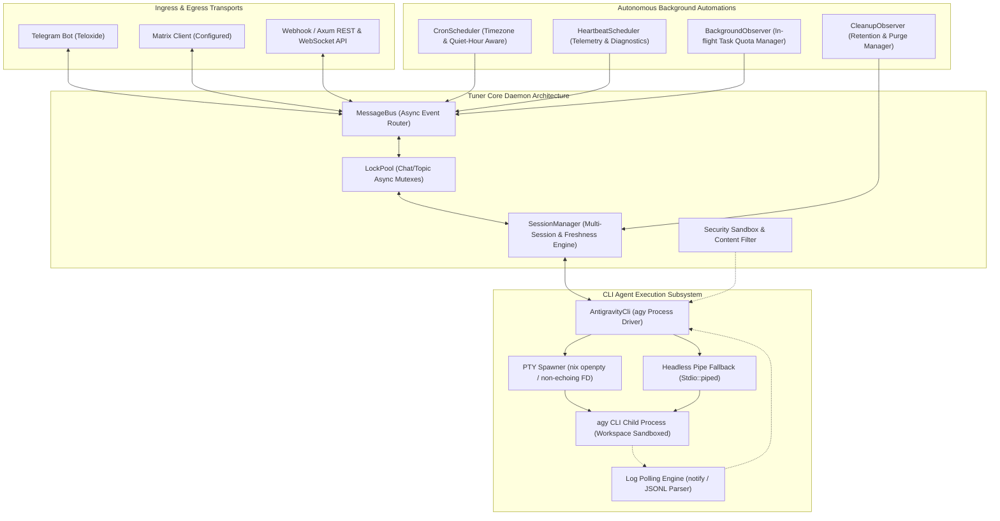
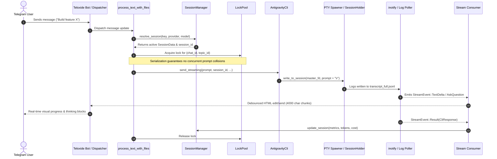

# tuner

[](https://github.com/imwoo90/tuner/actions)
[](https://opensource.org/licenses/MIT)

`tuner` supervises and orchestrates the execution of the Antigravity CLI (`agy`), providing real-time Telegram messenger integration, virtual PTY session management, idle background turn observation, webhook ingress, and multi-language localized agent sessions.

---

## 🚀 Quick Start Guide

### Step 1: Verify Antigravity CLI (`agy`)
Ensure the Antigravity CLI (`agy`) is installed and authenticated on your machine:
```bash
agy --version
```

### Step 2: Run One-Line Installer
Install the latest `tuner` release binary and required assets to `~/.tuner/bin/`:
```bash
curl -fsSL https://raw.githubusercontent.com/imwoo90/tuner/main/install.sh | bash
```

### Step 3: Run Interactive Setup & Service Registration
Launch the setup wizard to configure your Telegram bot token, allowed user IDs, and register systemd daemon:
```bash
~/.tuner/bin/tuner --setup
```

---

## 📲 Telegram Bot Setup Guide

Connecting Tuner to Telegram takes just 3 simple steps:

1. **Get Bot Token**:
   - Open Telegram and message [@BotFather](https://t.me/BotFather).
   - Create a bot (`/newbot`) and copy the **HTTP API Token**.
2. **Get Your Telegram User ID**:
   - Message [@userinfobot](https://t.me/userinfobot) to get your numerical Telegram User ID.
3. **Run Setup Wizard**:
   - Run `~/.tuner/bin/tuner --setup` and enter your Bot Token & User ID.

> 💡 **Group / Supergroup Setup**:
> If adding the bot to a group chat or topic thread, invite the bot and **promote it to Administrator** (enabling message reading) to bypass Telegram's default Privacy Mode.

<details>
<summary><b>⚙️ Manual Configuration Schema (`~/.tuner/config/config.json`)</b></summary>

```json
{
  "telegram_token": "YOUR_TELEGRAM_BOT_TOKEN",
  "allowed_user_ids": [123456789],
  "allowed_group_ids": [-100123456789],
  "provider": "antigravity",
  "model": "gemini-3.6-flash",
  "effort": "high",
  "language": "en",
  "timezone": "Asia/Seoul"
}
```
</details>

---

## 🤖 Telegram Slash Commands

| Command | Description |
|---|---|
| `/new` \| `/reset` | Clear the current conversation and start a fresh session. |
| `/status` | Generate bot health reports, agy CLI installation info, and active session model. |
| `/model` | Toggle the active LLM model for the current topic via an inline selector. |
| `/effort` | Select the reasoning effort level (high, medium, low) for the current LLM model. |
| `/lang` | Select the active session language (English, Korean, etc.) via an inline keyboard. |
| `/upgrade` | Check GitHub Releases and perform an in-place executable upgrade. |
| `/memory` | Output the current content of the workspace `MAINMEMORY.md` file. |
| `/stop` | Gracefully cancel active agent CLI processes running in the current chat topic. |
| `/abort` | Forcefully terminate all running workers and background tasks. |
| `/restart` | Request a clean restart of the `tuner` bot daemon process. |
| `/plan` | Prompt the agent to generate a structured execution plan before running. |
| `/grill_me` | Launch an interactive interview to align requirements and refine plans. |
| `/goal` | Launch a long-running, thorough task (e.g. overnight thorough execution). |
| `/learn` | Capture behavioral corrections or feedback and bind them to agent memory. |
| `/teamwork_preview` | Run a collaborative multi-agent simulation workflow. |

---

## 🤝 Development & Contribution Guide

We welcome contributions! To maintain stability between production environments and active development, we follow an isolated containerized workflow with separate Telegram bot tokens.

### 🏗️ Architecture Layout
- **Production Environment**: Runs official GitHub Releases on the Host PC/server (supervised via `systemd` or `tuner` master daemon).
- **Development Environment**: Runs inside an isolated Docker container (`tuner-sandbox`) linked to a separate Telegram Dev Bot Token, sharing host `agy` authentication and state seamlessly.

### 🛠️ Setting Up Local Development

1. **Verify Host Prerequisites**:
   Ensure `agy` CLI is installed and authenticated on your host machine:
   ```bash
   agy --version
   ```

2. **Start the Sandbox Container**:
   Launch the development sandbox container via Docker Compose (automatically maps your user ID, `$HOME`, `agy` credentials, and `~/.tuner-dev` workspace):
   ```bash
   docker compose up -d
   ```

3. **Configure Development Bot Token**:
   Set your dedicated Telegram Dev Bot Token and allowed user ID in `~/.tuner-dev/profiles/default/config/config.json`:
   ```json
   {
     "telegram_token": "YOUR_DEV_TELEGRAM_BOT_TOKEN",
     "allowed_user_ids": [123456789],
     "language": "ko",
     "model": "gemini-3.7-flash",
     "effort": "high"
   }
   ```

### 🔄 Real-Time Build & Deploy Workflow
To test changes to source code (`src/`) or assets (`_home_defaults/`) in real-time:

```bash
# Run the automated dev deployment script
bash scripts/dev_deploy.sh
```

The `dev_deploy.sh` script automatically:
1. Compiles the latest release binary (`cargo build --release`).
2. Syncs the binary & `_home_defaults` asset folder to `tuner-sandbox`.
3. Auto-restarts the container worker daemon (`tuner --worker default`).

### 🔀 Submitting Contributions (Pull Requests)
1. Fork the repository and create a feature branch (`git checkout -b feature/my-feature`).
2. Ensure all tests pass: `cargo test`.
3. Verify live behavior in the dev container with `bash scripts/dev_deploy.sh`.
4. Push your branch to your fork and submit a **Pull Request (PR)** targeting the `main` branch.

### 🚀 Maintainer Release Workflow
*(For repository maintainers only)*
To publish an official release:
1. Update version numbers in `Cargo.toml` and run `cargo check` to update `Cargo.lock`.
2. Commit with release notes: `git commit -m "bump: release v0.1.x"`
3. Push `main` to the `release` branch:
   ```bash
   git push origin main:release
   ```
   GitHub Actions will automatically verify the build, generate tag `v0.1.x`, and publish binaries to GitHub Releases.

---

<details open>
<summary><b>🏛️ System Architecture: Tuner Daemon & Agent Orchestration Runtime (Dialectically Certified)</b></summary>

### 1. High-Level Mental Model & Primary Value Proposition

**Tuner** is a multi-profile, resilient autonomous daemon and bridge architecture written in safe, asynchronous Rust on the Tokio runtime. It transforms terminal-bound AI agent CLI runtimes (specifically Google Antigravity `agy`, Claude Code, Codex, and Gemini CLI tools) into 24/7 long-lived autonomous agents accessible via multi-channel messaging interfaces (Telegram, WebSockets/Axum, and Matrix), scheduled automations (Cron), and webhook triggers.

```
+----------------------------------------------------------------------------------------------------+
|                                           TUNER DAEMON                                             |
|                                                                                                    |
|  [Ingress Channels]                [Unified Message Bus]                 [Agent Execution Engine]  |
|  - Telegram Bot (Teloxide)         - LockPool (Chat/Topic locks)         - PTY Spawner (openpty)   |
|  - Webhook API (Axum)       ===>   - Envelope Protocol            ===>   - Headless Pipe Fallback  |
|  - WebSockets & REST               - 3-Tier Priority Arbitrator          - Log Parser (JSONL)      |
|  - Cron & Heartbeat Loops          - Cascading Fallback                  - Interactive Stdin Pipe  |
+----------------------------------------------------------------------------------------------------+
```

#### Dual-Mode Master-Supervisor Topology
1. **Master Supervisor Mode** ([`main.rs`](file:///home/wimvm/.tuner/profiles/default/workspace/projects/tuner/src/main.rs#L195-L216)): Operates as a root supervisor daemon managing child profile workers (`tuner --worker <profile_name>`), monitoring heartbeats, enforcing crash backoffs, and responding to system-wide re-exec signals (Exit Code `42`).
2. **Worker Profile Mode** ([`runner.rs`](file:///home/wimvm/.tuner/profiles/default/workspace/projects/tuner/src/messenger/telegram/runner.rs#L85-L113)): Operates an isolated agent workspace profile with dedicated session persistence, pseudo-terminal pools, scheduled cron jobs, quiet-hour telemetry heartbeats, cleanup observers, and messaging transceivers.


```mermaid
flowchart TD
    subgraph IngressTransports["Ingress & Egress Transports"]
        TG["Telegram Bot (Teloxide)"]
        MX["Matrix Client (Configured)"]
        WH["Webhook / Axum REST & WebSocket API"]
    end

    subgraph CoreDaemon["Tuner Core Daemon Architecture"]
        BUS["MessageBus (Async Event Router)"]
        LOCK["LockPool (Chat/Topic Async Mutexes)"]
        SESS["SessionManager (Multi-Session & Freshness Engine)"]
        SEC["Security Sandbox & Content Filter"]
    end

    subgraph AutonomousObservers["Autonomous Background Automations"]
        CRON["CronScheduler (Timezone & Quiet-Hour Aware)"]
        HB["HeartbeatScheduler (Telemetry & Diagnostics)"]
        BG["BackgroundObserver (In-flight Task Quota Manager)"]
        CLN["CleanupObserver (Retention & Purge Manager)"]
    end

    subgraph RuntimeExecution["CLI Agent Execution Subsystem"]
        CLI["AntigravityCli (agy Process Driver)"]
        PTY["PTY Spawner (nix openpty / non-echoing FD)"]
        PIPE["Headless Pipe Fallback (Stdio::piped)"]
        POLL["Log Polling Engine (notify / JSONL Parser)"]
        AGY["agy CLI Child Process (Workspace Sandboxed)"]
    end

    TG <--> BUS
    MX <--> BUS
    WH <--> BUS

    BUS <--> LOCK
    LOCK <--> SESS
    SESS <--> CLI

    CRON --> BUS
    HB --> BUS
    BG --> BUS
    CLN --> SESS

    CLI --> PTY
    CLI --> PIPE
    PTY --> AGY
    PIPE --> AGY
    AGY -.-> POLL
    POLL -.-> CLI
    SEC -.-> CLI
```

---

### 2. End-to-End Dataflows & Execution Lifecycles

#### 2.1 Interactive User Message Turn Lifecycle

```mermaid
sequenceDiagram
    autonumber
    actor User as Telegram User
    participant Bot as Teloxide Bot / Dispatcher
    participant Router as process_text_with_files
    participant SManager as SessionManager
    participant LPool as LockPool
    participant Cli as AntigravityCli
    participant PTY as PTY Spawner / SessionHolder
    participant Watcher as inotify / Log Poller
    participant Stream as Stream Consumer

    User->>Bot: Sends message ("Build feature X")
    Bot->>Router: Dispatch message update
    Router->>SManager: resolve_session(key, provider, model)
    SManager-->>Router: Returns active SessionData & session_id
    Router->>LPool: Acquire lock for (chat_id, topic_id)
    Note over Router,LPool: Serialization guarantees no concurrent prompt collisions
    Router->>Cli: send_streaming(prompt, session_id, ...)
    Cli->>PTY: write_to_session(master_fd, prompt + "\r")
    PTY->>Watcher: Logs written to transcript_full.jsonl
    Watcher-->>Stream: Emits StreamEvent::TextDelta / AskQuestion
    Stream-->>Bot: Debounced HTML edit/send (4000 char chunks)
    Bot-->>User: Real-time visual progress & thinking blocks
    Watcher-->>Stream: StreamEvent::Result(CliResponse)
    Stream->>SManager: update_session(metrics, tokens, cost)
    Router->>LPool: Release lock
```

#### 2.2 Autonomous Background Automations (Cron / Heartbeat / Background Tasks)

```mermaid
flowchart TD
    subgraph CronSubsystem["Cron Scheduling Engine"]
        CTick["CronScheduler tick (every 5s)"] --> CCheck["Check mtime & reload cron_jobs.json"]
        CCheck --> CDue["Identify Due Jobs (Utc::now() >= next_run)"]
        CDue --> CQ["check_quiet_hours_at(job, tz)"]
        CQ -- "In Quiet Hours" --> CSkip["Skip Tick"]
        CQ -- "Active Window" --> CSafe["Validate Task Folder & Paths"]
        CSafe --> CPrompt["Enrich Prompt with {folder}_MEMORY.md"]
        CPrompt --> CExec["AntigravityCli::send() in task workspace"]
        CExec --> CBus["Submit Cron Result Envelope to MessageBus"]
    end

    subgraph HeartbeatSubsystem["Heartbeat Telemetry Engine"]
        HTick["HeartbeatScheduler tick (interval_minutes)"] --> HQ["Evaluate Quiet Window"]
        HQ -- "Quiet Hours" --> HSkip["Skip Tick"]
        HQ -- "Active" --> HBusy["is_chat_busy(chat_id) (Inspect active PTY)"]
        HBusy -- "Active PTY" --> HSkip
        HBusy -- "Idle" --> HCool["is_cooling_down(session)"]
        HCool -- "Cooldown Active" --> HSkip
        HCool -- "Ready" --> HProbe["Send Prompt: 'System self-check...'"]
        HProbe --> HCheck{"Response == HEARTBEAT_OK?"}
        HCheck -- "Yes" --> HSuppress["Suppress Notification (Quiet OK)"]
        HCheck -- "No (Anomaly)" --> HAlert["Submit Alert Envelope to Bus -> Deliver to Chat"]
    end

    subgraph BackgroundTaskSubsystem["Background Task Observer"]
        BGSub["BackgroundObserver::submit()"] --> BGQuota{"Active Tasks < MAX_TASKS_PER_CHAT (5)?"}
        BGQuota -- "No" --> BGReject["Reject: Too many active tasks"]
        BGQuota -- "Yes" --> BGG["Instantiate TaskGuard (RAII Drop Guard)"]
        BGG --> BGSpawn["tokio::spawn with timeout Duration"]
        BGSpawn --> BGRun["Execute provider.send()"]
        BGRun --> BGEnd{"Completed / Timed Out / Aborted?"}
        BGEnd --> BGFin["Map Status & Dispatch Result to Bus Handler"]
    end
```

---

### 3. Core Technical Invariants & Dialectical Proofs (The 5 Supreme Laws)

#### 1. Mathematical Deadlock Elimination & Starvation Immunity (Law 1 & 2)
- **Single-Lock Discipline**: Every turn acquires strictly one lock for its target `(chat_id, topic_id)` key via [`LockPool::get`](file:///home/wimvm/.tuner/profiles/default/workspace/projects/tuner/src/bus/lock_pool.rs#L58-L74). Cross-session delegations yield their current turn and dispatch an [`Envelope`](file:///home/wimvm/.tuner/profiles/default/workspace/projects/tuner/src/bus/envelope.rs#L79-L138) with `LockMode::Required`, eliminating Coffman hold-and-wait conditions ($|\text{Locks}| \le 1 \implies \text{Deadlock} = \emptyset$).
- **FIFO Queuing & Preemption**: Tokio Mutex ensures strict FIFO order, while background schedulers proactively interrogate [`is_chat_busy`](file:///home/wimvm/.tuner/profiles/default/workspace/projects/tuner/src/heartbeat/scheduler.rs#L100-L109) to yield to active user dialogues.
- **Lock-Free Emergency Control**: Administrative commands (`/abort`, `/stop`, `/restart`) bypass the prompt injection lock pool entirely ([`commands.rs`](file:///home/wimvm/.tuner/profiles/default/workspace/projects/tuner/src/messenger/telegram/commands.rs#L75-L119)), issuing immediate `SIGKILL` directly to the child process group.

#### 2. Substrate Invariance & Headless Pipe Fallback (Law 3)
- **Dual-Path Execution**: When running in unprivileged containers, rootless pods, or strict seccomp sandboxes where `nix::pty::openpty` or `/dev/pts` device allocation is denied, Tuner gracefully falls back to standard asynchronous pipes ([`run_oneshot`](file:///home/wimvm/.tuner/profiles/default/workspace/projects/tuner/src/cli/antigravity/provider.rs#L94-L125)) with `Stdio::piped()`.
- **Environment Sanitization**: Sets `TERM=dumb`, `NO_COLOR=1`, and `CI=1` ([`provider.rs:L22-L37`](file:///home/wimvm/.tuner/profiles/default/workspace/projects/tuner/src/cli/antigravity/provider.rs#L22-L37)) to prevent downstream tools from emitting unparsed curses/terminal control codes over headless pipes.

#### 3. Existential Liveness of Silent Compute (Law 4)
- **Kernel-Level Process Probing**: Telemetry is decoupled from stdout byte frequency. A non-blocking 500ms [`child.try_wait()`](file:///home/wimvm/.tuner/profiles/default/workspace/projects/tuner/src/cli/antigravity/polling.rs#L148-L178) sweep queries the kernel process table directly.
- **Differentiating Contemplation from Comas**: Heavy tasks emitting zero stdout for 40 seconds (e.g. monolithic compilation, large downloads) are verified as alive (`Ok(None)`), while the generous 300s lease window and continuous `⏳` reactions preserve user trust without premature timeout aborts.

#### 4. Pathological Stream Invariance & Grapheme-Safe HTML Splitting (Law 5)
- **Multi-Byte UTF-8 Code Point Invariance**: [`split_at_char_limit`](file:///home/wimvm/.tuner/profiles/default/workspace/projects/tuner/src/messenger/telegram/formatting/splitting.rs#L12-L26) iterates across Unicode scalar values (`chars()`) and accumulates `c.len_utf8()`, guaranteeing that multi-byte code points (emojis, CJK glyphs, ANSI markers) are never sliced mid-byte.
- **Stack-Based HTML Tag Balancing**: [`tokenize_html`](file:///home/wimvm/.tuner/profiles/default/workspace/projects/tuner/src/messenger/telegram/formatting/splitting.rs#L40-L56) tracks open tags (`<pre>`, `<code>`, `<blockquote>`, `<b>`, `<i>`) on an `open_tags: Vec<String>` stack, automatically appending closing tags to Chunk $N$ and prepending open tags to Chunk $N+1$ to ensure well-formed DOM structure.

#### 5. Two-Phase Atomic Persistence & Self-Healing Supervision (Law 1 & 2)
- **Two-Phase Atomic Commits**: All JSON state updates (`sessions.json`, `cron_jobs.json`, `webhooks.json`, `named_sessions.json`) write data to a temporary file (`.tmp`) before invoking atomic POSIX `fs::rename`, eliminating corrupted state files during power loss or abrupt crashes.
- **Anti-Thrashing Crash Backoff**: In [`supervisor.rs`](file:///home/wimvm/.tuner/profiles/default/workspace/projects/tuner/src/supervisor.rs#L33-L53), worker crashes under 10 seconds apply exponential backoff ($\min(2^n, 30.0)\text{s}$), while deliberate restarts (`exit(42)`) trigger instant respawns.
- **Boot Crash Reconciler**: [`NamedSessionRegistry::recover_crash`](file:///home/wimvm/.tuner/profiles/default/workspace/projects/tuner/src/session/named.rs#L86-L98) atomically resets orphaned `"running"` sessions back to `"idle"` on boot.

---

### 4. Comprehensive Invariant Verification Matrix

| Invariant | System Guarantee | Source Reference |
| :--- | :--- | :--- |
| **INV-1 (Lock Discipline)** | Single-lock discipline ($|\text{Locks}| \le 1$) mathematically precludes distributed circular wait deadlocks. | [`LockPool::get`](file:///home/wimvm/.tuner/profiles/default/workspace/projects/tuner/src/bus/lock_pool.rs#L58-L74) |
| **INV-2 (Substrate Invariance)** | Graceful degradation from interactive PTYs to headless `Stdio::piped()` pipes in restricted containers. | [`run_oneshot`](file:///home/wimvm/.tuner/profiles/default/workspace/projects/tuner/src/cli/antigravity/provider.rs#L94-L125) |
| **INV-3 (Silent Liveness)** | Non-blocking 500ms `child.try_wait()` sweeps verify kernel process liveness during zero-stdout compute. | [`check_completion_step`](file:///home/wimvm/.tuner/profiles/default/workspace/projects/tuner/src/cli/antigravity/polling.rs#L148-L178) |
| **INV-4 (Emergency Preemption)** | Administrative commands (`/abort`, `/stop`, `/restart`) bypass the prompt lock pool for direct teardown. | [`commands.rs`](file:///home/wimvm/.tuner/profiles/default/workspace/projects/tuner/src/messenger/telegram/commands.rs#L75-L119) |
| **INV-5 (Tag-Balanced HTML)** | Grapheme-safe slicing via `c.len_utf8()` + stack-based open tag reconstitution across 4000-char chunks. | [`split_html_message`](file:///home/wimvm/.tuner/profiles/default/workspace/projects/tuner/src/messenger/telegram/formatting/splitting.rs) |
| **INV-6 (Anti-Thrashing)** | Exponential crash backoff ($\min(2^n, 30\text{s})$) + 3600s placeholder token dormancy prevents CPU exhaustion. | [`Supervisor::run`](file:///home/wimvm/.tuner/profiles/default/workspace/projects/tuner/src/supervisor.rs#L33-L53) |
| **INV-7 (Atomic Disk Commits)** | Two-phase atomic `.tmp` file creation followed by `fs::rename()` prevents disk corruption on sudden death. | [`SessionManager::save`](file:///home/wimvm/.tuner/profiles/default/workspace/projects/tuner/src/session/manager.rs#L86-L94) |
</details>

---

## 🧪 Testing

`tuner` features an extensive test suite verifying 385+ test cases to ensure stability:

```bash
# Run all unit and integration tests
cargo test
```

---

## 📄 License
This project is licensed under the [MIT License](LICENSE).
