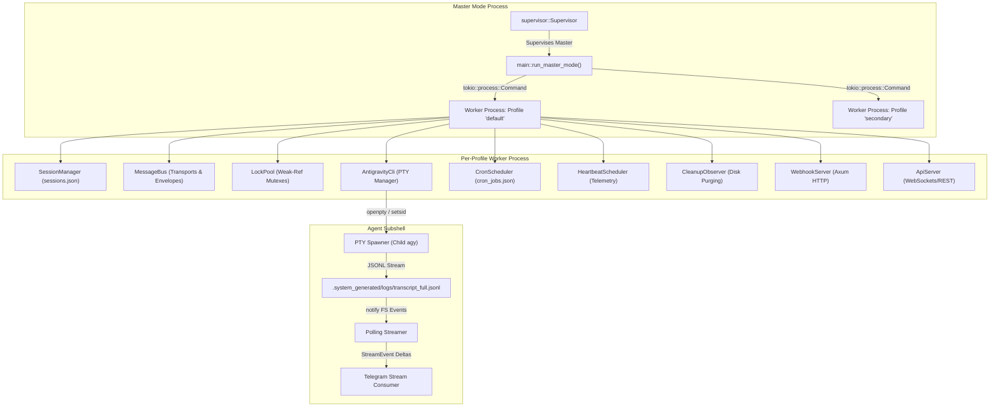

# tuner

[](https://github.com/imwoo90/tuner/actions)
[](https://opensource.org/licenses/MIT)

`tuner` supervises and orchestrates the execution of the Antigravity CLI (`agy`), providing real-time Telegram messenger integration, virtual PTY session management, idle background turn observation, webhook ingress, and multi-language localized agent sessions.

---

## 🚀 Quick Start Guide

### Step 1: Verify Antigravity CLI (`agy`)
Ensure the Antigravity CLI (`agy`) is installed and authenticated on your machine:
```bash
agy --version
```

### Step 2: Run One-Line Installer
Install the latest `tuner` release binary and required assets to `~/.tuner/bin/`:
```bash
curl -fsSL https://raw.githubusercontent.com/imwoo90/tuner/main/install.sh | bash
```

### Step 3: Run Interactive Setup & Service Registration
Launch the setup wizard to configure your Telegram bot token, allowed user IDs, and register systemd daemon:
```bash
~/.tuner/bin/tuner --setup
```

---

## 📲 Telegram Bot Setup Guide

Connecting Tuner to Telegram takes just 3 simple steps:

1. **Get Bot Token**:
   - Open Telegram and message [@BotFather](https://t.me/BotFather).
   - Create a bot (`/newbot`) and copy the **HTTP API Token**.
2. **Get Your Telegram User ID**:
   - Message [@userinfobot](https://t.me/userinfobot) to get your numerical Telegram User ID.
3. **Run Setup Wizard**:
   - Run `~/.tuner/bin/tuner --setup` and enter your Bot Token & User ID.

> 💡 **Group / Supergroup Setup**:
> If adding the bot to a group chat or topic thread, invite the bot and **promote it to Administrator** (enabling message reading) to bypass Telegram's default Privacy Mode.

<details>
<summary><b>⚙️ Manual Configuration Schema (`~/.tuner/config/config.json`)</b></summary>

```json
{
  "telegram_token": "YOUR_TELEGRAM_BOT_TOKEN",
  "allowed_user_ids": [123456789],
  "allowed_group_ids": [-100123456789],
  "provider": "antigravity",
  "model": "gemini-3.6-flash",
  "effort": "high",
  "language": "en",
  "timezone": "Asia/Seoul"
}
```
</details>

---

## 🤖 Telegram Slash Commands

| Command | Description |
|---|---|
| `/new` \| `/reset` | Clear the current conversation and start a fresh session. |
| `/status` | Generate bot health reports, agy CLI installation info, and active session model. |
| `/model` | Toggle the active LLM model for the current topic via an inline selector. |
| `/effort` | Select the reasoning effort level (high, medium, low) for the current LLM model. |
| `/lang` | Select the active session language (English, Korean, etc.) via an inline keyboard. |
| `/upgrade` | Check GitHub Releases and perform an in-place executable upgrade. |
| `/memory` | Output the current content of the workspace `MAINMEMORY.md` file. |
| `/stop` | Gracefully cancel active agent CLI processes running in the current chat topic. |
| `/abort` | Forcefully terminate all running workers and background tasks. |
| `/restart` | Request a clean restart of the `tuner` bot daemon process. |
| `/plan` | Prompt the agent to generate a structured execution plan before running. |
| `/grill_me` | Launch an interactive interview to align requirements and refine plans. |
| `/goal` | Launch a long-running, thorough task (e.g. overnight thorough execution). |
| `/learn` | Capture behavioral corrections or feedback and bind them to agent memory. |
| `/teamwork_preview` | Run a collaborative multi-agent simulation workflow. |

---

## 🤝 Development & Contribution Guide

We welcome contributions! To maintain stability between production environments and active development, we follow an isolated containerized workflow with separate Telegram bot tokens.

### 🏗️ Architecture Layout
- **Production Environment**: Runs official GitHub Releases on the Host PC/server (supervised via `systemd` or `tuner` master daemon).
- **Development Environment**: Runs inside an isolated Docker container (`tuner-sandbox`) linked to a separate Telegram Dev Bot Token, sharing host `agy` authentication and state seamlessly.

### 🛠️ Setting Up Local Development

1. **Verify Host Prerequisites**:
   Ensure `agy` CLI is installed and authenticated on your host machine:
   ```bash
   agy --version
   ```

2. **Start the Sandbox Container**:
   Launch the development sandbox container via Docker Compose (automatically maps your user ID, `$HOME`, `agy` credentials, and `~/.tuner-dev` workspace):
   ```bash
   docker compose up -d
   ```

3. **Configure Development Bot Token**:
   Set your dedicated Telegram Dev Bot Token and allowed user ID in `~/.tuner-dev/profiles/default/config/config.json`:
   ```json
   {
     "telegram_token": "YOUR_DEV_TELEGRAM_BOT_TOKEN",
     "allowed_user_ids": [123456789],
     "language": "ko",
     "model": "gemini-3.7-flash",
     "effort": "high"
   }
   ```

### 🔄 Real-Time Build & Deploy Workflow
To test changes to source code (`src/`) or assets (`_home_defaults/`) in real-time:

```bash
# Run the automated dev deployment script
bash scripts/dev_deploy.sh
```

The `dev_deploy.sh` script automatically:
1. Compiles the latest release binary (`cargo build --release`).
2. Syncs the binary & `_home_defaults` asset folder to `tuner-sandbox`.
3. Auto-restarts the container worker daemon (`tuner --worker default`).

### 🔀 Submitting Contributions (Pull Requests)
1. Fork the repository and create a feature branch (`git checkout -b feature/my-feature`).
2. Ensure all tests pass: `cargo test`.
3. Verify live behavior in the dev container with `bash scripts/dev_deploy.sh`.
4. Push your branch to your fork and submit a **Pull Request (PR)** targeting the `main` branch.

### 🚀 Maintainer Release Workflow
*(For repository maintainers only)*
To publish an official release:
1. Update version numbers in `Cargo.toml` and run `cargo check` to update `Cargo.lock`.
2. Commit with release notes: `git commit -m "bump: release v0.1.x"`
3. Push `main` to the `release` branch:
   ```bash
   git push origin main:release
   ```
   GitHub Actions will automatically verify the build, generate tag `v0.1.x`, and publish binaries to GitHub Releases.

---

<details open>
<summary><b>🏛️ System Architecture: Tuner Daemon & Agent Runtime (Officially Approved)</b></summary>

### 1. Executive Perspective & Comprehensive Mental Model

Modern Large Language Model (LLM) coding agents (e.g., Google Antigravity `agy`, Anthropic Claude Code, OpenAI Codex, and Gemini CLI) operate primarily as ephemeral, single-user, interactive terminal sessions. While effective for localized interactive development, they lack daemonization, multi-channel messaging interfaces, persistent session registries, scheduled background automations, secure remote ingress, and multi-tenant process supervision.

`tuner` bridges this gap. Implemented in safe, asynchronous Rust on the Tokio runtime, `tuner` transforms standalone CLI-based AI coding agents into a continuous, stateful, multi-channel daemon infrastructure.

```
+----------------------------------------------------------------------------------------------------+
|                                           TUNER DAEMON                                             |
|                                                                                                    |
|  [Ingress Channels]                [Unified Message Bus]                 [Agent Execution Engine]  |
|  - Telegram Bot (Teloxide)         - LockPool (Chat/Topic locks)         - PTY Spawner (openpty)   |
|  - Webhook API (Axum)       ===>   - Envelope Protocol            ===>   - Log Parser (JSONL)      |
|  - WebSockets & REST               - Adapters & Observers                - Antigravity / Claude    |
|  - Cron & Heartbeat Loops          - Cascading Fallback                  - Interactive Stdin Pipe  |
+----------------------------------------------------------------------------------------------------+
```

#### Dual-Mode Architectural Topography
1. **Master Supervisor Mode** ([`main.rs`](file:///home/wimvm/.tuner/profiles/default/workspace/projects/tuner/src/main.rs#L195-L216)): Operates as a root supervisor daemon managing child profile workers (`tuner --worker <profile_name>`), monitoring heartbeats, enforcing crash backoffs, and responding to system-wide re-exec signals (Exit Code `42`).
2. **Worker Profile Mode** ([`runner.rs`](file:///home/wimvm/.tuner/profiles/default/workspace/projects/tuner/src/messenger/telegram/runner.rs#L85-L113)): Operates an isolated agent workspace profile with dedicated session persistence, pseudo-terminal pools, scheduled cron jobs, quiet-hour telemetry heartbeats, cleanup observers, and messaging transceivers.


```mermaid
graph TD
    subgraph Supervisor Plane [Master Mode Process]
        M["main::run_master_mode()"] -->|tokio::process::Command| W1["Worker Process: Profile 'default'"]
        M -->|tokio::process::Command| W2["Worker Process: Profile 'secondary'"]
        S["supervisor::Supervisor"] -->|Supervises Master| M
    end

    subgraph Worker Runtime [Per-Profile Worker Process]
        W1 --> SM["SessionManager (sessions.json)"]
        W1 --> MB["MessageBus (Transports & Envelopes)"]
        W1 --> LP["LockPool (Weak-Ref Mutexes)"]
        W1 --> AGY["AntigravityCli (PTY Manager)"]
        W1 --> CS["CronScheduler (cron_jobs.json)"]
        W1 --> HS["HeartbeatScheduler (Telemetry)"]
        W1 --> CL["CleanupObserver (Disk Purging)"]
        W1 --> WS["WebhookServer (Axum HTTP)"]
        W1 --> API["ApiServer (WebSockets/REST)"]
    end

    subgraph Subprocess Execution [Agent Subshell]
        AGY -->|openpty / setsid| PTY["PTY Spawner (Child agy)"]
        PTY -->|JSONL Stream| LOG[".system_generated/logs/transcript_full.jsonl"]
        LOG -->|notify FS Events| POLL["Polling Streamer"]
        POLL -->|StreamEvent Deltas| STR["Telegram Stream Consumer"]
    end
```

---

### 2. Core Subsystems & Operational Mechanics

#### 2.1 PTY Subshell vs. Standard Non-Blocking Pipes
Standard pipes created via `std::process::Stdio::piped()` fail catastrophically when driving modern interactive agent CLI tools like Google Antigravity `agy`. `tuner` explicitly implements raw Unix pseudo-terminal (`PTY`) subshells using `openpty(3)` ([`pty_spawner.rs`](file:///home/wimvm/.tuner/profiles/default/workspace/projects/tuner/src/cli/antigravity/pty_spawner.rs#L85-L147)).

```
+-----------------------------------------------------------------------------------+
|                              PTY DESCRIPTOR TOPOLOGY                              |
|                                                                                   |
|  [Tuner Daemon]                                        [Child Subprocess: agy]    |
|  AsyncFd<OwnedFd> (Master FD)  <=== Unix PTY ===>      Slave FD (Stdin/Stdout/Err)|
|  - Non-blocking (O_NONBLOCK)                           - Echo disabled (~ECHO)    |
|  - Asynchronous drain task                             - Process Group Leader     |
+-----------------------------------------------------------------------------------+
```

- **Interactive TTY Checks (`isatty(3)`)**: Modern CLI agents inspect `isatty(STDIN_FILENO)`. When attached to regular pipes, they disable interactive rich features, abort interactive option menus (`ask_question`), or exit immediately assuming a headless batch script. PTY allocation satisfies `isatty()`.
- **Block Buffering Deadlocks (`libc` 4KB/8KB buffers)**: Standard C runtime libraries apply block-buffering (typically 4096 or 8192 bytes) when standard output is not a terminal. In an interactive dialogue, the agent prints a short prompt and waits for user input. Because the buffer has not filled, `libc` never flushes stdout across the pipe, causing an unrecoverable deadlock. Allocating a PTY forces the underlying C library into **line-buffered or unbuffered** mode.
- **Echo Suppression (`~ECHO`)**: Terminal drivers echo input characters back to the master descriptor by default. In [`disable_echo()`](file:///home/wimvm/.tuner/profiles/default/workspace/projects/tuner/src/cli/antigravity/pty_spawner.rs#L68-L74), `tuner` clears `LocalFlags::ECHO` before passing the slave descriptor to the child, preventing input keystrokes from corrupting output streams.
- **Process Group Isolation**: In `spawn_session()`, a `pre_exec` closure calls `setsid()` and `tcsetpgrp()`. This establishes the child as a distinct session leader, allowing clean signal propagation and total process group eradication upon teardown.
- **Non-Blocking Master Descriptors**: The master descriptor is set to `O_NONBLOCK` and wrapped inside Tokio's [`AsyncFd`](file:///home/wimvm/.tuner/profiles/default/workspace/projects/tuner/src/cli/antigravity/pty_spawner.rs#L131). An asynchronous drain loop ([`spawn_drain_task`](file:///home/wimvm/.tuner/profiles/default/workspace/projects/tuner/src/cli/antigravity/pty_spawner.rs#L149-L175)) yields on `async_master.readable().await`, draining chunks into a shared buffer without reactor stalls.

---

#### 2.2 Weak-Reference `LockPool` Mechanics & Deadlock Freedom
To serialize execution within individual chat threads while maximizing concurrency across unrelated chats, `tuner` implements a specialized asynchronous lock pool ([`LockPool`](file:///home/wimvm/.tuner/profiles/default/workspace/projects/tuner/src/bus/lock_pool.rs#L38-L117)).

```
+-----------------------------------------------------------------------------------+
|                              LOCKPOOL ARCHITECTURE                                |
|                                                                                   |
|  [LockPool]                                                                       |
|  Mutex<HashMap<LockKey, Weak<tokio::sync::Mutex<()>>>>                            |
|                                                                                   |
|  1. Incoming Request for (chat_id, topic_id)                                      |
|  2. locks.retain(|_, weak| weak.strong_count() > 0)    ==> Auto-prune dead locks  |
|  3. weak.upgrade()                                     ==> Upgrade or Create New  |
|  4. Return Arc<tokio::sync::Mutex<()>>                 ==> Acquire turn lock      |
+-----------------------------------------------------------------------------------+
```

- **Automatic Garbage Collection on Lookup**: Every call to `LockPool::get()` sweeps the table with `locks.retain(|_, weak| weak.strong_count() > 0)`. Completed locks (strong count = 0) are evicted dynamically, scaling to thousands of topics with zero idle memory overhead.
- **Deadlock Freedom**: Envelopes only acquire a single lock for their target `(chat_id, topic_id)` key. Because turns never perform multi-lock nested acquisitions, cyclical lock inversion deadlocks are mathematically impossible.
- **ABA Prevention**: Rust's `Arc`/`Weak` reference counters guarantee that memory addresses are never recycled while references exist, completely preventing ABA identity collisions.

---

#### 2.3 Exit Code 42 Orchestration & Re-exec Protocol

```mermaid
stateDiagram-v2
    [*] --> SupervisorRunning: tuner --supervisor
    SupervisorRunning --> SpawnChild: supervisor::Supervisor::run()
    SpawnChild --> ChildRunning: tokio::process::Command::spawn()
    
    ChildRunning --> ChildExit: child.wait()
    
    state ChildExit <<choice>>
    ChildExit --> CleanExit: Exit Code 0
    ChildExit --> FastRestart: Exit Code 42
    ChildExit --> CrashRecovery: Exit Code != 0 & != 42
    
    CleanExit --> [*]: Master Terminates
    FastRestart --> SpawnChild: Reset backoff, Immediate Spawn
    
    state CrashRecovery {
        [*] --> CheckRuntime
        CheckRuntime --> FastCrash: Runtime < 10s (fast_crash_count++)
        CheckRuntime --> StableCrash: Runtime >= 10s (fast_crash_count = 0)
        FastCrash --> BackoffSleep: sleep(min(2^count, 30s))
        StableCrash --> BackoffSleep: sleep(min(2^0, 30s))
        BackoffSleep --> [*]
    }
    CrashRecovery --> SpawnChild: Respawn Worker
```

- **Exit Code `0`**: Graceful shutdown requested by user or system. Loop terminates.
- **Exit Code `42`**: Intentional self-restart signal (emitted by `/restart`, upgrade completion, or owner registration). The supervisor resets `fast_crash_count = 0` and immediately respawns the child with zero delay.
- **Non-Zero Crashes**: If child runtime was $< 10$ seconds, `fast_crash_count` increments; otherwise, it resets to 0. It executes exponential backoff sleep $\min(2^{\text{fast\_crash\_count}}, 30.0)\text{ seconds}$.
- **Child Subprocess Teardown Guard** ([`terminate_child`](file:///home/wimvm/.tuner/profiles/default/workspace/projects/tuner/src/supervisor.rs#L68-L96)): Issues `SIGTERM` to the child PID, escalating to `SIGKILL` after 5 seconds to guarantee clean termination.

---

### 3. Formal End-to-End Turn State Machine

```mermaid
stateDiagram-v2
    [*] --> IngressUpdate: Telegram / API / Webhook Message

    state IngressUpdate {
        [*] --> ExtractMetadata: Parse chat_id, from_id, topic_id
        ExtractMetadata --> CheckAuth: Query allowed_user_ids / groups
    }

    CheckAuth --> OwnerAutoReg: Empty allowed_user_ids & from_id != 0
    OwnerAutoReg --> Exit42: Save config, trigger restart (Exit 42)
    Exit42 --> [*]

    CheckAuth --> DropUnauthorized: from_id / group_id not whitelisted
    DropUnauthorized --> [*]

    CheckAuth --> AcquireTurnLock: Authentication Passed

    state AcquireTurnLock {
        [*] --> LockPoolGet: LockPool::get(chat_id, topic_id)
        LockPoolGet --> AwaitMutex: lock.lock().await
    }

    AcquireTurnLock --> ResolveSessionData: Lock Acquired

    state ResolveSessionData {
        [*] --> LoadJson: SessionManager::load()
        LoadJson --> CheckFreshness: is_session_fresh()
        CheckFreshness --> UseExisting: Fresh (under idle/msg/daily reset limits)
        CheckFreshness --> CreateNew: Stale / Expired (SessionData::new)
    }

    ResolveSessionData --> RouteActiveSession: SessionData Resolved

    state RouteActiveSession <<choice>>
    RouteActiveSession --> InjectRunningPTY: Session Active & Running/Ask
    RouteActiveSession --> SpawnNewPTY: Session Idle / Needs Spawning

    InjectRunningPTY --> FeedInteractiveStdin: feed_active_session_if_running()
    FeedInteractiveStdin --> AwaitPTYStream

    SpawnNewPTY --> SpawnerInit: spawn_session() (openpty, setsid)
    SpawnerInit --> WaitForPrompt: wait_for_pty_prompt()

    state WaitForPrompt <<choice>>
    WaitForPrompt --> PTYInitTimeout: Timeout > 15s
    WaitForPrompt --> WritePromptToPTY: Prompt Symbol '>' Detected

    PTYInitTimeout --> AbortAndReportError: Kill PTY, Return Error HTML
    WritePromptToPTY --> AwaitPTYStream: Write prompt + '\r'

    state AwaitPTYStream {
        [*] --> PollTranscript: spawn_log_polling()
        PollTranscript --> NotifyEvent: Transcript JSONL Modified
        NotifyEvent --> LogParser: AntigravityLogParser::parse_log_delta()
        
        state LogParser <<choice>>
        LogParser --> DeltaText: Thinking / Tool Call / Delta
        LogParser --> InteractiveAsk: Tool Call 'ask_question'
        LogParser --> FinalResult: Status 'DONE' & Tool Calls Empty

        DeltaText --> DebouncedEdit: Edit Telegram Message (2s interval)
        InteractiveAsk --> RenderKeyboard: Render Inline Keyboard & Set AskState
        RenderKeyboard --> UserInteractionWait: Wait for Callback or Write-in
        UserInteractionWait --> InjectInteractiveAnswer: User clicks button / sends text
        InjectInteractiveAnswer --> PollTranscript: Write option index + '\r' to PTY
    }

    AbortAndReportError --> ReleaseTurnLock
    FinalResult --> PostProcessOutput: Format HTML & Split 4000 chars

    state PostProcessOutput {
        [*] --> CheckAttachments: send_file_attachments()
        CheckAttachments --> HistoryLog: log_telegram_message()
        HistoryLog --> SessionUpdate: update_session() (tokens, cost, count)
    }

    PostProcessOutput --> ReleaseTurnLock: Drop Lock Guard
    ReleaseTurnLock --> [*]: Turn Complete
```

---

### 4. Scheduler Arbitration & Collision Dynamics

```
+-----------------------------------------------------------------------------------+
|                        COLLISION ARBITRATION HIERARCHY                            |
|                                                                                   |
|  [CronScheduler]             [HeartbeatScheduler]          [Telegram Ingress]     |
|         |                            |                             |              |
|         v                            v                             v              |
|  1. Quiet Hours Check        1. Quiet Hours Check          1. Auth Check          |
|  2. Path Sandboxing          2. is_chat_busy() Check       2. LockPool.get()      |
|  3. LockMode::Required       3. is_cooling_down() Check    3. feed_active_session |
|         |                            |                             |              |
|         +----------------------------+-----------------------------+              |
|                                      |                                            |
|                                      v                                            |
|                  MessageBus & LockPool Dynamic Arbitration                        |
+-----------------------------------------------------------------------------------+
```

1. **Cron Execution Arbitration ([`CronScheduler`](file:///home/wimvm/.tuner/profiles/default/workspace/projects/tuner/src/cron/scheduler.rs#L32-L248))**:
   - Polls every 5s, calculating next runs via `cron::Schedule::upcoming(tz)`.
   - **Quiet Hours:** Skips execution if local time is within `[quiet_start, quiet_end]`.
   - **Enriched Memory Context:** Injects `<task>_MEMORY.md` into prompts.
   - **Bus Dispatch:** Emits `Envelope` with `Origin::Cron`, acquiring chat `LockPool` mutex before delivery.
2. **Telemetry Heartbeat Arbitration ([`HeartbeatScheduler`](file:///home/wimvm/.tuner/profiles/default/workspace/projects/tuner/src/heartbeat/scheduler.rs#L23-L194))**:
   - Runs periodic health checks (every 30m).
   - **Busy Chat Avoidance:** Aborts check if `is_chat_busy()` detects an active PTY session.
   - **ACK Suppression:** When the model replies with `HEARTBEAT_OK`, notifications are suppressed to prevent spam.
3. **Automated Storage Janitor ([`CleanupObserver`](file:///home/wimvm/.tuner/profiles/default/workspace/projects/tuner/src/cleanup/observer.rs))**:
   - Daily maintenance (03:00 UTC) purges media files and deliverables older than 30 days and removes empty directory trees.

---

### 5. Fault Tolerance, Security & Auxiliary Subsystems

#### 5.1 Fault Tolerance & Silent Crash Recovery
- **Non-Blocking Process Probing (`try_wait`)**: Polled on every tick; detects premature process termination immediately without hanging.
- **Process Group Eradication (`SIGKILL -pgid`)**: `SessionHolder::drop` sends `SIGKILL` to `-pgid`, instantly reaping compiler, interpreter, and tool child processes.
- **RAII Drop Guards (`TaskGuard`)**: Synthesizes `BackgroundResultStatus::Aborted` on unexpected cancellation, keeping central event streams clean.
- **Crash State Reconciler**: On daemon boot, `NamedSessionRegistry::recover_crash` reconciles interrupted `"running"` sessions back to `"idle"`.

#### 5.2 Security Sandboxing & Prompt Injection Defense
- **Path Traversal Containment ([`validate_file_path`](file:///home/wimvm/.tuner/profiles/default/workspace/projects/tuner/src/security/paths.rs#L80-L109))**: Rejects null bytes (`\0`) and control characters, resolves symlinks, and enforces root boundary containment (`workspace/`, `cron_tasks/`, `output_to_user/`).
- **Prompt Injection Defense ([`detect_suspicious_patterns`](file:///home/wimvm/.tuner/profiles/default/workspace/projects/tuner/src/security/content.rs#L46-L55))**: Folds full-width Unicode characters and scans against instruction overrides, role hijacking, fake system tokens (`<|im_start|>`), and internal metadata leaks.

#### 5.3 Auxiliary Subsystems
- **Media Ingestion & Debouncing ([`MediaGroupManager`](file:///home/wimvm/.tuner/profiles/default/workspace/projects/tuner/src/messenger/telegram/media_group.rs#L25-L86))**: Aggregates album uploads across 1.5s windows, downloading items sequentially into `workspace/telegram_files/` and injecting a unified prompt hint.
- **Multi-Provider Accounting ([`ProviderSessionData`](file:///home/wimvm/.tuner/profiles/default/workspace/projects/tuner/src/session/data.rs#L85))**: Tracks session IDs, message counts, token totals, and USD costs independently per CLI provider.
- **Task-Local Localization ([`TASK_ACTIVE_LANG`](file:///home/wimvm/.tuner/profiles/default/workspace/projects/tuner/src/i18n/mod.rs))**: Propagates localized language catalogs across Tokio tasks without cross-tenant leakage.
- **Axum Webhook & API Security ([`auth.rs`](file:///home/wimvm/.tuner/profiles/default/workspace/projects/tuner/src/webhook/auth.rs#L59-L65))**: Sliding-window rate limiter and constant-time HMAC-SHA256 signature verification via `subtle::ConstantTimeEq`.

---

### 6. Architectural Verdict & Quality Guarantees

| Quality Attribute | Architectural Guarantee | Implementation Mechanism |
| :--- | :--- | :--- |
| **Fault Tolerance** | Zero manual intervention on crashes; zero zombie processes. | Supervisor Exit Code 42 re-exec protocol; exponential crash backoff; negative process group `kill(-pgid, SIGKILL)` in Drop guards. |
| **Concurrency Safety** | Thread-level serialization with cluster-level parallelism. | Dynamic `LockPool` with weak-reference garbage collection on access; hierarchical single-lock acquisition discipline. |
| **State Integrity** | Zero data corruption on sudden shutdown or power cut. | Atomic temporary-file-and-rename staging (`.tmp` $\to$ target) for all JSON state storage. |
| **Isolation** | Strict separation of agent memory, skills, and tools across profiles. | `DuctorPaths` rooted directory hierarchy; `validate_file_path` canonical sandboxing; full-width Unicode regex prompt injection filters. |
| **Interactivity** | True bi-directional dialogue with headless CLI agents. | Raw PTY subshell allocation (`openpty`, `~ECHO`); non-blocking `AsyncFd` reading; filesystem event log polling; inline keyboard stdin injection. |
</details>

---

## 🧪 Testing

`tuner` features an extensive test suite verifying 385+ test cases to ensure stability:

```bash
# Run all unit and integration tests
cargo test
```

---

## 📄 License
This project is licensed under the [MIT License](LICENSE).
