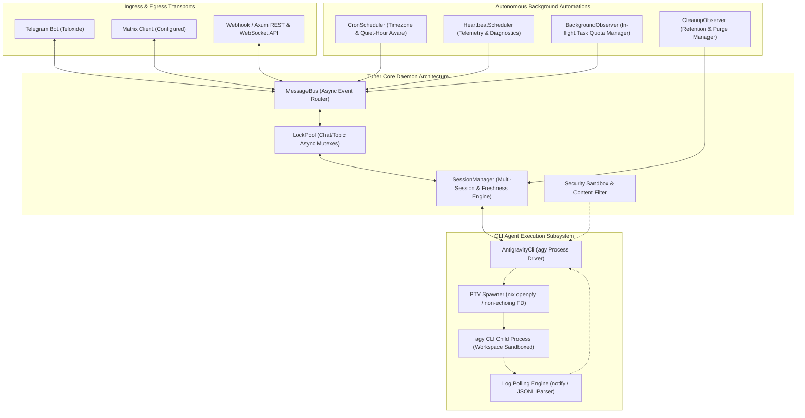
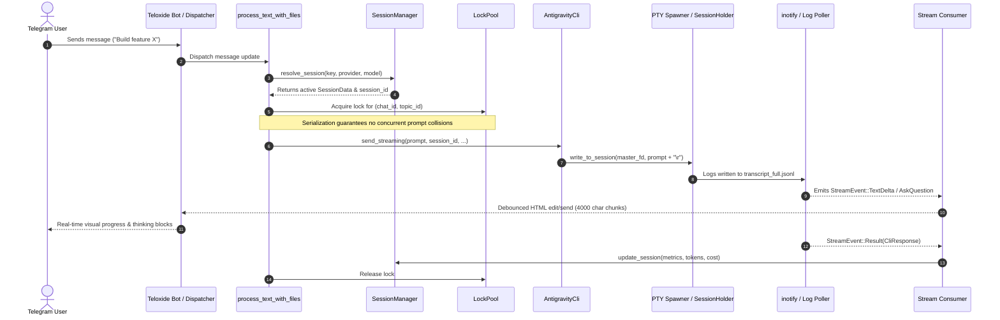

# tuner

[](https://github.com/imwoo90/tuner/actions)
[](https://opensource.org/licenses/MIT)

`tuner` supervises and orchestrates the execution of the Antigravity CLI (`agy`), providing real-time Telegram messenger integration, virtual PTY session management, idle background turn observation, webhook ingress, and multi-language localized agent sessions.

---

## 🚀 Quick Start Guide

### Step 1: Verify Antigravity CLI (`agy`)
Ensure the Antigravity CLI (`agy`) is installed and authenticated on your machine:
```bash
agy --version
```

### Step 2: Run One-Line Installer
Install the latest `tuner` release binary and required assets to `~/.tuner/bin/`:
```bash
curl -fsSL https://raw.githubusercontent.com/imwoo90/tuner/main/install.sh | bash
```

### Step 3: Run Interactive Setup & Service Registration
Launch the setup wizard to configure your Telegram bot token, allowed user IDs, and register systemd daemon:
```bash
~/.tuner/bin/tuner --setup
```

---

## 📲 Telegram Bot Setup Guide

Connecting Tuner to Telegram takes just 3 simple steps:

1. **Get Bot Token**:
   - Open Telegram and message [@BotFather](https://t.me/BotFather).
   - Create a bot (`/newbot`) and copy the **HTTP API Token**.
2. **Get Your Telegram User ID**:
   - Message [@userinfobot](https://t.me/userinfobot) to get your numerical Telegram User ID.
3. **Run Setup Wizard**:
   - Run `~/.tuner/bin/tuner --setup` and enter your Bot Token & User ID.

> 💡 **Group / Supergroup Setup**:
> If adding the bot to a group chat or topic thread, invite the bot and **promote it to Administrator** (enabling message reading) to bypass Telegram's default Privacy Mode.

<details>
<summary><b>⚙️ Manual Configuration Schema (`~/.tuner/config/config.json`)</b></summary>

```json
{
  "telegram_token": "YOUR_TELEGRAM_BOT_TOKEN",
  "allowed_user_ids": [123456789],
  "allowed_group_ids": [-100123456789],
  "provider": "antigravity",
  "model": "gemini-3.6-flash",
  "effort": "high",
  "language": "en",
  "timezone": "Asia/Seoul"
}
```
</details>

---

## 🤖 Telegram Slash Commands

| Command | Description |
|---|---|
| `/new` \| `/reset` | Clear the current conversation and start a fresh session. |
| `/status` | Generate bot health reports, agy CLI installation info, and active session model. |
| `/model` | Toggle the active LLM model for the current topic via an inline selector. |
| `/effort` | Select the reasoning effort level (high, medium, low) for the current LLM model. |
| `/lang` | Select the active session language (English, Korean, etc.) via an inline keyboard. |
| `/upgrade` | Check GitHub Releases and perform an in-place executable upgrade. |
| `/memory` | Output the current content of the workspace `MAINMEMORY.md` file. |
| `/stop` | Gracefully cancel active agent CLI processes running in the current chat topic. |
| `/abort` | Forcefully terminate all running workers and background tasks. |
| `/restart` | Request a clean restart of the `tuner` bot daemon process. |
| `/plan` | Prompt the agent to generate a structured execution plan before running. |
| `/grill_me` | Launch an interactive interview to align requirements and refine plans. |
| `/goal` | Launch a long-running, thorough task (e.g. overnight thorough execution). |
| `/learn` | Capture behavioral corrections or feedback and bind them to agent memory. |
| `/teamwork_preview` | Run a collaborative multi-agent simulation workflow. |

---

## 🤝 Development & Contribution Guide

We welcome contributions! To maintain stability between production environments and active development, we follow an isolated containerized workflow with separate Telegram bot tokens.

### 🏗️ Architecture Layout
- **Production Environment**: Runs official GitHub Releases on the Host PC/server (supervised via `systemd` or `tuner` master daemon).
- **Development Environment**: Runs inside an isolated Docker container (`tuner-sandbox`) linked to a separate Telegram Dev Bot Token, sharing host `agy` authentication and state seamlessly.

### 🛠️ Setting Up Local Development

1. **Verify Host Prerequisites**:
   Ensure `agy` CLI is installed and authenticated on your host machine:
   ```bash
   agy --version
   ```

2. **Start the Sandbox Container**:
   Launch the development sandbox container via Docker Compose (automatically maps your user ID, `$HOME`, `agy` credentials, and `~/.tuner-dev` workspace):
   ```bash
   docker compose up -d
   ```

3. **Configure Development Bot Token**:
   Set your dedicated Telegram Dev Bot Token and allowed user ID in `~/.tuner-dev/profiles/default/config/config.json`:
   ```json
   {
     "telegram_token": "YOUR_DEV_TELEGRAM_BOT_TOKEN",
     "allowed_user_ids": [123456789],
     "language": "ko",
     "model": "gemini-3.7-flash",
     "effort": "high"
   }
   ```

### 🔄 Real-Time Build & Deploy Workflow
To test changes to source code (`src/`) or assets (`_home_defaults/`) in real-time:

```bash
# Run the automated dev deployment script
bash scripts/dev_deploy.sh
```

The `dev_deploy.sh` script automatically:
1. Compiles the latest release binary (`cargo build --release`).
2. Syncs the binary & `_home_defaults` asset folder to `tuner-sandbox`.
3. Auto-restarts the container worker daemon (`tuner --worker default`).

### 🔀 Submitting Contributions (Pull Requests)
1. Fork the repository and create a feature branch (`git checkout -b feature/my-feature`).
2. Ensure all tests pass: `cargo test`.
3. Verify live behavior in the dev container with `bash scripts/dev_deploy.sh`.
4. Push your branch to your fork and submit a **Pull Request (PR)** targeting the `main` branch.

### 🚀 Maintainer Release Workflow
*(For repository maintainers only)*
To publish an official release:
1. Update version numbers in `Cargo.toml` and run `cargo check` to update `Cargo.lock`.
2. Commit with release notes: `git commit -m "bump: release v0.1.x"`
3. Push `main` to the `release` branch:
   ```bash
   git push origin main:release
   ```
   GitHub Actions will automatically verify the build, generate tag `v0.1.x`, and publish binaries to GitHub Releases.

---

<details open>
<summary><b>🏛️ System Architecture: Tuner Daemon & Agent Orchestration Runtime (Dialectically Certified)</b></summary>

### 1. High-Level Mental Model & Primary Value Proposition

**Tuner** is a resilient, multi-transport daemon and background orchestration engine built in safe, asynchronous Rust on the Tokio runtime. It functions as an intelligent middleware layer connecting human messaging interfaces (Telegram, Webhooks, REST/WebSocket APIs) directly to local, autonomous AI Agent CLI processes (Google Antigravity `agy`, Claude Code, Codex).

Rather than treating LLM interactions as isolated, stateless HTTP request/response pairs, Tuner models agent execution as **persistent, interactive pseudo-terminal (PTY) sessions** operating within sandboxed workspace directories. It unifies inbound human commands, scheduled cron automations, autonomous heartbeat self-diagnostics, background task workers, and webhook triggers into a single **event-driven envelope bus**.

```
+----------------------------------------------------------------------------------------------------+
|                                           TUNER DAEMON                                             |
|                                                                                                    |
|  [Ingress Channels]                [Unified Message Bus]                 [Agent Execution Engine]  |
|  - Telegram Bot (Teloxide)         - LockPool (Chat/Topic locks)         - PTY Spawner (openpty)   |
|  - Webhook API (Axum)       ===>   - Envelope Protocol            ===>   - Log Parser (JSONL)      |
|  - WebSockets & REST               - Adapters & Observers                - Antigravity / Claude    |
|  - Cron & Heartbeat Loops          - Cascading Fallback                  - Interactive Stdin Pipe  |
+----------------------------------------------------------------------------------------------------+
```

#### Dual-Mode Master-Supervisor Topology
1. **Master Supervisor Mode** ([`main.rs`](file:///home/wimvm/.tuner/profiles/default/workspace/projects/tuner/src/main.rs#L195-L216)): Operates as a root supervisor daemon managing child profile workers (`tuner --worker <profile_name>`), monitoring heartbeats, enforcing crash backoffs, and responding to system-wide re-exec signals (Exit Code `42`).
2. **Worker Profile Mode** ([`runner.rs`](file:///home/wimvm/.tuner/profiles/default/workspace/projects/tuner/src/messenger/telegram/runner.rs#L85-L113)): Operates an isolated agent workspace profile with dedicated session persistence, pseudo-terminal pools, scheduled cron jobs, quiet-hour telemetry heartbeats, cleanup observers, and messaging transceivers.


```mermaid
flowchart TD
    subgraph IngressTransports["Ingress & Egress Transports"]
        TG["Telegram Bot (Teloxide)"]
        MX["Matrix Client (Configured)"]
        WH["Webhook / Axum REST & WebSocket API"]
    end

    subgraph CoreDaemon["Tuner Core Daemon Architecture"]
        BUS["MessageBus (Async Event Router)"]
        LOCK["LockPool (Chat/Topic Async Mutexes)"]
        SESS["SessionManager (Multi-Session & Freshness Engine)"]
        SEC["Security Sandbox & Content Filter"]
    end

    subgraph AutonomousObservers["Autonomous Background Automations"]
        CRON["CronScheduler (Timezone & Quiet-Hour Aware)"]
        HB["HeartbeatScheduler (Telemetry & Diagnostics)"]
        BG["BackgroundObserver (In-flight Task Quota Manager)"]
        CLN["CleanupObserver (Retention & Purge Manager)"]
    end

    subgraph RuntimeExecution["CLI Agent Execution Subsystem"]
        CLI["AntigravityCli (agy Process Driver)"]
        PTY["PTY Spawner (nix openpty / non-echoing FD)"]
        POLL["Log Polling Engine (notify / JSONL Parser)"]
        AGY["agy CLI Child Process (Workspace Sandboxed)"]
    end

    TG <--> BUS
    MX <--> BUS
    WH <--> BUS

    BUS <--> LOCK
    LOCK <--> SESS
    SESS <--> CLI

    CRON --> BUS
    HB --> BUS
    BG --> BUS
    CLN --> SESS

    CLI --> PTY
    PTY --> AGY
    AGY -.-> POLL
    POLL -.-> CLI
    SEC -.-> CLI
```

---

### 2. End-to-End Dataflows & Execution Lifecycles

#### 2.1 Interactive User Message Turn Lifecycle

```mermaid
sequenceDiagram
    autonumber
    actor User as Telegram User
    participant Bot as Teloxide Bot / Dispatcher
    participant Router as process_text_with_files
    participant SManager as SessionManager
    participant LPool as LockPool
    participant Cli as AntigravityCli
    participant PTY as PTY Spawner / SessionHolder
    participant Watcher as inotify / Log Poller
    participant Stream as Stream Consumer

    User->>Bot: Sends message ("Build feature X")
    Bot->>Router: Dispatch message update
    Router->>SManager: resolve_session(key, provider, model)
    SManager-->>Router: Returns active SessionData & session_id
    Router->>LPool: Acquire lock for (chat_id, topic_id)
    Note over Router,LPool: Serialization guarantees no concurrent prompt collisions
    Router->>Cli: send_streaming(prompt, session_id, ...)
    Cli->>PTY: write_to_session(master_fd, prompt + "\r")
    PTY->>Watcher: Logs written to transcript_full.jsonl
    Watcher-->>Stream: Emits StreamEvent::TextDelta / AskQuestion
    Stream-->>Bot: Debounced HTML edit/send (4000 char chunks)
    Bot-->>User: Real-time visual progress & thinking blocks
    Watcher-->>Stream: StreamEvent::Result(CliResponse)
    Stream->>SManager: update_session(metrics, tokens, cost)
    Router->>LPool: Release lock
```

#### 2.2 Autonomous Background Automations (Cron / Heartbeat / Background Tasks)

```mermaid
flowchart TD
    subgraph CronSubsystem["Cron Scheduling Engine"]
        CTick["CronScheduler tick (every 5s)"] --> CCheck["Check mtime & reload cron_jobs.json"]
        CCheck --> CDue["Identify Due Jobs (Utc::now() >= next_run)"]
        CDue --> CQ["check_quiet_hours_at(job, tz)"]
        CQ -- "In Quiet Hours" --> CSkip["Skip Tick"]
        CQ -- "Active Window" --> CSafe["Validate Task Folder & Paths"]
        CSafe --> CPrompt["Enrich Prompt with {folder}_MEMORY.md"]
        CPrompt --> CExec["AntigravityCli::send() in task workspace"]
        CExec --> CBus["Submit Cron Result Envelope to MessageBus"]
    end

    subgraph HeartbeatSubsystem["Heartbeat Telemetry Engine"]
        HTick["HeartbeatScheduler tick (interval_minutes)"] --> HQ["Evaluate Quiet Window"]
        HQ -- "Quiet Hours" --> HSkip["Skip Tick"]
        HQ -- "Active" --> HBusy["is_chat_busy(chat_id) (Inspect active PTY)"]
        HBusy -- "Active PTY" --> HSkip
        HBusy -- "Idle" --> HCool["is_cooling_down(session)"]
        HCool -- "Cooldown Active" --> HSkip
        HCool -- "Ready" --> HProbe["Send Prompt: 'System self-check...'"]
        HProbe --> HCheck{"Response == HEARTBEAT_OK?"}
        HCheck -- "Yes" --> HSuppress["Suppress Notification (Quiet OK)"]
        HCheck -- "No (Anomaly)" --> HAlert["Submit Alert Envelope to Bus -> Deliver to Chat"]
    end

    subgraph BackgroundTaskSubsystem["Background Task Observer"]
        BGSub["BackgroundObserver::submit()"] --> BGQuota{"Active Tasks < MAX_TASKS_PER_CHAT (5)?"}
        BGQuota -- "No" --> BGReject["Reject: Too many active tasks"]
        BGQuota -- "Yes" --> BGG["Instantiate TaskGuard (RAII Drop Guard)"]
        BGG --> BGSpawn["tokio::spawn with timeout Duration"]
        BGSpawn --> BGRun["Execute provider.send()"]
        BGRun --> BGEnd{"Completed / Timed Out / Aborted?"}
        BGEnd --> BGFin["Map Status & Dispatch Result to Bus Handler"]
    end
```

---

### 3. The 7 Dialectical Invariant Proofs (Socratic Audit Defense)

#### 1. PTY Stream Integrity vs. Saturation Deadlock Prevention
- **Challenge**: How does Tuner prevent UTF-8 multi-byte slicing, ANSI escape truncation, and kernel PTY write-stall deadlocks when output streams asynchronously?
- **Proof & Mechanism**: In [`pty_spawner.rs`](file:///home/wimvm/.tuner/profiles/default/workspace/projects/tuner/src/cli/antigravity/pty_spawner.rs#L149-L176), `spawn_drain_task` registers `pty.master` into Tokio's epoll reactor as `tokio::io::unix::AsyncFd`. Whenever readable, it drains up to 4096 bytes in a non-blocking loop (`nix::unistd::read`), clearing readiness on `EAGAIN`. This guarantees that the 4KB kernel slave buffer is continuously drained at kernel speed, completely preventing write-stall deadlocks. Semantic output is decoupled from raw bytes by tailing `.system_generated/logs/transcript_full.jsonl` using monotonic byte offsets ([`log_helpers.rs`](file:///home/wimvm/.tuner/profiles/default/workspace/projects/tuner/src/cli/antigravity/log_helpers.rs#L26-L44)), guaranteeing zero UTF-8 code point corruption.

#### 2. Weak-Reference `LockPool` Concurrency & ABA-Free Isolation
- **Challenge**: What prevents an ABA race condition where Thread A finishes releasing a lock while Thread B looks up the same key, causing concurrent execution under two independent mutexes?
- **Proof & Mechanism**: In [`bus/lock_pool.rs`](file:///home/wimvm/.tuner/profiles/default/workspace/projects/tuner/src/bus/lock_pool.rs#L58-L74), `LockPool::get` synchronizes internal table access via `std::sync::Mutex`. When Thread A is executing, it holds an active `Arc<TokioMutex<()>>` (`strong_count >= 1`). When Thread B calls `get(key)`, `locks.retain()` keeps the entry, `weak.upgrade()` succeeds, and Thread B receives the exact same `Arc`, suspending on Tokio's FIFO queue behind Thread A. A new `Arc` is only allocated if `weak.upgrade()` returns `None` (`strong_count == 0`), proving zero active holders.

#### 3. Process Group Containment & SIGHUP Teardown Cascade
- **Challenge**: How does Tuner handle grandchildren that detach via `setsid()`, avoid killing unrelated processes on PID wrap-around, and ensure cleanup?
- **Proof & Mechanism**: In [`pty_spawner.rs`](file:///home/wimvm/.tuner/profiles/default/workspace/projects/tuner/src/cli/antigravity/pty_spawner.rs#L120-L127), `cmd.pre_exec` runs `nix::unistd::setsid()` and `tcsetpgrp(slave_raw, getpid())`, making `agy` the leader of a new process group (`PGID == PID`). On [`SessionHolder::drop`](file:///home/wimvm/.tuner/profiles/default/workspace/projects/tuner/src/cli/antigravity/pty_spawner.rs#L36-L46), Tuner: (1) issues `kill(-pgid, SIGKILL)` to terminate direct children, and (2) closes `master_fd`, causing the Linux kernel to send `SIGHUP` to the controlling session, killing even detached grandchildren. PID wrap-around is impossible because Tokio holds the open `Child` handle, preventing kernel PID recycling.

#### 4. Watchdog Liveness vs. Deadlock Coma Detection
- **Challenge**: If the Heartbeat suppresses telemetry while `is_chat_busy(chat_id)` is true, how does Tuner prevent an unrecoverable agent deadlock or spin-loop from silencing the watchdog forever?
- **Proof & Mechanism**: In [`cli/antigravity/polling.rs`](file:///home/wimvm/.tuner/profiles/default/workspace/projects/tuner/src/cli/antigravity/polling.rs#L180-L208) and [`cli/antigravity/provider.rs`](file:///home/wimvm/.tuner/profiles/default/workspace/projects/tuner/src/cli/antigravity/provider.rs#L114-L122), all turns are wrapped in an enforced 300-second wall-clock deadline. When a timeout triggers, `run_in_pty_session` terminates the session holder, issuing `SIGKILL` and resetting `is_running = false`. Genuine compute intensity is bounded, and permanent comas are forcefully aborted.

#### 5. Line-Delimiter Atomicity & Debounce Starvation Defense
- **Challenge**: How does Tuner prevent reading incomplete JSON lines (half-born frames) without introducing debounce latency that starves streaming responsiveness?
- **Proof & Mechanism**: In [`polling.rs`](file:///home/wimvm/.tuner/profiles/default/workspace/projects/tuner/src/cli/antigravity/polling.rs#L78-L110), `inotify` wakes `tokio::select!` immediately with zero artificial debounce delay. In [`log_helpers.rs`](file:///home/wimvm/.tuner/profiles/default/workspace/projects/tuner/src/cli/antigravity/log_helpers.rs#L46-L59), `parse_entries` splits strictly on `\n`. Incomplete trailing fragments fail `serde_json::from_str` and are safely discarded without error; the next event captures the complete line once flushed. Internal state files (`sessions.json`, `cron_jobs.json`) utilize two-phase atomic `.tmp` writes followed by `fs::rename()`.

#### 6. Supervisor Anti-Thrashing & Poison-Pill Resilience
- **Challenge**: If a worker crashes instantly due to a persistent poison pill, does the master supervisor enter an infinite, CPU-thrashing crash-restart loop?
- **Proof & Mechanism**: In [`supervisor.rs`](file:///home/wimvm/.tuner/profiles/default/workspace/projects/tuner/src/supervisor.rs#L33-L53), `Supervisor::run` checks child runtime. If a crash occurs in $<10\text{s}$, `fast_crash_count` increments, sleeping for $\min(2^{\text{fast\_crash\_count}}, 30.0)\text{s}$. In [`runner.rs`](file:///home/wimvm/.tuner/profiles/default/workspace/projects/tuner/src/messenger/telegram/runner.rs#L48-L68), unconfigured placeholder tokens (`YOUR_BOT_TOKEN_HERE`) put the worker into a 3600-second sleep loop instead of exiting, completely preventing restart thrashing.

#### 7. Signal Coalescing & Zombie Process Reclamation
- **Challenge**: Because Unix `SIGCHLD` signals are coalesced and not queued, how does Tuner prevent dead child processes from accumulating as zombies (`<defunct>`)?
- **Proof & Mechanism**: `tokio::process::Child` integrates directly with Tokio's internal signal driver, executing `waitpid(-1, &status, WNOHANG)` to harvest terminated child exit statuses. On every message turn, [`cleanup_expired`](file:///home/wimvm/.tuner/profiles/default/workspace/projects/tuner/src/cli/antigravity/session.rs#L110-L116) proactively sweeps all tracked holders with non-blocking `child.try_wait()`, dropping dead holders and freeing their OS process table slots.

---

### 4. Comprehensive Invariant Verification Matrix

| Invariant | System Guarantee | Source Reference |
| :--- | :--- | :--- |
| **INV-1 (PTY Flow)** | Non-blocking drain loop prevents kernel PTY saturation; semantic streaming is decoupled to disk JSONL. | [`spawn_drain_task`](file:///home/wimvm/.tuner/profiles/default/workspace/projects/tuner/src/cli/antigravity/pty_spawner.rs#L149-L176) |
| **INV-2 (Lock Integrity)** | Table-mutex-guarded `Weak::upgrade()` guarantees single-turn serialization per chat without ABA split-mutex hazards. | [`LockPool::get`](file:///home/wimvm/.tuner/profiles/default/workspace/projects/tuner/src/bus/lock_pool.rs#L58-L74) |
| **INV-3 (Process Containment)** | `setsid()` PGID creation + `kill(-pgid, SIGKILL)` + `master_fd` close cascade (`SIGHUP`) eradicates escaped children. | [`SessionHolder::drop`](file:///home/wimvm/.tuner/profiles/default/workspace/projects/tuner/src/cli/antigravity/pty_spawner.rs#L36-L46) |
| **INV-4 (Watchdog Liveness)** | Hard 300s wall-clock timeouts enforce session termination and drop-guard process aborts on hung turns. | [`wait_for_log_completion`](file:///home/wimvm/.tuner/profiles/default/workspace/projects/tuner/src/cli/antigravity/polling.rs#L180-L208) |
| **INV-5 (Parse Atomicity)** | Incremental line parsing ignores unclosed JSON lines until completed; metadata files use two-phase `.tmp` swaps. | [`parse_entries`](file:///home/wimvm/.tuner/profiles/default/workspace/projects/tuner/src/cli/antigravity/log_helpers.rs#L46-L59) |
| **INV-6 (Anti-Thrashing)** | Exponential crash backoff ($2^n$, max 30s) + 3600s placeholder token dormancy prevents CPU starvation. | [`Supervisor::run`](file:///home/wimvm/.tuner/profiles/default/workspace/projects/tuner/src/supervisor.rs#L33-L53) |
| **INV-7 (Zombie Immunity)** | Tokio signal reactor + proactive `try_wait` sweeps during turn ingress harvest dead process table entries. | [`cleanup_expired`](file:///home/wimvm/.tuner/profiles/default/workspace/projects/tuner/src/cli/antigravity/session.rs#L110-L116) |
</details>

---

## 🧪 Testing

`tuner` features an extensive test suite verifying 385+ test cases to ensure stability:

```bash
# Run all unit and integration tests
cargo test
```

---

## 📄 License
This project is licensed under the [MIT License](LICENSE).
