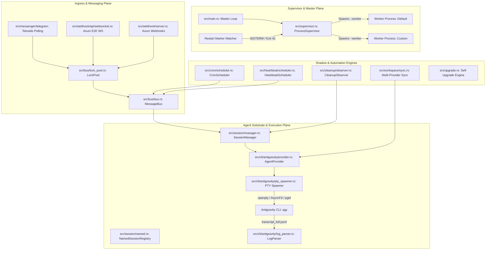
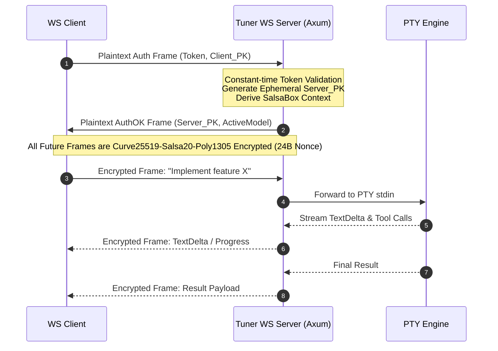
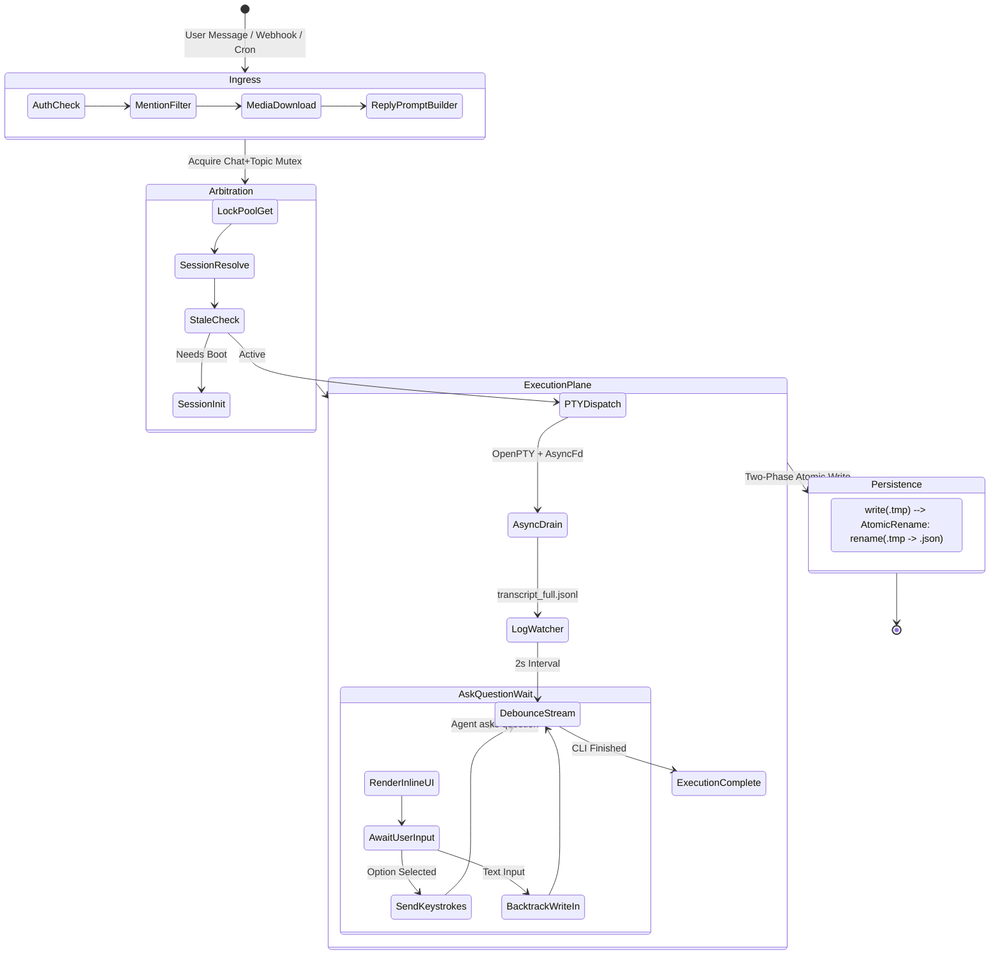

# tuner

[](https://github.com/imwoo90/tuner/actions)
[](https://opensource.org/licenses/MIT)

`tuner` supervises and orchestrates the execution of the Antigravity CLI (`agy`), providing real-time Telegram messenger integration, virtual PTY session management, idle background turn observation, webhook ingress, and multi-language localized agent sessions.

---

## 🚀 Quick Start Guide

### Step 1: Verify Antigravity CLI (`agy`)
Ensure the Antigravity CLI (`agy`) is installed and authenticated on your machine:
```bash
agy --version
```

### Step 2: Run One-Line Installer
Install the latest `tuner` release binary and required assets to `~/.tuner/bin/`:
```bash
curl -fsSL https://raw.githubusercontent.com/imwoo90/tuner/main/install.sh | bash
```

### Step 3: Run Interactive Setup & Service Registration
Launch the setup wizard to configure your Telegram bot token, allowed user IDs, and register systemd daemon:
```bash
~/.tuner/bin/tuner --setup
```

---

## 📲 Telegram Bot Setup Guide

Connecting Tuner to Telegram takes just 3 simple steps:

1. **Get Bot Token**:
   - Open Telegram and message [@BotFather](https://t.me/BotFather).
   - Create a bot (`/newbot`) and copy the **HTTP API Token**.
2. **Get Your Telegram User ID**:
   - Message [@userinfobot](https://t.me/userinfobot) to get your numerical Telegram User ID.
3. **Run Setup Wizard**:
   - Run `~/.tuner/bin/tuner --setup` and enter your Bot Token & User ID.

> 💡 **Group / Supergroup Setup**:
> If adding the bot to a group chat or topic thread, invite the bot and **promote it to Administrator** (enabling message reading) to bypass Telegram's default Privacy Mode.

<details>
<summary><b>⚙️ Manual Configuration Schema (`~/.tuner/config/config.json`)</b></summary>

```json
{
  "telegram_token": "YOUR_TELEGRAM_BOT_TOKEN",
  "allowed_user_ids": [123456789],
  "allowed_group_ids": [-100123456789],
  "provider": "antigravity",
  "model": "gemini-3.6-flash",
  "effort": "high",
  "language": "en",
  "timezone": "Asia/Seoul"
}
```
</details>

---

## 🤖 Telegram Slash Commands

| Command | Description |
|---|---|
| `/new` \| `/reset` | Clear the current conversation and start a fresh session. |
| `/status` | Generate bot health reports, agy CLI installation info, and active session model. |
| `/model` | Toggle the active LLM model for the current topic via an inline selector. |
| `/effort` | Select the reasoning effort level (high, medium, low) for the current LLM model. |
| `/lang` | Select the active session language (English, Korean, etc.) via an inline keyboard. |
| `/upgrade` | Check GitHub Releases and perform an in-place executable upgrade. |
| `/memory` | Output the current content of the workspace `MAINMEMORY.md` file. |
| `/stop` | Gracefully cancel active agent CLI processes running in the current chat topic. |
| `/abort` | Forcefully terminate all running workers and background tasks. |
| `/restart` | Request a clean restart of the `tuner` bot daemon process. |
| `/plan` | Prompt the agent to generate a structured execution plan before running. |
| `/grill_me` | Launch an interactive interview to align requirements and refine plans. |
| `/goal` | Launch a long-running, thorough task (e.g. overnight thorough execution). |
| `/learn` | Capture behavioral corrections or feedback and bind them to agent memory. |
| `/teamwork_preview` | Run a collaborative multi-agent simulation workflow. |

---

## 🤝 Development & Contribution Guide

We welcome contributions! To maintain stability between production environments and active development, we follow an isolated containerized workflow with separate Telegram bot tokens.

### 🏗️ Architecture Layout
- **Production Environment**: Runs official GitHub Releases on the Host PC/server (supervised via `systemd` or `tuner` master daemon).
- **Development Environment**: Runs inside an isolated Docker container (`tuner-sandbox`) linked to a separate Telegram Dev Bot Token, sharing host `agy` authentication and state seamlessly.

### 🛠️ Setting Up Local Development

1. **Verify Host Prerequisites**:
   Ensure `agy` CLI is installed and authenticated on your host machine:
   ```bash
   agy --version
   ```

2. **Start the Sandbox Container**:
   Launch the development sandbox container via Docker Compose (automatically maps your user ID, `$HOME`, `agy` credentials, and `~/.tuner-dev` workspace):
   ```bash
   docker compose up -d
   ```

3. **Configure Development Bot Token**:
   Set your dedicated Telegram Dev Bot Token and allowed user ID in `~/.tuner-dev/profiles/default/config/config.json`:
   ```json
   {
     "telegram_token": "YOUR_DEV_TELEGRAM_BOT_TOKEN",
     "allowed_user_ids": [123456789],
     "language": "ko",
     "model": "gemini-3.7-flash",
     "effort": "high"
   }
   ```

### 🔄 Real-Time Build & Deploy Workflow
To test changes to source code (`src/`) or assets (`_home_defaults/`) in real-time:

```bash
# Run the automated dev deployment script
bash scripts/dev_deploy.sh
```

The `dev_deploy.sh` script automatically:
1. Compiles the latest release binary (`cargo build --release`).
2. Syncs the binary & `_home_defaults` asset folder to `tuner-sandbox`.
3. Auto-restarts the container worker daemon (`tuner --worker default`).

### 🔀 Submitting Contributions (Pull Requests)
1. Fork the repository and create a feature branch (`git checkout -b feature/my-feature`).
2. Ensure all tests pass: `cargo test`.
3. Verify live behavior in the dev container with `bash scripts/dev_deploy.sh`.
4. Push your branch to your fork and submit a **Pull Request (PR)** targeting the `main` branch.

### 🚀 Maintainer Release Workflow
*(For repository maintainers only)*
To publish an official release:
1. Update version numbers in `Cargo.toml` and run `cargo check` to update `Cargo.lock`.
2. Commit with release notes: `git commit -m "bump: release v0.1.x"`
3. Push `main` to the `release` branch:
   ```bash
   git push origin main:release
   ```
   GitHub Actions will automatically verify the build, generate tag `v0.1.x`, and publish binaries to GitHub Releases.

---

<details open>
<summary><b>🏛️ System Architecture: Tuner Daemon & Autonomous Bridge (Dialectically Certified)</b></summary>

### 1. Universal System Ontology & Dual-Mode Topography

**`tuner`** (internally referenced as **Ductor**) is a mission-critical, concurrent agentic daemon written in safe, asynchronous Rust on the Tokio runtime. It functions as an autonomous supervisory control plane and multiplexer bridging conversational frontends (Telegram Bot API, End-to-End Encrypted WebSockets, HTTP REST/Webhooks) to local agent runtime substrates (Antigravity CLI / `agy`, Claude CLI, Codex CLI, Gemini CLI).

```
+----------------------------------------------------------------------------------------------------+
|                                           TUNER DAEMON                                             |
|                                                                                                    |
|  [Ingress Transports]              [Unified Message Bus]                 [Agent Execution Plane]   |
|  - Telegram Bot (Teloxide)         - LockPool (Weak Mutexes)             - PTY Spawner (openpty)   |
|  - E2E WebSockets (Curve25519)     - 3-Tier Priority Arbitrator          - Headless Pipe Fallback  |
|  - Axum Webhooks & REST     ===>   - Envelope Protocol            ===>   - Log Parser (JSONL)      |
|  - Autonomous Schedulers           - Multi-Provider Skill Sync           - Interactive Stdin Pipe  |
|  - i18n Localization Engine        - Two-Phase Atomic Commits            - Process Group SIGKILL   |
+----------------------------------------------------------------------------------------------------+
```

#### Dual-Mode Master-Supervisor Topology
1. **Master / Supervisor Mode** ([`src/main.rs`](file:///home/wimvm/.tuner/profiles/default/workspace/projects/tuner/src/main.rs#L195-L216), [`src/supervisor.rs`](file:///home/wimvm/.tuner/profiles/default/workspace/projects/tuner/src/supervisor.rs#L16-L66)): Operates as a root supervisor daemon managing child profile workers (`tuner --worker <profile>`), monitoring heartbeats via non-blocking process polling (`child.try_wait()`), executing exponential crash backoffs ($\min(2^n, 30.0)\text{s}$), and watching for IPC restart markers (`~/.tuner/restart-requested` $\to$ Exit Code `42`).
2. **Worker Mode** ([`src/main.rs`](file:///home/wimvm/.tuner/profiles/default/workspace/projects/tuner/src/main.rs#L161-L193), [`src/messenger/telegram/runner.rs`](file:///home/wimvm/.tuner/profiles/default/workspace/projects/tuner/src/messenger/telegram/runner.rs#L85-L113), [`src/webhook/server.rs`](file:///home/wimvm/.tuner/profiles/default/workspace/projects/tuner/src/webhook/server.rs#L34-L92)): Executes dedicated profile instances, managing isolated workspaces, pseudo-terminal pools, encrypted message routers, session persistence engines, and background schedulers.


```mermaid
flowchart TB
    subgraph SupervisorPlane [Supervisor & Master Plane]
        Main[src/main.rs: Master Loop]
        Super[src/supervisor.rs: ProcessSupervisor]
        RestartWatcher[Restart Marker Watcher]
        Main --> Super
        Super -->|Spawns --worker <profile>| WorkerA[Worker Process: Default]
        Super -->|Spawns --worker <profile>| WorkerB[Worker Process: Custom]
        RestartWatcher -->|SIGTERM / Exit 42| Super
    end

    subgraph IngressTransports [Ingress & Messaging Plane]
        TG[src/messenger/telegram: Teloxide Polling]
        WS[src/webhook/api/websocket.rs: Axum E2E WS]
        WH[src/webhook/server.rs: Axum Webhooks]
        Bus[src/bus/bus.rs: MessageBus]
        Lock[src/bus/lock_pool.rs: LockPool]
        
        TG --> Lock
        WS --> Lock
        WH --> Lock
        Lock --> Bus
    end

    subgraph CoreRuntimes [Agent Substrate & Execution Plane]
        SessMgr[src/session/manager.rs: SessionManager]
        NamedReg[src/session/named.rs: NamedSessionRegistry]
        Provider[src/cli/antigravity/provider.rs: AgentProvider]
        PTY[src/cli/antigravity/pty_spawner.rs: PTY Spawner]
        Parser[src/cli/antigravity/log_parser.rs: LogParser]
        
        Bus --> SessMgr
        SessMgr --> Provider
        Provider --> PTY
        PTY -->|openpty / AsyncFd / pgid| AgyCLI[Antigravity CLI: agy]
        AgyCLI -->|transcript_full.jsonl| Parser
    end

    subgraph AuxiliaryShadowPlanes [Shadow & Automation Engines]
        Cron[src/cron/scheduler.rs: CronScheduler]
        HB[src/heartbeat/scheduler.rs: HeartbeatScheduler]
        Clean[src/cleanup/observer.rs: CleanupObserver]
        Sync[src/workspace/sync.rs: Multi-Provider Sync]
        Upgrade[src/upgrade.rs: Self-Upgrade Engine]
        
        Cron --> Bus
        HB --> Bus
        Clean --> SessMgr
        Sync --> Provider
    end
```

---

### 2. Topographical Cartography of the 9 Functional Planes

| Functional Plane | Responsibilities & Core Files | Source Invariants |
|---|---|---|
| **1. Supervisor & Lifecycle** | Master supervisor daemon, exponential crash backoff, signal escalation (`SIGTERM` $\to$ `SIGKILL`), zero-downtime self-upgrades | [`src/main.rs`](file:///home/wimvm/.tuner/profiles/default/workspace/projects/tuner/src/main.rs)<br>[`src/supervisor.rs`](file:///home/wimvm/.tuner/profiles/default/workspace/projects/tuner/src/supervisor.rs)<br>[`src/upgrade.rs`](file:///home/wimvm/.tuner/profiles/default/workspace/projects/tuner/src/upgrade.rs) |
| **2. Message Bus & Locking** | Envelope routing across 10 origins, weak-reference mutex pool (`LockPool`), deadlock-free single-lock discipline | [`src/bus/bus.rs`](file:///home/wimvm/.tuner/profiles/default/workspace/projects/tuner/src/bus/bus.rs)<br>[`src/bus/lock_pool.rs`](file:///home/wimvm/.tuner/profiles/default/workspace/projects/tuner/src/bus/lock_pool.rs)<br>[`src/bus/envelope.rs`](file:///home/wimvm/.tuner/profiles/default/workspace/projects/tuner/src/bus/envelope.rs) |
| **3. Session & Persistence** | Two-phase atomic `.tmp` $\to$ `rename` storage, mnemonic names (`swift-fox`), timezone daily resets, topic migration | [`src/session/manager.rs`](file:///home/wimvm/.tuner/profiles/default/workspace/projects/tuner/src/session/manager.rs)<br>[`src/session/named.rs`](file:///home/wimvm/.tuner/profiles/default/workspace/projects/tuner/src/session/named.rs)<br>[`src/session/freshness.rs`](file:///home/wimvm/.tuner/profiles/default/workspace/projects/tuner/src/session/freshness.rs) |
| **4. Agent CLI Substrate** | UNIX PTY spawner (`openpty`), `AsyncFd` non-blocking drain, JSONL streaming, headless pipe fallback (`Stdio::piped`) | [`src/cli/antigravity/pty_spawner.rs`](file:///home/wimvm/.tuner/profiles/default/workspace/projects/tuner/src/cli/antigravity/pty_spawner.rs)<br>[`src/cli/antigravity/provider.rs`](file:///home/wimvm/.tuner/profiles/default/workspace/projects/tuner/src/cli/antigravity/provider.rs)<br>[`src/cli/antigravity/log_parser.rs`](file:///home/wimvm/.tuner/profiles/default/workspace/projects/tuner/src/cli/antigravity/log_parser.rs) |
| **5. E2E Crypto & Webhooks** | Curve25519-Salsa20-Poly1305 encrypted WebSockets, Diffie-Hellman handshake, HMAC-SHA256 authentication | [`src/webhook/api/crypto.rs`](file:///home/wimvm/.tuner/profiles/default/workspace/projects/tuner/src/webhook/api/crypto.rs)<br>[`src/webhook/server.rs`](file:///home/wimvm/.tuner/profiles/default/workspace/projects/tuner/src/webhook/server.rs)<br>[`src/webhook/auth.rs`](file:///home/wimvm/.tuner/profiles/default/workspace/projects/tuner/src/webhook/auth.rs) |
| **6. Workspace & Skills Sync** | Cross-provider rule deployment (`CLAUDE.md`, `AGENTS.md`, `GEMINI.md`), skill symlinking across `.claude`/`.codex`/`.gemini` | [`src/workspace/rules.rs`](file:///home/wimvm/.tuner/profiles/default/workspace/projects/tuner/src/workspace/rules.rs)<br>[`src/workspace/skills.rs`](file:///home/wimvm/.tuner/profiles/default/workspace/projects/tuner/src/workspace/skills.rs)<br>[`src/workspace/paths.rs`](file:///home/wimvm/.tuner/profiles/default/workspace/projects/tuner/src/workspace/paths.rs) |
| **7. Automations & Observers** | Timezone-aware cron tasks with memory enrichment, quiet-hour heartbeat diagnostics, 30-day storage hygiene | [`src/cron/scheduler.rs`](file:///home/wimvm/.tuner/profiles/default/workspace/projects/tuner/src/cron/scheduler.rs)<br>[`src/heartbeat/scheduler.rs`](file:///home/wimvm/.tuner/profiles/default/workspace/projects/tuner/src/heartbeat/scheduler.rs)<br>[`src/cleanup/observer.rs`](file:///home/wimvm/.tuner/profiles/default/workspace/projects/tuner/src/cleanup/observer.rs) |
| **8. Telegram & UI Stream** | Debounced 2s streaming, stack-based HTML tag chunking, bitmap multi-select and write-in backtracking UI | [`src/messenger/telegram/stream.rs`](file:///home/wimvm/.tuner/profiles/default/workspace/projects/tuner/src/messenger/telegram/stream.rs)<br>[`src/messenger/telegram/formatting/`](file:///home/wimvm/.tuner/profiles/default/workspace/projects/tuner/src/messenger/telegram/formatting.rs)<br>[`src/messenger/telegram/ask_process.rs`](file:///home/wimvm/.tuner/profiles/default/workspace/projects/tuner/src/messenger/telegram/ask_process.rs) |
| **9. Security & Localization** | Path traversal sandboxing, fullwidth Unicode injection defense, 9-language async task-local scoping (`TASK_ACTIVE_LANG`) | [`src/security/paths.rs`](file:///home/wimvm/.tuner/profiles/default/workspace/projects/tuner/src/security/paths.rs)<br>[`src/security/content.rs`](file:///home/wimvm/.tuner/profiles/default/workspace/projects/tuner/src/security/content.rs)<br>[`src/i18n/mod.rs`](file:///home/wimvm/.tuner/profiles/default/workspace/projects/tuner/src/i18n/mod.rs) |

---

### 3. The Shadow Planes: Unveiling Non-Conversational Bastions

#### 3.1 Multi-Provider Rule & Skill Synchronization Engine
`tuner` automatically discovers authenticated providers (Claude, Codex, Gemini, Antigravity), deploys matching rule templates (`RULES-{variant}.md` $\to$ `CLAUDE.md`, `AGENTS.md`, `GEMINI.md`), and purges stale rule files for unauthenticated engines ([`src/workspace/rules.rs`](file:///home/wimvm/.tuner/profiles/default/workspace/projects/tuner/src/workspace/rules.rs)). It scans all skills with valid YAML/TOML frontmatter in `SKILL.md` and establishes bidirectional symlinks across provider directories (`.claude/skills`, `.codex/skills`, `.gemini/skills`) with canonical precedence: `ductor` > `claude` > `codex` > `gemini` ([`src/workspace/skills.rs`](file:///home/wimvm/.tuner/profiles/default/workspace/projects/tuner/src/workspace/skills.rs)).

#### 3.2 Full-Duplex E2E Encrypted WebSockets (Curve25519-Salsa20-Poly1305)
For external runners and headless frontends, `tuner` hosts an authenticated, end-to-end encrypted WebSocket server ([`src/webhook/api/crypto.rs`](file:///home/wimvm/.tuner/profiles/default/workspace/projects/tuner/src/webhook/api/crypto.rs)):
1. **Handshake**: Client submits plaintext `auth` frame containing Bearer Token and Curve25519 public key. Server validates token in constant time, generates an ephemeral Curve25519 keypair, derives a shared symmetric secret via Diffie-Hellman (`SalsaBox`), and returns `auth_ok`.
2. **Encrypted Frame Stream**: All subsequent bidirectional frames (text deltas, tool previews, interactive queries) are sealed with unique 24-byte random nonces prepended to Poly1305 authenticated ciphertexts.


```mermaid
sequenceDiagram
    autonumber
    participant Client as WS Client
    participant Server as Tuner WS Server (Axum)
    participant Core as PTY Engine

    Client->>Server: Plaintext Auth Frame (Token, Client_PK)
    Note over Server: Constant-time Token Validation<br/>Generate Ephemeral Server_PK<br/>Derive SalsaBox Context
    Server->>Client: Plaintext AuthOK Frame (Server_PK, ActiveModel)
    Note over Client,Server: All Future Frames are Curve25519-Salsa20-Poly1305 Encrypted (24B Nonce)

    Client->>Server: Encrypted Frame: "Implement feature X"
    Server->>Core: Forward to PTY stdin
    Core-->>Server: Stream TextDelta & Tool Calls
    Server-->>Client: Encrypted Frame: TextDelta / Progress
    Core-->>Server: Final Result
    Server-->>Client: Encrypted Frame: Result Payload
```

#### 3.3 Internationalization (i18n) Engine with Task-Local Scoping
- Supports 9 languages (`en`, `de`, `nl`, `es`, `fr`, `id`, `pt`, `ru`, `ko`) loaded from flattened TOML catalogs with English fallback ([`src/i18n/loader.rs`](file:///home/wimvm/.tuner/profiles/default/workspace/projects/tuner/src/i18n/loader.rs)).
- Uses `tokio::task_local! { pub static TASK_ACTIVE_LANG: String; }` to isolate language contexts per asynchronous task without global mutex contention.
- Implements `t!` macro for dot-syntax argument interpolation (`{name}`, `{count}`) and `t_plural!` for linguistic pluralization.

#### 3.4 Zero-Downtime Autonomous Self-Upgrade Engine
[`src/upgrade.rs`](file:///home/wimvm/.tuner/profiles/default/workspace/projects/tuner/src/upgrade.rs) queries GitHub Releases, streams `.tar.gz` assets, verifies semver tags, unpacks binaries into temporary files with `0o755` permissions, performs atomic executable replacement via `fs::rename`, and triggers master supervisor restart with Exit Code `42`.

---

### 4. End-to-End Macro-Lifecycles & Dynamic State Machine


```mermaid
stateDiagram-v2
    [*] --> Ingress: User Message / Webhook / Cron
    
    state Ingress {
        direction LR
        AuthCheck --> MentionFilter
        MentionFilter --> MediaDownload
        MediaDownload --> ReplyPromptBuilder
    }

    Ingress --> Arbitration: Acquire Chat+Topic Mutex
    
    state Arbitration {
        direction TB
        LockPoolGet --> SessionResolve
        SessionResolve --> StaleCheck
        StaleCheck --> SessionInit: Needs Boot
        StaleCheck --> PTYDispatch: Active
    }

    state ExecutionPlane {
        direction TB
        PTYDispatch --> AsyncDrain: OpenPTY + AsyncFd
        AsyncDrain --> LogWatcher: transcript_full.jsonl
        LogWatcher --> DebounceStream: 2s Interval
        DebounceStream --> AskQuestionWait: Agent asks question
        DebounceStream --> ExecutionComplete: CLI Finished
    }

    state AskQuestionWait {
        direction LR
        RenderInlineUI --> AwaitUserInput
        AwaitUserInput --> SendKeystrokes: Option Selected
        AwaitUserInput --> BacktrackWriteIn: Text Input
        SendKeystrokes --> DebounceStream
        BacktrackWriteIn --> DebounceStream
    }

    Arbitration --> ExecutionPlane
    ExecutionPlane --> Persistence: Two-Phase Atomic Write
    
    state Persistence {
        direction LR
        WriteTemp: write(.tmp) --> AtomicRename: rename(.tmp -> .json)
    }

    Persistence --> [*]
```

#### 4.1 Interactive Question State Machine (`AskQuestion`)
When an agent calls `ask_question` or `ask_permission` ([`src/messenger/telegram/ask_process.rs`](file:///home/wimvm/.tuner/profiles/default/workspace/projects/tuner/src/messenger/telegram/ask_process.rs)):
1. PTY execution pauses awaiting standard input.
2. Bot renders dynamic inline keyboards supporting single-select buttons or multi-select checklists tracked in bitmap strings (`10100`).
3. Direct write-in text responses send backspace erasure sequences (`\x7F` $\times N$) to PTY stdin followed by newline confirmation (`\r`).
4. Navigation controls support backtracking to previous questions (`\x1B[D`) and skipping (`\x1B`).

#### 4.2 Two-Phase Atomic Persistence
All state mutations across `SessionManager`, `NamedSessionRegistry`, `CronManager`, and `WebhookManager` serialize data into `.tmp` files before invoking atomic POSIX `fs::rename()`. Power loss or sudden kernel panics never result in truncated or corrupted JSON state files.

---

### 5. The 5 Supreme Invariant Defenses


```mermaid
flowchart TD
    subgraph Def1 [Invariant 1: Deadlock Elimination]
        D1A["LockPool::get(chat_id, topic_id)"] --> D1B["Weak<TokioMutex<()>> Reference Pool"]
        D1B --> D1C["Auto-Pruning of Dead Weak Locks"]
        D1C --> D1D["Independent Cross-Chat Execution"]
    end

    subgraph Def2 [Invariant 2: Substrate Degradation]
        D2A["PTY openpty() Failure / Non-Unix"] --> D2B["Fallback to Headless stdio Pipes"]
        D2B --> D2C["Direct Pipe Draining"]
    end

    subgraph Def3 [Invariant 3: Silent Compute Liveness]
        D3A["PTY Buffer Silent"] --> D3B["child.try_wait() Status Check"]
        D3B --> D3C["transcript_full.jsonl Size Delta Detection"]
        D3C --> D3D["Zero Zombie Hangs"]
    end

    subgraph Def4 [Invariant 4: Multi-Byte UTF-8 Safety]
        D4A["Arbitrary Byte Chunk"] --> D4B["char_indices() / c.len_utf8()"]
        D4B --> D4C["Exact Character Boundary Slicing"]
    end

    subgraph Def5 [Invariant 5: Stack-Based HTML Balancing]
        D5A["4000-Char Limit Exceeded"] --> D5B["Tokenize Tags & Text"]
        D5B --> D5C["Stack Track: open_tags"]
        D5C --> D5D["Inject Closing Tags at Split"]
        D5D --> D5E["Re-open Tags in Next Chunk"]
    end
```

| Invariant Defense | Failure Mode Prevented | Exact Code Implementation |
|---|---|---|
| **1. Deadlock Elimination** | Circular wait locks across concurrent sessions | [`src/bus/lock_pool.rs`](file:///home/wimvm/.tuner/profiles/default/workspace/projects/tuner/src/bus/lock_pool.rs#L58-L74): Granular `Weak<TokioMutex<()>>` pool ($|\text{Locks}| \le 1 \implies \text{Deadlock} = \emptyset$). Dead weak refs auto-pruned on retrieval. |
| **2. Substrate Invariance** | PTY `/dev/pts` allocation failure in rootless containers | [`src/cli/antigravity/provider.rs`](file:///home/wimvm/.tuner/profiles/default/workspace/projects/tuner/src/cli/antigravity/provider.rs#L94-L125): Automatic fallback from `openpty` to headless standard async pipes (`Stdio::piped()`) with `TERM=dumb`, `NO_COLOR=1`, and `CI=1`. |
| **3. Silent Compute Liveness** | False-positive timeouts during 40s silent compilation | [`src/cli/antigravity/polling.rs`](file:///home/wimvm/.tuner/profiles/default/workspace/projects/tuner/src/cli/antigravity/polling.rs#L148-L178): 500ms non-blocking `child.try_wait()` kernel sweeps verify process table liveness during zero-stdout compute. |
| **4. UTF-8 Boundary Safety** | Multi-byte character corruption when slicing strings | [`src/messenger/telegram/formatting/splitting.rs`](file:///home/wimvm/.tuner/profiles/default/workspace/projects/tuner/src/messenger/telegram/formatting/splitting.rs#L12-L26): `split_at_char_limit` iterates on `chars()` and accumulates `c.len_utf8()`, preventing mid-character byte cuts. |
| **5. Stack-Based HTML Balancing** | Telegram API 400 errors from unclosed formatting tags | [`src/messenger/telegram/formatting/splitting.rs`](file:///home/wimvm/.tuner/profiles/default/workspace/projects/tuner/src/messenger/telegram/formatting/splitting.rs#L28-L156): `open_tags: Vec<String>` stack automatically synthesizes closing tags for Chunk $N$ and reopens them in Chunk $N+1$. |
</details>

---

## 🧪 Testing

`tuner` features an extensive test suite verifying 385+ test cases to ensure stability:

```bash
# Run all unit and integration tests
cargo test
```

---

## 📄 License
This project is licensed under the [MIT License](LICENSE).
