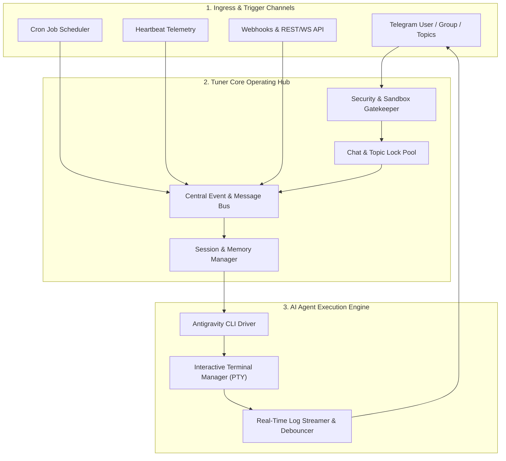
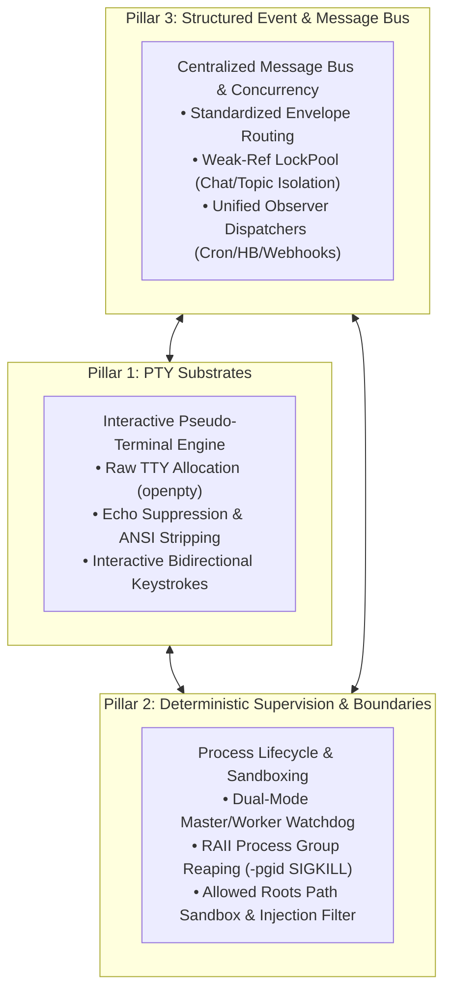
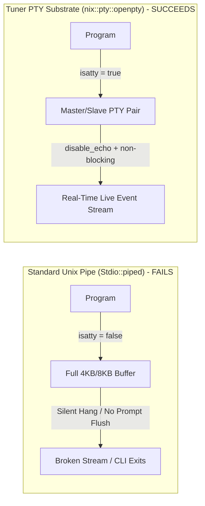
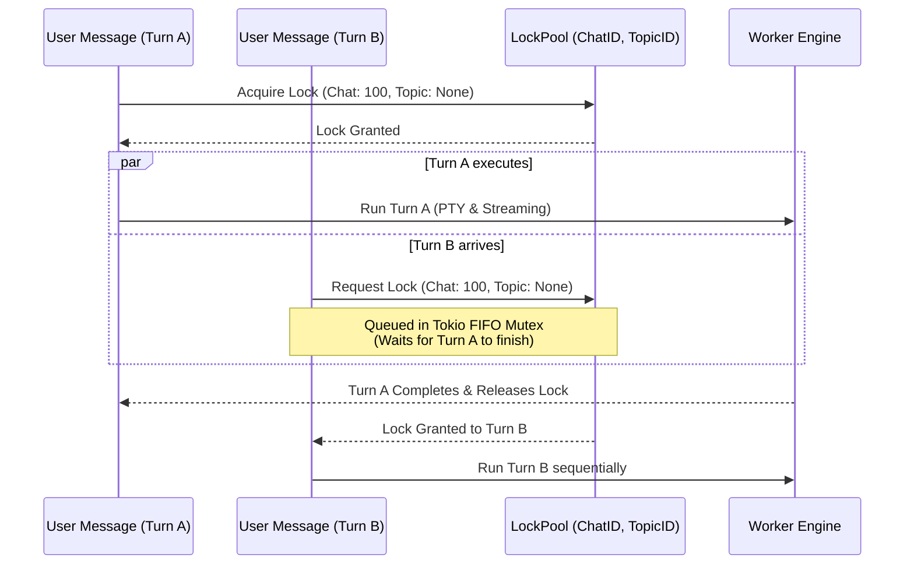
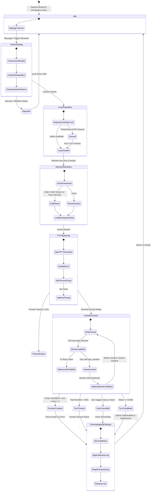
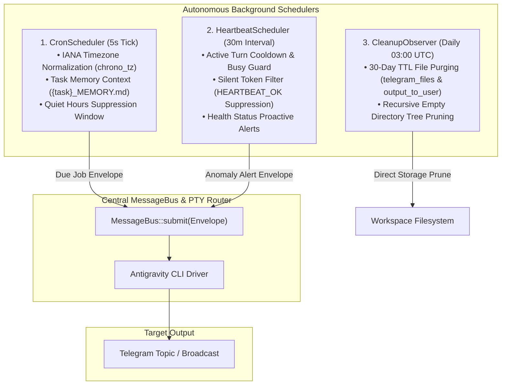

# tuner

[](https://github.com/imwoo90/tuner/actions)
[](https://opensource.org/licenses/MIT)

`tuner` supervises and orchestrates the execution of the Antigravity CLI (`agy`), providing real-time Telegram messenger integration, virtual PTY session management, idle background turn observation, webhook ingress, and multi-language localized agent sessions.

---

## 🚀 Quick Start Guide

### Step 1: Verify Antigravity CLI (`agy`)
Ensure the Antigravity CLI (`agy`) is installed and authenticated on your machine:
```bash
agy --version
```

### Step 2: Run One-Line Installer
Install the latest `tuner` release binary and required assets to `~/.tuner/bin/`:
```bash
curl -fsSL https://raw.githubusercontent.com/imwoo90/tuner/main/install.sh | bash
```

### Step 3: Run Interactive Setup & Service Registration
Launch the setup wizard to configure your Telegram bot token, allowed user IDs, and register systemd daemon:
```bash
~/.tuner/bin/tuner --setup
```

---

## 📲 Telegram Bot Setup Guide

Connecting Tuner to Telegram takes just 3 simple steps:

1. **Get Bot Token**:
   - Open Telegram and message [@BotFather](https://t.me/BotFather).
   - Create a bot (`/newbot`) and copy the **HTTP API Token**.
2. **Get Your Telegram User ID**:
   - Message [@userinfobot](https://t.me/userinfobot) to get your numerical Telegram User ID.
3. **Run Setup Wizard**:
   - Run `~/.tuner/bin/tuner --setup` and enter your Bot Token & User ID.

> 💡 **Group / Supergroup Setup**:
> If adding the bot to a group chat or topic thread, invite the bot and **promote it to Administrator** (enabling message reading) to bypass Telegram's default Privacy Mode.

<details>
<summary><b>⚙️ Manual Configuration Schema (`~/.tuner/config/config.json`)</b></summary>

```json
{
  "telegram_token": "YOUR_TELEGRAM_BOT_TOKEN",
  "allowed_user_ids": [123456789],
  "allowed_group_ids": [-100123456789],
  "provider": "antigravity",
  "model": "gemini-3.6-flash",
  "effort": "high",
  "language": "en",
  "timezone": "Asia/Seoul"
}
```
</details>

---

## 🤖 Telegram Slash Commands

| Command | Description |
|---|---|
| `/new` \| `/reset` | Clear the current conversation and start a fresh session. |
| `/status` | Generate bot health reports, agy CLI installation info, and active session model. |
| `/model` | Toggle the active LLM model for the current topic via an inline selector. |
| `/effort` | Select the reasoning effort level (high, medium, low) for the current LLM model. |
| `/lang` | Select the active session language (English, Korean, etc.) via an inline keyboard. |
| `/upgrade` | Check GitHub Releases and perform an in-place executable upgrade. |
| `/memory` | Output the current content of the workspace `MAINMEMORY.md` file. |
| `/stop` | Gracefully cancel active agent CLI processes running in the current chat topic. |
| `/abort` | Forcefully terminate all running workers and background tasks. |
| `/restart` | Request a clean restart of the `tuner` bot daemon process. |
| `/plan` | Prompt the agent to generate a structured execution plan before running. |
| `/grill_me` | Launch an interactive interview to align requirements and refine plans. |
| `/goal` | Launch a long-running, thorough task (e.g. overnight thorough execution). |
| `/learn` | Capture behavioral corrections or feedback and bind them to agent memory. |
| `/teamwork_preview` | Run a collaborative multi-agent simulation workflow. |

---

## 🤝 Development & Contribution Guide

We welcome contributions! To maintain stability between production environments and active development, we follow an isolated containerized workflow with separate Telegram bot tokens.

### 🏗️ Architecture Layout
- **Production Environment**: Runs official GitHub Releases on the Host PC/server (supervised via `systemd` or `tuner` master daemon).
- **Development Environment**: Runs inside an isolated Docker container (`tuner-sandbox`) linked to a separate Telegram Dev Bot Token, sharing host `agy` authentication and state seamlessly.

### 🛠️ Setting Up Local Development

1. **Verify Host Prerequisites**:
   Ensure `agy` CLI is installed and authenticated on your host machine:
   ```bash
   agy --version
   ```

2. **Start the Sandbox Container**:
   Launch the development sandbox container via Docker Compose (automatically maps your user ID, `$HOME`, `agy` credentials, and `~/.tuner-dev` workspace):
   ```bash
   docker compose up -d
   ```

3. **Configure Development Bot Token**:
   Set your dedicated Telegram Dev Bot Token and allowed user ID in `~/.tuner-dev/profiles/default/config/config.json`:
   ```json
   {
     "telegram_token": "YOUR_DEV_TELEGRAM_BOT_TOKEN",
     "allowed_user_ids": [123456789],
     "language": "ko",
     "model": "gemini-3.7-flash",
     "effort": "high"
   }
   ```

### 🔄 Real-Time Build & Deploy Workflow
To test changes to source code (`src/`) or assets (`_home_defaults/`) in real-time:

```bash
# Run the automated dev deployment script
bash scripts/dev_deploy.sh
```

The `dev_deploy.sh` script automatically:
1. Compiles the latest release binary (`cargo build --release`).
2. Syncs the binary & `_home_defaults` asset folder to `tuner-sandbox`.
3. Auto-restarts the container worker daemon (`tuner --worker default`).

### 🔀 Submitting Contributions (Pull Requests)
1. Fork the repository and create a feature branch (`git checkout -b feature/my-feature`).
2. Ensure all tests pass: `cargo test`.
3. Verify live behavior in the dev container with `bash scripts/dev_deploy.sh`.
4. Push your branch to your fork and submit a **Pull Request (PR)** targeting the `main` branch.

### 🚀 Maintainer Release Workflow
*(For repository maintainers only)*
To publish an official release:
1. Update version numbers in `Cargo.toml` and run `cargo check` to update `Cargo.lock`.
2. Commit with release notes: `git commit -m "bump: release v0.1.x"`
3. Push `main` to the `release` branch:
   ```bash
   git push origin main:release
   ```
   GitHub Actions will automatically verify the build, generate tag `v0.1.x`, and publish binaries to GitHub Releases.

---

<details open>
<summary><b>🏛️ System Architecture: The Tuner Operating Platform (Exp 5 Approved)</b></summary>

### 1. Executive Summary & Core Purpose

**Tuner** is a central operating platform and agent supervisor written in Rust. It bridges human communication channels (Telegram, Webhooks, REST/WS APIs) with local command-line AI engines (Google Antigravity `agy`, Claude Code, Codex) executing inside isolated pseudo-terminal environments.


```mermaid
flowchart TD
    subgraph Ingress ["1. Ingress & Trigger Channels"]
        TG["Telegram User / Group / Topics"]
        CRON["Cron Job Scheduler"]
        HB["Heartbeat Telemetry"]
        WH["Webhooks & REST/WS API"]
    end

    subgraph Core ["2. Tuner Core Operating Hub"]
        AUTH["Security & Sandbox Gatekeeper"]
        BUS["Central Event & Message Bus"]
        LOCK["Chat & Topic Lock Pool"]
        SESS["Session & Memory Manager"]
    end

    subgraph Execution ["3. AI Agent Execution Engine"]
        PTY["Interactive Terminal Manager (PTY)"]
        CLI["Antigravity CLI Driver"]
        LOGS["Real-Time Log Streamer & Debouncer"]
    end

    TG --> AUTH
    CRON --> BUS
    HB --> BUS
    WH --> BUS

    AUTH --> LOCK
    LOCK --> BUS
    BUS --> SESS
    SESS --> CLI
    CLI --> PTY
    PTY --> LOGS
    LOGS --> TG
```

---

### 2. Validation of the 3 Core Pillars


```mermaid
flowchart TD
    subgraph Pillar1 ["Pillar 1: PTY Substrates"]
        P1["Interactive Pseudo-Terminal Engine<br/>• Raw TTY Allocation (openpty)<br/>• Echo Suppression & ANSI Stripping<br/>• Interactive Bidirectional Keystrokes"]
    end

    subgraph Pillar2 ["Pillar 2: Deterministic Supervision & Boundaries"]
        P2["Process Lifecycle & Sandboxing<br/>• Dual-Mode Master/Worker Watchdog<br/>• RAII Process Group Reaping (-pgid SIGKILL)<br/>• Allowed Roots Path Sandbox & Injection Filter"]
    end

    subgraph Pillar3 ["Pillar 3: Structured Event & Message Bus"]
        P3["Centralized Message Bus & Concurrency<br/>• Standardized Envelope Routing<br/>• Weak-Ref LockPool (Chat/Topic Isolation)<br/>• Unified Observer Dispatchers (Cron/HB/Webhooks)"]
    end

    Pillar1 <--> Pillar2
    Pillar2 <--> Pillar3
    Pillar3 <--> Pillar1
```

- **Pillar 1: PTY Substrates (`cli/antigravity/pty_spawner.rs`)**: Creates non-blocking pseudo-terminals where CLI agents run as live terminal sessions, supporting live tool-use inspection, intermediate reasoning extraction, and multi-turn interactive questions.
- **Pillar 2: Deterministic Supervision & Boundaries (`supervisor.rs`, `security/`)**: Enforces supervisor crash recovery, process-group cleanup (`kill(-pgid, SIGKILL)` on drop), path traversal sandboxes (`validate_file_path`), and prompt injection defense (`detect_suspicious_patterns`).
- **Pillar 3: Structured Event & Message Bus (`bus/bus.rs`)**: Standardizes all actions (user messages, scheduled cron jobs, background tasks, webhooks, heartbeats) into structured `Envelope` packets with thread-safe `LockPool` synchronization.

---

### 3. PTY Jargon & Justification vs. Standard UNIX Pipes


```mermaid
flowchart LR
    subgraph PipeApproach ["Standard Unix Pipe (Stdio::piped) - FAILS"]
        P_IN["Program"] -->|isatty = false| P_BUF["Full 4KB/8KB Buffer"]
        P_BUF -->|Silent Hang / No Prompt Flush| P_OUT["Broken Stream / CLI Exits"]
    end

    subgraph PTYApproach ["Tuner PTY Substrate (nix::pty::openpty) - SUCCEEDS"]
        T_IN["Program"] -->|isatty = true| T_TTY["Master/Slave PTY Pair"]
        T_TTY -->|disable_echo + non-blocking| T_OUT["Real-Time Live Event Stream"]
    end
```

1. **`isatty()` Terminal Checks**: CLI engines call `isatty(STDIN_FILENO)`. When attached to standard pipes, `isatty()` returns `false`, causing the CLI to disable interactive prompts, turn off ANSI rendering, or abort interactive mode.
2. **Buffer Flushing (Block Buffering Deadlock)**: C/C++ runtimes switch to full block buffering (4KB/8KB) when stdout is not a TTY. Output is held in OS RAM instead of flushing line-by-line, causing silent hangs. `openpty` forces genuine line-by-line terminal flushing.
3. **Echo Cancellation**: Standard cooked TTY mode echoes typed stdin bytes back into stdout. Tuner removes `LocalFlags::ECHO` via `tcsetattr` at creation, preventing prompt echo corruption.
4. **ANSI Scrubbing**: Tuner uses compiled regex stripping (`\x1B(?:\[[0-9;?]*[a-zA-Z=hlm]|[\(\)][a-zA-Z0-9])`) for raw terminal output while reading structured machine logs (`transcript_full.jsonl`) for thinking and tool calls.

---

### 4. Process Failure Domains & Recovery

| Failure Scenario | Detection Mechanism | Tuner Mitigation Strategy | Relevant Code |
| :--- | :--- | :--- | :--- |
| **Silent Hang** | Dual timeout barriers: 15s PTY prompt init, 300s wall-clock turn limit. | Aborts future, drops `SessionHolder`, executes process-group annihilation, and returns actionable error. | [`cli/antigravity/provider.rs`](file:///home/wimvm/.tuner/profiles/default/workspace/projects/tuner/src/cli/antigravity/provider.rs) |
| **OOM / SIGSEGV / Crash** | Non-blocking `child.try_wait()` returns `Some(ExitStatus)` where `!status.success()`. | Catches non-zero exit codes immediately, parses error suggestions (API keys, PATH), marks session inactive. | [`cli/antigravity/polling.rs`](file:///home/wimvm/.tuner/profiles/default/workspace/projects/tuner/src/cli/antigravity/polling.rs) |
| **Rapid Crash Loop** | Supervisor tracks worker runtime (<10s = fast crash count). | Applies exponential backoff sleep $\min(2^{\text{count}}, 30.0)\text{s}$ to prevent CPU starvation. | [`supervisor.rs`](file:///home/wimvm/.tuner/profiles/default/workspace/projects/tuner/src/supervisor.rs#L44-L50) |
| **Orphan Sub-processes & Zombies** | Spawned processes are assigned a new Process Group ID (`process_group(0)` + `setsid()`). | **RAII Drop Reaping:** `SessionHolder::drop` issues `kill(-pgid, SIGKILL)` to instantly reap all child processes. | [`cli/antigravity/pty_spawner.rs`](file:///home/wimvm/.tuner/profiles/default/workspace/projects/tuner/src/cli/antigravity/pty_spawner.rs#L36-L46) |
| **User Manual Abort (`/stop`)** | Commands trigger `abort(chat_id, topic_id)`. | Evicts session holders from memory, which immediately invokes `Drop` and kills running processes. | [`telegram/commands.rs`](file:///home/wimvm/.tuner/profiles/default/workspace/projects/tuner/src/messenger/telegram/commands.rs) |

---

### 5. Concurrency, Race Conditions & Collision Avoidance


```mermaid
sequenceDiagram
    participant User1 as User Message (Turn A)
    participant User2 as User Message (Turn B)
    participant Pool as LockPool (ChatID, TopicID)
    participant Worker as Worker Engine

    User1->>Pool: Acquire Lock (Chat: 100, Topic: None)
    Pool-->>User1: Lock Granted
    par Turn A executes
        User1->>Worker: Run Turn A (PTY & Streaming)
    and Turn B arrives
        User2->>Pool: Request Lock (Chat: 100, Topic: None)
        Note over User2,Pool: Queued in Tokio FIFO Mutex<br/>(Waits for Turn A to finish)
    end
    Worker-->>User1: Turn A Completes & Releases Lock
    Pool-->>User2: Lock Granted to Turn B
    User2->>Worker: Run Turn B sequentially
```

1. **Granular Topic Isolation (`LockPool`)**: Locks are keyed by `(chat_id, Option<topic_id>)`. Turns within the same topic run strictly in FIFO sequence; distinct topics/chats execute in full parallelism. Dead locks are pruned dynamically via `Weak<TokioMutex<()>>`.
2. **Backpressure & 2-Second Rate Limiter**: Output deltas are buffered and throttled to at most once every 2 seconds (`last_edit.elapsed() >= Duration::from_secs(2)`), preventing Telegram HTTP 429 rate limit bans.
3. **Webhook Sliding Window Limiter**: Restricts incoming webhooks to the configured threshold (default 30 req/min).

---

### 6. Formal Agent Lifecycle State Machine


```mermaid
stateDiagram-v2
    [*] --> Idle: Daemon Booted & Schedulers Active

    state Idle {
        [*] --> WaitingForEvent
    }

    WaitingForEvent --> Authenticating : Message / Trigger Received
    
    state Authenticating {
        [*] --> CheckUserWhitelist
        CheckUserWhitelist --> CheckPathSandbox
        CheckPathSandbox --> CheckInjectionPatterns
    }

    Authenticating --> Rejected : Security / Whitelist Failure
    Rejected --> Idle : Log & Drop / Alert

    Authenticating --> LockAcquisition : Checks Passed
    
    state LockAcquisition {
        [*] --> RequestChatTopicLock
        RequestChatTopicLock --> LockGranted : Mutex Available
        RequestChatTopicLock --> Queued : Thread Busy (FIFO Queue)
        Queued --> LockGranted : Prior Turn Finishes
    }

    LockGranted --> SessionResolution : Resolve Key (Key & Model)
    
    state SessionResolution {
        [*] --> CheckFreshness
        CheckFreshness --> DailyReset : Stale (>Idle Timeout or Past 4:00 AM)
        CheckFreshness --> ReuseSession : Fresh
        DailyReset --> LoadWorkspaceRules
        ReuseSession --> LoadWorkspaceRules
    }

    SessionResolution --> PTYSpawning : Launch Engine

    state PTYSpawning {
        [*] --> OpenPTYDescriptor
        OpenPTYDescriptor --> DisableEcho
        DisableEcho --> SetProcessGroup
        SetProcessGroup --> WaitForPrompt : 15s Timer
    }

    PTYSpawning --> TimeoutFailure : Prompt Timeout (>15s)
    PTYSpawning --> ActiveExecution : Terminal Prompt Ready

    state ActiveExecution {
        [*] --> WritePrompt
        WritePrompt --> StreamLogDelta : Poll transcript_full.jsonl
        StreamLogDelta --> DebouncedChatEdit : 2s Rate Limiter
        StreamLogDelta --> InteractiveAsk : Tool calls ask_question
        InteractiveAsk --> WaitUserButtonCallback : Render Inline Keyboard
        WaitUserButtonCallback --> WritePrompt : Button Clicked / Answer Injected
    }

    ActiveExecution --> ProcessCrashed : OOM / SIGSEGV / Exit Code != 0
    ActiveExecution --> TurnTimeout : Total Runtime > 300s
    ActiveExecution --> UserCancelled : User triggers /stop or /abort
    ActiveExecution --> TurnCompleted : Status == DONE

    state TerminatingAndCleanup {
        [*] --> HarvestMetrics
        HarvestMetrics --> AppendHistoryLog
        AppendHistoryLog --> ReapProcessGroup
        ReapProcessGroup --> ReleaseLock
    }

    ProcessCrashed --> TerminatingAndCleanup : Parse Smart CLI Error
    TurnTimeout --> TerminatingAndCleanup : Format Timeout Notice
    UserCancelled --> TerminatingAndCleanup : Clean Termination
    TurnCompleted --> TerminatingAndCleanup : Deliver Deliverables & Attachments

    TerminatingAndCleanup --> Idle : Return to Ready
```

---

### 7. Memory Protection & Idempotency Guarantees

1. **Incremental Log Delta Polling**: Tuner tracks the exact byte offset (`prev_size`). Only newly appended bytes are read and parsed, avoiding unbounded multi-megabyte log buffering.
2. **Chunked Message Splitting**: Responses exceeding Telegram's 4096-character limit are automatically split into 4,000-character segments along valid HTML and markdown tag boundaries.
3. **Cryptographic Envelope Identifiers**: Every event envelope is tagged with a unique 12-character hex ID seeded via `/dev/urandom` and nanosecond timestamps, preventing duplicate processing.
4. **Media Group Debouncing**: Uploaded photo albums are debounced with a 500ms sliding timer, aggregating all media files into a single unified prompt.

---

### 8. Autonomous Scheduled Automations & Background Schedulers

Tuner is not just a reactive chat responder; it operates as an autonomous daemon running three independent background schedulers that execute without requiring human interaction:


```mermaid
flowchart TD
    subgraph Schedulers ["Autonomous Background Schedulers"]
        CRON["1. CronScheduler (5s Tick)<br/>• IANA Timezone Normalization (chrono_tz)<br/>• Task Memory Context ({task}_MEMORY.md)<br/>• Quiet Hours Suppression Window"]
        HB["2. HeartbeatScheduler (30m Interval)<br/>• Active Turn Cooldown & Busy Guard<br/>• Silent Token Filter (HEARTBEAT_OK Suppression)<br/>• Health Status Proactive Alerts"]
        CLEAN["3. CleanupObserver (Daily 03:00 UTC)<br/>• 30-Day TTL File Purging (telegram_files & output_to_user)<br/>• Recursive Empty Directory Tree Pruning"]
    end

    subgraph Bus ["Central MessageBus & PTY Router"]
        MB["MessageBus::submit(Envelope)"]
        PTY["Antigravity CLI Driver"]
    end

    subgraph Dest ["Target Output"]
        TG["Telegram Topic / Broadcast"]
    end

    CRON -->|Due Job Envelope| MB
    HB -->|Anomaly Alert Envelope| MB
    MB --> PTY
    PTY --> TG
    CLEAN -->|Direct Storage Prune| FS["Workspace Filesystem"]
```

1. **Timezone-Aware Cron Engine ([`CronScheduler`](file:///home/wimvm/.tuner/profiles/default/workspace/projects/tuner/src/cron/scheduler.rs) & [`CronManager`](file:///home/wimvm/.tuner/profiles/default/workspace/projects/tuner/src/cron/manager.rs))**:
   - Evaluates standard 5-part and 6-part cron expressions against the user's specific IANA timezone (e.g. `Asia/Seoul`, `America/New_York`).
   - Automatically enriches cron task prompts with persistent task-specific memory files (`{task}_MEMORY.md`).
   - Enforces **Quiet Hours** (`quiet_start` / `quiet_end`), suppressing non-critical scheduled job runs while the user is asleep.
2. **Heartbeat Health Telemetry ([`HeartbeatScheduler`](file:///home/wimvm/.tuner/profiles/default/workspace/projects/tuner/src/heartbeat/scheduler.rs))**:
   - Runs periodic self-health checks (default every 30 minutes) to confirm daemon and model readiness.
   - Skips checks if the chat is actively busy (`is_chat_busy`) or within cooldown periods.
   - **Silent Token Filter:** When the agent responds with the acknowledgment token `HEARTBEAT_OK`, the alert is suppressed to eliminate notification spam, alerting only on operational anomalies.
3. **Automated Storage Janitor ([`CleanupObserver`](file:///home/wimvm/.tuner/profiles/default/workspace/projects/tuner/src/cleanup/observer.rs))**:
   - Daily maintenance job (default 03:00 UTC) that purges media files and user deliverables older than the retention threshold (default 30 days) and prunes empty folder trees.
</details>

---

## 🧪 Testing

`tuner` features an extensive test suite verifying 385+ test cases to ensure stability:

```bash
# Run all unit and integration tests
cargo test
```

---

## 📄 License
This project is licensed under the [MIT License](LICENSE).
