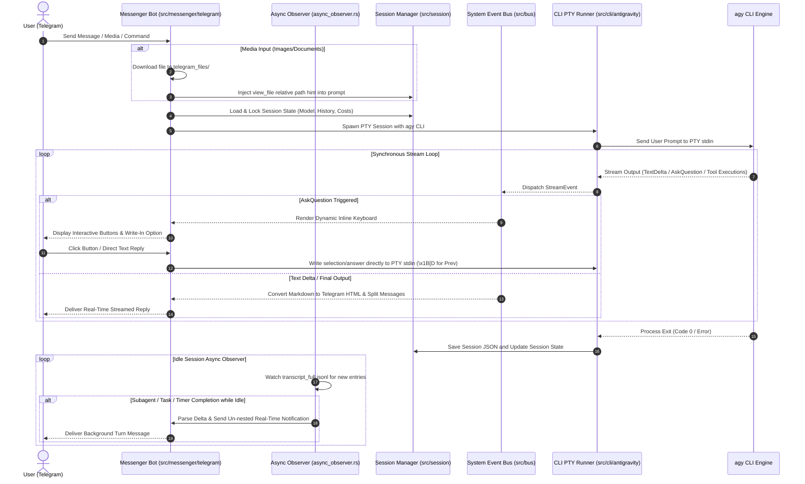

# tuner

[](https://github.com/imwoo90/tuner/actions)
[](https://opensource.org/licenses/MIT)

`tuner` supervises and orchestrates the execution of the Antigravity CLI (`agy`), providing real-time Telegram messenger integration, virtual PTY session management, idle background turn observation, webhook ingress, and multi-language localized agent sessions.

---

## 🚀 Quick Start Guide

### Step 1: Verify Antigravity CLI (`agy`)
Ensure the Antigravity CLI (`agy`) is installed and authenticated on your machine:
```bash
agy --version
```

### Step 2: Run One-Line Installer
Install the latest `tuner` release binary and required assets to `~/.tuner/bin/`:
```bash
curl -fsSL https://raw.githubusercontent.com/imwoo90/tuner/main/install.sh | bash
```

### Step 3: Run Interactive Setup & Service Registration
Launch the setup wizard to configure your Telegram bot token, allowed user IDs, and register systemd daemon:
```bash
~/.tuner/bin/tuner --setup
```

---

## 📲 Telegram Bot Setup Guide

Connecting Tuner to Telegram takes just 3 simple steps:

1. **Get Bot Token**:
   - Open Telegram and message [@BotFather](https://t.me/BotFather).
   - Create a bot (`/newbot`) and copy the **HTTP API Token**.
2. **Get Your Telegram User ID**:
   - Message [@userinfobot](https://t.me/userinfobot) to get your numerical Telegram User ID.
3. **Run Setup Wizard**:
   - Run `~/.tuner/bin/tuner --setup` and enter your Bot Token & User ID.

> 💡 **Group / Supergroup Setup**:
> If adding the bot to a group chat or topic thread, invite the bot and **promote it to Administrator** (enabling message reading) to bypass Telegram's default Privacy Mode.

<details>
<summary><b>⚙️ Manual Configuration Schema (`~/.tuner/config/config.json`)</b></summary>

```json
{
  "telegram_token": "YOUR_TELEGRAM_BOT_TOKEN",
  "allowed_user_ids": [123456789],
  "allowed_group_ids": [-100123456789],
  "provider": "antigravity",
  "model": "gemini-3.6-flash",
  "effort": "high",
  "language": "en",
  "timezone": "Asia/Seoul"
}
```
</details>

---

## 🤖 Telegram Slash Commands

| Command | Description |
|---|---|
| `/new` \| `/reset` | Clear the current conversation and start a fresh session. |
| `/status` | Generate bot health reports, agy CLI installation info, and active session model. |
| `/model` | Toggle the active LLM model for the current topic via an inline selector. |
| `/effort` | Select the reasoning effort level (high, medium, low) for the current LLM model. |
| `/lang` | Select the active session language (English, Korean, etc.) via an inline keyboard. |
| `/upgrade` | Check GitHub Releases and perform an in-place executable upgrade. |
| `/memory` | Output the current content of the workspace `MAINMEMORY.md` file. |
| `/stop` | Gracefully cancel active agent CLI processes running in the current chat topic. |
| `/abort` | Forcefully terminate all running workers and background tasks. |
| `/restart` | Request a clean restart of the `tuner` bot daemon process. |
| `/plan` | Prompt the agent to generate a structured execution plan before running. |
| `/grill_me` | Launch an interactive interview to align requirements and refine plans. |
| `/goal` | Launch a long-running, thorough task (e.g. overnight thorough execution). |
| `/learn` | Capture behavioral corrections or feedback and bind them to agent memory. |
| `/teamwork_preview` | Run a collaborative multi-agent simulation workflow. |

---

## 🤝 Development & Contribution Guide

We welcome contributions! To maintain stability between production environments and active development, we follow a containerized workflow with separate Telegram bot tokens.

### 🏗️ Architecture Layout
- **Production Environment**: Runs official GitHub Releases on the Host PC/server (supervised via `systemd` or `tuner` master daemon).
- **Development Environment**: Runs inside an isolated Docker container (`tuner-sandbox`) linked to a separate Telegram Dev Bot Token.

### 🛠️ Setting Up Local Development
1. Start the container environment:
   ```bash
   docker run -d --name tuner-sandbox -v $(pwd):/workspace -w /workspace tuner-tuner-sandbox sleep infinity
   ```
2. Configure your Telegram Dev Bot Token in `~/.tuner/config/config.json` inside the container.

### 🔄 Real-Time Build & Deploy Workflow
To test changes to source code (`src/`) or assets (`_home_defaults/`) in real-time:

```bash
# Run the automated dev deployment script
bash scripts/dev_deploy.sh
```

The `dev_deploy.sh` script automatically:
1. Compiles the latest release binary (`cargo build --release`).
2. Syncs the binary & `_home_defaults` asset folder to `tuner-sandbox`.
3. Auto-restarts the container worker daemon seamlessly.

### 🔀 Submitting Contributions (Pull Requests)
1. Fork the repository and create a feature branch (`git checkout -b feature/my-feature`).
2. Test your changes locally using `cargo test` and `bash scripts/dev_deploy.sh`.
3. Push your branch to your fork and submit a **Pull Request (PR)** targeting the `main` branch.

### 🚀 Maintainer Release Workflow
*(For repository maintainers only)*
To publish an official release:
1. Update version numbers in `Cargo.toml` and run `cargo check` to update `Cargo.lock`.
2. Commit with release notes: `git commit -m "bump: release v0.1.x"`
3. Push `main` to the `release` branch:
   ```bash
   git push origin main:release
   ```
   GitHub Actions will automatically verify the build, generate tag `v0.1.x`, and publish binaries to GitHub Releases.

---

<details>
<summary><b>🔑 Key Features & Architecture Specifications</b></summary>

### 🔑 Key Features
- **Extensible Messenger Integration**: Symmetrical messenger transport layout (`src/messenger/telegram/`) ready for multi-protocol extensions.
- **Real-Time Idle Session Async Observer**: Monitors active session transcript logs in the background while idle, dispatching real-time notifications for subagent completions, background task outputs, and timer/cron events directly to Telegram as clean markdown messages.
- **Interactive Inline Keyboard Loops (`ask_question`)**: Converts agent `ask_question` prompts into real-time Telegram Inline Keyboards. Supports direct write-in text responses without extra confirmation, and seamless `Prev` option navigation via ANSI arrow key sequence (`\x1B[D`) injection to PTY stdin.
- **Automatic Media Ingestion & Multimodal Support**: Automatically downloads incoming Telegram images/documents into workspace `telegram_files/` and injects `view_file` prompt hints for native LLM multimodal analysis.
- **Session & Chat Persistence**: Structured JSON-based session storage tracks per-topic message history, active LLM model selection, reasoning effort settings, and session identity.
- **Self-Upgrade Engine**: Supports single-command in-place executable upgrades from GitHub Releases with zero-downtime supervisor process restarts.
- **Webhook & API Servers (Axum)**: Features a robust Axum-based async web server with HMAC-SHA256 signature verification, Bearer Token authentication, and built-in Rate Limiting.
- **PTY Session Supervision**: Launches agent CLI processes in stateful virtual PTY sessions, supporting real-time stdout/stderr interception, interactive stdin injection, and timeout protection.

### 🛠️ Module Layout
- `src/cli/antigravity`: Wraps `agy` CLI execution, spawns PTYs, streams stderr/stdout events, and parses event deltas (`log_parser`).
- `src/session`: Manages session keys, state serialization, cumulative costs/tokens, and daily resets.
- `src/messenger/telegram`: Telegram bot event handler, `async_observer` background listener, interactive inline keyboard generator, and Markdown-to-HTML parser.
- `src/background`: PTY executor wrapping spawned CLI processes with safe async cancellation and SIGKILL cleanup.
- `src/security`: Content filtering, path traversal protection, and allowed root constraints.
- `src/webhook`: Axum webhook ingress endpoint server.
- `src/upgrade`: GitHub Release fetcher, tarball unpacker, and atomic executable updater.
- `src/i18n`: TOML localization file loader and translation macros.

### 🔄 Dynamic Data Flow

```mermaid
sequenceDiagram
    autonumber
    actor User as User (Telegram)
    participant Bot as Messenger Bot (src/messenger/telegram)
    participant Observer as Async Observer (async_observer.rs)
    participant Session as Session Manager (src/session)
    participant Bus as System Event Bus (src/bus)
    participant PTY as CLI PTY Runner (src/cli/antigravity)
    participant AGY as agy CLI Engine

    User->>Bot: Send Message / Media / Command
    alt Media Input (Images/Documents)
        Bot->>Bot: Download file to telegram_files/
        Bot->>Session: Inject view_file relative path hint into prompt
    end
    Bot->>Session: Load & Lock Session State (Model, History, Costs)
    Bot->>PTY: Spawn PTY Session with agy CLI
    PTY->>AGY: Send User Prompt to PTY stdin

    loop Synchronous Stream Loop
        AGY-->>PTY: Stream Output (TextDelta / AskQuestion / Tool Executions)
        PTY-->>Bus: Dispatch StreamEvent
        alt AskQuestion Triggered
            Bus-->>Bot: Render Dynamic Inline Keyboard
            Bot-->>User: Display Interactive Buttons & Write-In Option
            User->>Bot: Click Button / Direct Text Reply
            Bot->>PTY: Write selection/answer directly to PTY stdin (\x1B[D for Prev)
        else Text Delta / Final Output
            Bus-->>Bot: Convert Markdown to Telegram HTML & Split Messages
            Bot-->>User: Deliver Real-Time Streamed Reply
        end
    end

    AGY-->>PTY: Process Exit (Code 0 / Error)
    PTY->>Session: Save Session JSON and Update Session State

    loop Idle Session Async Observer
        Observer->>Observer: Watch transcript_full.jsonl for new entries
        alt Subagent / Task / Timer Completion while Idle
            Observer->>Bot: Parse Delta & Send Un-nested Real-Time Notification
            Bot-->>User: Deliver Background Turn Message
        end
    end
```
</details>

---

## 🧪 Testing

`tuner` features an extensive test suite verifying 385+ test cases to ensure stability:

```bash
# Run all unit and integration tests
cargo test
```

---

## 📄 License
This project is licensed under the [MIT License](LICENSE).
