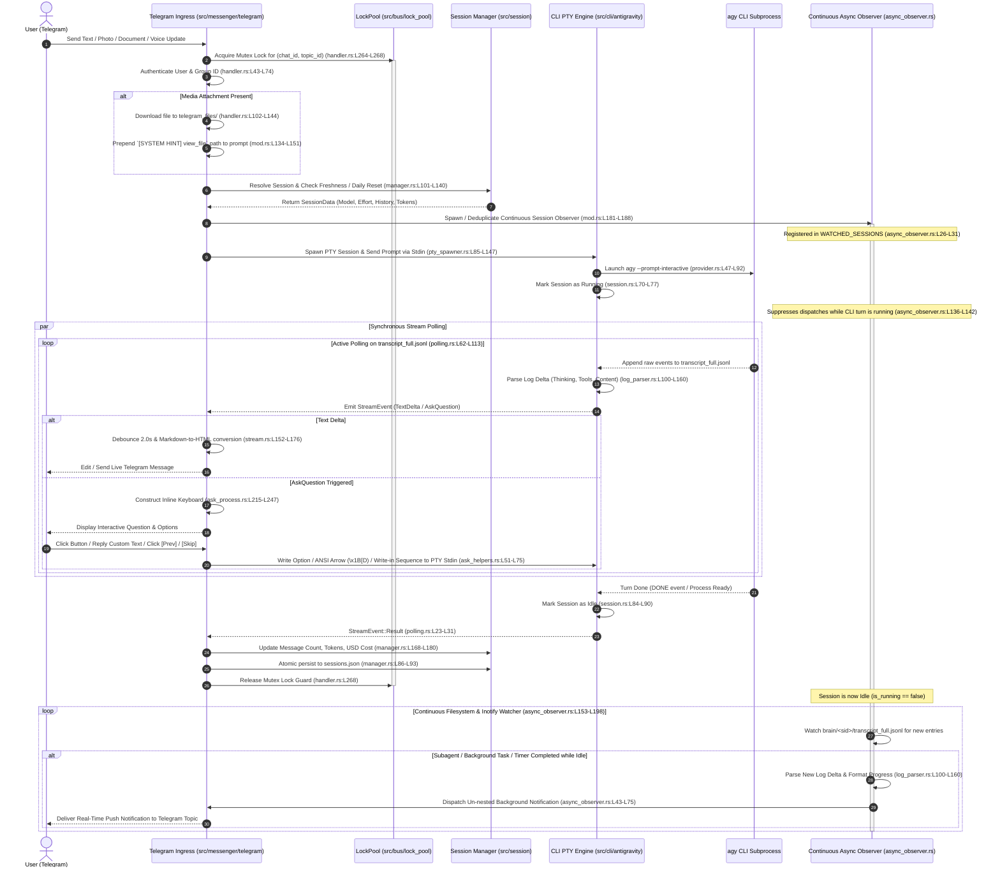
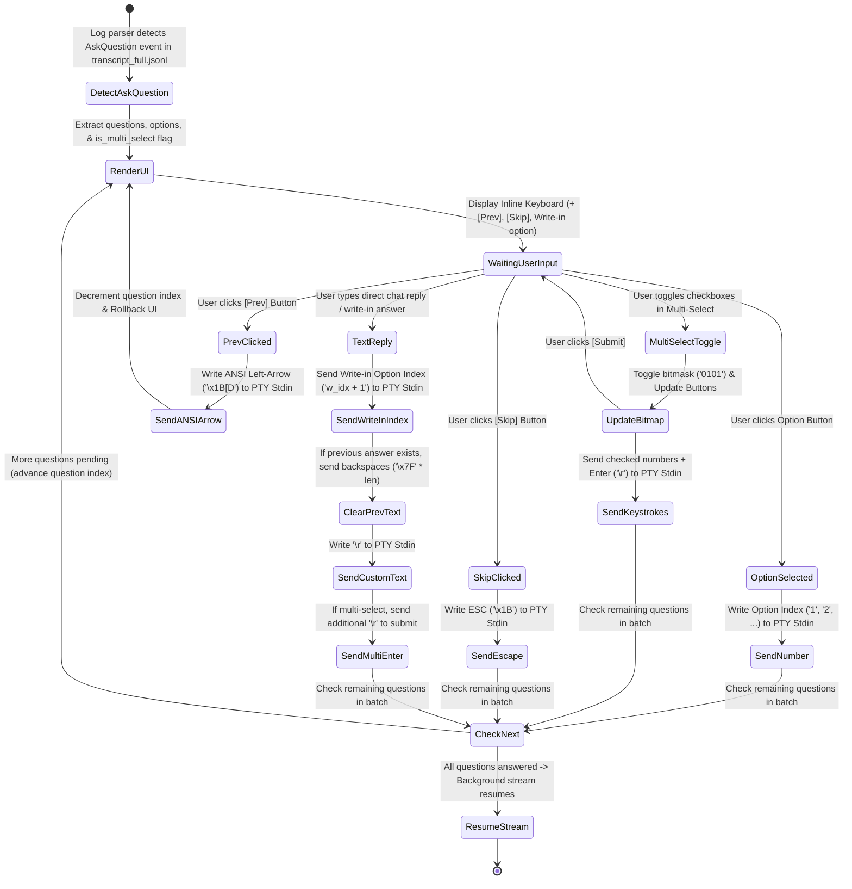

# tuner

[](https://github.com/imwoo90/tuner/actions)
[](https://opensource.org/licenses/MIT)

`tuner` supervises and orchestrates the execution of the Antigravity CLI (`agy`), providing real-time Telegram messenger integration, virtual PTY session management, idle background turn observation, webhook ingress, and multi-language localized agent sessions.

---

## 🚀 Quick Start Guide

### Step 1: Verify Antigravity CLI (`agy`)
Ensure the Antigravity CLI (`agy`) is installed and authenticated on your machine:
```bash
agy --version
```

### Step 2: Run One-Line Installer
Install the latest `tuner` release binary and required assets to `~/.tuner/bin/`:
```bash
curl -fsSL https://raw.githubusercontent.com/imwoo90/tuner/main/install.sh | bash
```

### Step 3: Run Interactive Setup & Service Registration
Launch the setup wizard to configure your Telegram bot token, allowed user IDs, and register systemd daemon:
```bash
~/.tuner/bin/tuner --setup
```

---

## 📲 Telegram Bot Setup Guide

Connecting Tuner to Telegram takes just 3 simple steps:

1. **Get Bot Token**:
   - Open Telegram and message [@BotFather](https://t.me/BotFather).
   - Create a bot (`/newbot`) and copy the **HTTP API Token**.
2. **Get Your Telegram User ID**:
   - Message [@userinfobot](https://t.me/userinfobot) to get your numerical Telegram User ID.
3. **Run Setup Wizard**:
   - Run `~/.tuner/bin/tuner --setup` and enter your Bot Token & User ID.

> 💡 **Group / Supergroup Setup**:
> If adding the bot to a group chat or topic thread, invite the bot and **promote it to Administrator** (enabling message reading) to bypass Telegram's default Privacy Mode.

<details>
<summary><b>⚙️ Manual Configuration Schema (`~/.tuner/config/config.json`)</b></summary>

```json
{
  "telegram_token": "YOUR_TELEGRAM_BOT_TOKEN",
  "allowed_user_ids": [123456789],
  "allowed_group_ids": [-100123456789],
  "provider": "antigravity",
  "model": "gemini-3.6-flash",
  "effort": "high",
  "language": "en",
  "timezone": "Asia/Seoul"
}
```
</details>

---

## 🤖 Telegram Slash Commands

| Command | Description |
|---|---|
| `/new` \| `/reset` | Clear the current conversation and start a fresh session. |
| `/status` | Generate bot health reports, agy CLI installation info, and active session model. |
| `/model` | Toggle the active LLM model for the current topic via an inline selector. |
| `/effort` | Select the reasoning effort level (high, medium, low) for the current LLM model. |
| `/lang` | Select the active session language (English, Korean, etc.) via an inline keyboard. |
| `/upgrade` | Check GitHub Releases and perform an in-place executable upgrade. |
| `/memory` | Output the current content of the workspace `MAINMEMORY.md` file. |
| `/stop` | Gracefully cancel active agent CLI processes running in the current chat topic. |
| `/abort` | Forcefully terminate all running workers and background tasks. |
| `/restart` | Request a clean restart of the `tuner` bot daemon process. |
| `/plan` | Prompt the agent to generate a structured execution plan before running. |
| `/grill_me` | Launch an interactive interview to align requirements and refine plans. |
| `/goal` | Launch a long-running, thorough task (e.g. overnight thorough execution). |
| `/learn` | Capture behavioral corrections or feedback and bind them to agent memory. |
| `/teamwork_preview` | Run a collaborative multi-agent simulation workflow. |

---

## 🤝 Development & Contribution Guide

We welcome contributions! To maintain stability between production environments and active development, we follow an isolated containerized workflow with separate Telegram bot tokens.

### 🏗️ Architecture Layout
- **Production Environment**: Runs official GitHub Releases on the Host PC/server (supervised via `systemd` or `tuner` master daemon).
- **Development Environment**: Runs inside an isolated Docker container (`tuner-sandbox`) linked to a separate Telegram Dev Bot Token, sharing host `agy` authentication and state seamlessly.

### 🛠️ Setting Up Local Development

1. **Verify Host Prerequisites**:
   Ensure `agy` CLI is installed and authenticated on your host machine:
   ```bash
   agy --version
   ```

2. **Start the Sandbox Container**:
   Launch the development sandbox container via Docker Compose (automatically maps your user ID, `$HOME`, `agy` credentials, and `~/.tuner-dev` workspace):
   ```bash
   docker compose up -d
   ```

3. **Configure Development Bot Token**:
   Set your dedicated Telegram Dev Bot Token and allowed user ID in `~/.tuner-dev/profiles/default/config/config.json`:
   ```json
   {
     "telegram_token": "YOUR_DEV_TELEGRAM_BOT_TOKEN",
     "allowed_user_ids": [123456789],
     "language": "ko",
     "model": "gemini-3.7-flash",
     "effort": "high"
   }
   ```

### 🔄 Real-Time Build & Deploy Workflow
To test changes to source code (`src/`) or assets (`_home_defaults/`) in real-time:

```bash
# Run the automated dev deployment script
bash scripts/dev_deploy.sh
```

The `dev_deploy.sh` script automatically:
1. Compiles the latest release binary (`cargo build --release`).
2. Syncs the binary & `_home_defaults` asset folder to `tuner-sandbox`.
3. Auto-restarts the container worker daemon (`tuner --worker default`).

### 🔀 Submitting Contributions (Pull Requests)
1. Fork the repository and create a feature branch (`git checkout -b feature/my-feature`).
2. Ensure all tests pass: `cargo test`.
3. Verify live behavior in the dev container with `bash scripts/dev_deploy.sh`.
4. Push your branch to your fork and submit a **Pull Request (PR)** targeting the `main` branch.

### 🚀 Maintainer Release Workflow
*(For repository maintainers only)*
To publish an official release:
1. Update version numbers in `Cargo.toml` and run `cargo check` to update `Cargo.lock`.
2. Commit with release notes: `git commit -m "bump: release v0.1.x"`
3. Push `main` to the `release` branch:
   ```bash
   git push origin main:release
   ```
   GitHub Actions will automatically verify the build, generate tag `v0.1.x`, and publish binaries to GitHub Releases.

---

<details>
<summary><b>🔑 Key Features & Architecture Specifications</b></summary>

### 🏛️ 3-Tier System Architecture Overview

`tuner` is designed as a high-performance, asynchronous orchestration supervisor for the Google Antigravity CLI (`agy`). It bridges real-time messaging clients (Telegram) and webhooks with virtual PTY agent execution environments, managing state persistence, interactive dialog loops, background task scheduling, and idle turn observations.

```
┌────────────────────────────────────────────────────────────────────────────────────────────────────────┐
│                                       TIER 1: MESSENGER INGRESS                                        │
│  Telegram Bot (Teloxide)  │  Media Ingestion (telegram_files/)  │  Webhook HTTP Ingress (Axum Engine) │
└───────────────────────────────────────────────────┬────────────────────────────────────────────────────┘
                                                    │
┌───────────────────────────────────────────────────▼────────────────────────────────────────────────────┐
│                                  TIER 2: CORE ORCHESTRATION & BUS                                      │
│  Session Lock Pool        │  JSON Session State Registry        │  System Event Message Bus (Bus)      │
│  Workspace Synchronizer   │  Cron & Heartbeat Schedulers        │  Security Sandbox & Path Traversal   │
│  Process Supervisor       │  Storage Cleanup Observer           │  Multi-Language i18n Catalog Engine  │
└───────────────────────────────────────────────────┬────────────────────────────────────────────────────┘
                                                    │
┌───────────────────────────────────────────────────▼────────────────────────────────────────────────────┐
│                                 TIER 3: CLI & VIRTUAL PTY ENGINE                                       │
│  PTY Process Spawner (openpty) │ Non-blocking Async Drainer     │ Log Delta Parser (transcript_full)   │
│  Interactive Prompt Feeder     │ Real-time ask_question UI Loop │ Continuous Session Async Observer    │
└────────────────────────────────────────────────────────────────────────────────────────────────────────┘
```

### 🔄 Dynamic End-to-End Dataflow

The following sequence diagram details the full lifecycle of an update: per-topic mutex lock acquisition at entry, authentication, media ingestion, state resolution, continuous async observer spawning, PTY execution, interactive tool queries, turn finalization, and idle background push delivery.


```mermaid
sequenceDiagram
    autonumber
    actor User as User (Telegram)
    participant Bot as Telegram Ingress (src/messenger/telegram)
    participant Lock as LockPool (src/bus/lock_pool)
    participant Session as Session Manager (src/session)
    participant PTY as CLI PTY Engine (src/cli/antigravity)
    participant AGY as agy CLI Subprocess
    participant Obs as Continuous Async Observer (async_observer.rs)

    %% 1. Ingress & Lock Acquisition
    User->>Bot: Send Text / Photo / Document / Voice Update
    Bot->>Lock: Acquire Mutex Lock for (chat_id, topic_id) (handler.rs:L264-L268)
    activate Lock

    %% 2. Authentication & Media Handling
    Bot->>Bot: Authenticate User & Group ID (handler.rs:L43-L74)
    alt Media Attachment Present
        Bot->>Bot: Download file to telegram_files/ (handler.rs:L102-L144)
        Bot->>Bot: Prepend `[SYSTEM HINT] view_file` path to prompt (mod.rs:L134-L151)
    end

    %% 3. Session Resolution & Continuous Observer Spawning
    Bot->>Session: Resolve Session & Check Freshness / Daily Reset (manager.rs:L101-L140)
    Session-->>Bot: Return SessionData (Model, Effort, History, Tokens)
    Bot->>Obs: Spawn / Deduplicate Continuous Session Observer (mod.rs:L181-L188)
    activate Obs
    Note over Obs: Registered in WATCHED_SESSIONS (async_observer.rs:L26-L31)

    %% 4. PTY Launch & Streaming
    Bot->>PTY: Spawn PTY Session & Send Prompt via Stdin (pty_spawner.rs:L85-L147)
    PTY->>AGY: Launch agy --prompt-interactive (provider.rs:L47-L92)
    PTY->>PTY: Mark Session as Running (session.rs:L70-L77)
    Note over Obs: Suppresses dispatches while CLI turn is running (async_observer.rs:L136-L142)

    %% 5. Stream Loop & Log Polling
    par Synchronous Stream Polling
        loop Active Polling on transcript_full.jsonl (polling.rs:L62-L113)
            AGY-->>PTY: Append raw events to transcript_full.jsonl
            PTY->>PTY: Parse Log Delta (Thinking, Tools, Content) (log_parser.rs:L100-L160)
            PTY-->>Bot: Emit StreamEvent (TextDelta / AskQuestion)
            
            alt Text Delta
                Bot->>Bot: Debounce 2.0s & Markdown-to-HTML conversion (stream.rs:L152-L176)
                Bot-->>User: Edit / Send Live Telegram Message
            else AskQuestion Triggered
                Bot->>Bot: Construct Inline Keyboard (ask_process.rs:L215-L247)
                Bot-->>User: Display Interactive Question & Options
                User->>Bot: Click Button / Reply Custom Text / Click [Prev] / [Skip]
                Bot->>PTY: Write Option / ANSI Arrow (\x1B[D) / Write-in Sequence to PTY Stdin (ask_helpers.rs:L51-L75)
            end
        end
    end

    %% 6. Turn Completion & Identity Preservation
    AGY-->>PTY: Turn Done (DONE event / Process Ready)
    PTY->>PTY: Mark Session as Idle (session.rs:L84-L90)
    PTY-->>Bot: StreamEvent::Result (polling.rs:L23-L31)
    Bot->>Session: Update Message Count, Tokens, USD Cost (manager.rs:L168-L180)
    Bot->>Session: Atomic persist to sessions.json (manager.rs:L86-L93)
    Bot->>Lock: Release Mutex Lock Guard (handler.rs:L268)
    deactivate Lock

    %% 7. Idle Background Async Push Notifications
    Note over Obs: Session is now Idle (is_running == false)
    loop Continuous Filesystem & Inotify Watcher (async_observer.rs:L153-L198)
        Obs->>Obs: Watch brain/<sid>/transcript_full.jsonl for new entries
        alt Subagent / Background Task / Timer Completed while Idle
            Obs->>Obs: Parse New Log Delta & Format Progress (log_parser.rs:L100-L160)
            Obs->>Bot: Dispatch Un-nested Background Notification (async_observer.rs:L43-L75)
            Bot-->>User: Deliver Real-Time Push Notification to Telegram Topic
        end
    end
    deactivate Obs
```

### 🎮 Interactive `ask_question` Loop & State Machine

When an agent invokes `ask_question` or `ask_permission`, Tuner translates the CLI ANSI prompts into Telegram Inline Keyboards. The state machine below illustrates the precise input handling, including the multi-step write-in feed mechanism ([`ask_helpers.rs:L51-L75`](file:///home/wimvm/tuner/profiles/default/workspace/projects/tuner/src/messenger/telegram/ask_helpers.rs#L51-L75)):


```mermaid
stateDiagram-v2
    [*] --> DetectAskQuestion: Log parser detects AskQuestion event in transcript_full.jsonl
    DetectAskQuestion --> RenderUI: Extract questions, options, & is_multi_select flag
    RenderUI --> WaitingUserInput: Display Inline Keyboard (+ [Prev], [Skip], Write-in option)

    WaitingUserInput --> OptionSelected: User clicks Option Button
    OptionSelected --> SendNumber: Write Option Index ('1', '2', ...) to PTY Stdin
    
    WaitingUserInput --> MultiSelectToggle: User toggles checkboxes in Multi-Select
    MultiSelectToggle --> UpdateBitmap: Toggle bitmask ('0101') & Update Buttons
    UpdateBitmap --> WaitingUserInput: User clicks [Submit]
    UpdateBitmap --> SendKeystrokes: Send checked numbers + Enter ('\r') to PTY Stdin

    WaitingUserInput --> PrevClicked: User clicks [Prev] Button
    PrevClicked --> SendANSIArrow: Write ANSI Left-Arrow ('\\x1B[D') to PTY Stdin
    SendANSIArrow --> RenderUI: Decrement question index & Rollback UI

    WaitingUserInput --> SkipClicked: User clicks [Skip] Button
    SkipClicked --> SendEscape: Write ESC ('\\x1B') to PTY Stdin

    WaitingUserInput --> TextReply: User types direct chat reply / write-in answer
    TextReply --> SendWriteInIndex: Send Write-in Option Index ('w_idx + 1') to PTY Stdin
    SendWriteInIndex --> ClearPrevText: If previous answer exists, send backspaces ('\\x7F' * len)
    ClearPrevText --> SendCustomText: Write '<current_text>\\r' to PTY Stdin
    SendCustomText --> SendMultiEnter: If multi-select, send additional '\\r' to submit

    SendNumber --> CheckNext: Check remaining questions in batch
    SendKeystrokes --> CheckNext: Check remaining questions in batch
    SendEscape --> CheckNext: Check remaining questions in batch
    SendMultiEnter --> CheckNext: Check remaining questions in batch

    CheckNext --> RenderUI: More questions pending (advance question index)
    CheckNext --> ResumeStream: All questions answered -> Background stream resumes
    ResumeStream --> [*]
```

### 📦 Complete Module Architecture & Code Reference

The following table documents all **20 core architectural modules** in `projects/tuner/src/` with their responsibilities and verified source code line ranges:

| # | Module / Subsystem | Architectural Role & Core Responsibilities | Verified Code Evidence (File & Line Range) |
|---|---|---|---|
| 1 | **`src/messenger/telegram`** | Teloxide bot entry point, message ingress dispatcher, command registration, and chat routing. | [`runner.rs:L85-L113`](file:///home/wimvm/tuner/profiles/default/workspace/projects/tuner/src/messenger/telegram/runner.rs#L85-L113)<br>[`handler.rs:L242-L271`](file:///home/wimvm/tuner/profiles/default/workspace/projects/tuner/src/messenger/telegram/handler.rs#L242-L271) |
| 2 | **`src/messenger/telegram/stream.rs`** | Debounces streaming stdout chunks (2s interval), parses markdown to HTML, and handles message splitting (4000-char limits). | [`stream.rs:L78-L118`](file:///home/wimvm/tuner/profiles/default/workspace/projects/tuner/src/messenger/telegram/stream.rs#L78-L118)<br>[`stream.rs:L152-L208`](file:///home/wimvm/tuner/profiles/default/workspace/projects/tuner/src/messenger/telegram/stream.rs#L152-L208) |
| 3 | **`src/messenger/telegram/ask_*.rs`** | Interactive dialog state machine (`AskState`), keyboard builder, ANSI key injection (`\x1B[D` for Prev, `\x1B` for Skip), and multi-step write-in input feeder. | [`ask_process.rs:L69-L142`](file:///home/wimvm/tuner/profiles/default/workspace/projects/tuner/src/messenger/telegram/ask_process.rs#L69-L142)<br>[`ask_callbacks.rs:L52-L175`](file:///home/wimvm/tuner/profiles/default/workspace/projects/tuner/src/messenger/telegram/ask_callbacks.rs#L52-L175)<br>[`ask_helpers.rs:L51-L75`](file:///home/wimvm/tuner/profiles/default/workspace/projects/tuner/src/messenger/telegram/ask_helpers.rs#L51-L75) |
| 4 | **`src/messenger/telegram/async_observer.rs`** | Continuous session transcript watcher (`notify`) monitoring `transcript_full.jsonl` across turns; suppresses dispatches while active and delivers push notifications when idle. | [`async_observer.rs:L18-L41`](file:///home/wimvm/tuner/profiles/default/workspace/projects/tuner/src/messenger/telegram/async_observer.rs#L18-L41)<br>[`async_observer.rs:L128-L198`](file:///home/wimvm/tuner/profiles/default/workspace/projects/tuner/src/messenger/telegram/async_observer.rs#L128-L198) |
| 5 | **`src/cli/antigravity`** | Antigravity CLI provider implementation, environment variable propagation (`TUNER_*`), session resolution, and error parsing. | [`provider.rs:L21-L37`](file:///home/wimvm/tuner/profiles/default/workspace/projects/tuner/src/cli/antigravity/provider.rs#L21-L37)<br>[`provider.rs:L47-L92`](file:///home/wimvm/tuner/profiles/default/workspace/projects/tuner/src/cli/antigravity/provider.rs#L47-L92)<br>[`session.rs:L118-L149`](file:///home/wimvm/tuner/profiles/default/workspace/projects/tuner/src/cli/antigravity/session.rs#L118-L149) |
| 6 | **`src/cli/antigravity/pty_spawner.rs`** | Spawns agent CLI child processes wrapped in virtual pseudo-terminals (`openpty`), disables terminal echo, and manages non-blocking async master fd draining. | [`pty_spawner.rs:L25-L66`](file:///home/wimvm/tuner/profiles/default/workspace/projects/tuner/src/cli/antigravity/pty_spawner.rs#L25-L66)<br>[`pty_spawner.rs:L85-L175`](file:///home/wimvm/tuner/profiles/default/workspace/projects/tuner/src/cli/antigravity/pty_spawner.rs#L85-L175) |
| 7 | **`src/cli/antigravity/log_parser.rs`** | Incremental JSON line parser (`AntigravityLogParser`) extracting model thinking blocks, tool calls, tool completions, final content, and `ask_question` tool structures. | [`log_parser.rs:L16-L62`](file:///home/wimvm/tuner/profiles/default/workspace/projects/tuner/src/cli/antigravity/log_parser.rs#L16-L62)<br>[`log_parser.rs:L100-L160`](file:///home/wimvm/tuner/profiles/default/workspace/projects/tuner/src/cli/antigravity/log_parser.rs#L100-L160) |
| 8 | **`src/cli/antigravity/polling.rs`** | Coordinates live transcript polling loops, inotify directory watchers, and completion detection (`wait_for_log_completion`) to yield stream frames (`StreamEvent`). | [`polling.rs:L62-L113`](file:///home/wimvm/tuner/profiles/default/workspace/projects/tuner/src/cli/antigravity/polling.rs#L62-L113)<br>[`polling.rs:L180-L257`](file:///home/wimvm/tuner/profiles/default/workspace/projects/tuner/src/cli/antigravity/polling.rs#L180-L257) |
| 9 | **`src/session`** | JSON-based session state persistence (`sessions.json`), per-topic session key resolution, token/cost metrics accumulation, and timezone-based daily reset rules. | [`manager.rs:L59-L93`](file:///home/wimvm/tuner/profiles/default/workspace/projects/tuner/src/session/manager.rs#L59-L93)<br>[`manager.rs:L101-L180`](file:///home/wimvm/tuner/profiles/default/workspace/projects/tuner/src/session/manager.rs#L101-L180)<br>[`data.rs:L15-L47`](file:///home/wimvm/tuner/profiles/default/workspace/projects/tuner/src/session/data.rs#L15-L47) |
| 10 | **`src/bus`** | Central asynchronous message bus (`MessageBus`), chat/topic mutex lock pools (`LockPool`), prompt injection hooks, and transport routing (`TelegramTransport`). | [`bus.rs:L94-L149`](file:///home/wimvm/tuner/profiles/default/workspace/projects/tuner/src/bus/bus.rs#L94-L149)<br>[`lock_pool.rs:L15-L31`](file:///home/wimvm/tuner/profiles/default/workspace/projects/tuner/src/bus/lock_pool.rs#L15-L31)<br>[`envelope.rs:L10-L45`](file:///home/wimvm/tuner/profiles/default/workspace/projects/tuner/src/bus/envelope.rs#L10-L45) |
| 11 | **`src/background`** | Background task executor (`BackgroundObserver`) enforcing per-chat task concurrency limits (`MAX_TASKS_PER_CHAT = 5`), timeout guards, and drop cancellations. | [`observer.rs:L84-L143`](file:///home/wimvm/tuner/profiles/default/workspace/projects/tuner/src/background/observer.rs#L84-L143)<br>[`observer.rs:L238-L288`](file:///home/wimvm/tuner/profiles/default/workspace/projects/tuner/src/background/observer.rs#L238-L288) |
| 12 | **`src/cron`** | Background cron scheduler (`CronScheduler`) evaluating cron expressions with timezone offsets, quiet hours enforcement, and automatic CLI execution. | [`scheduler.rs:L62-L146`](file:///home/wimvm/tuner/profiles/default/workspace/projects/tuner/src/cron/scheduler.rs#L62-L146)<br>[`scheduler.rs:L212-L247`](file:///home/wimvm/tuner/profiles/default/workspace/projects/tuner/src/cron/scheduler.rs#L212-L247)<br>[`manager.rs:L12-L40`](file:///home/wimvm/tuner/profiles/default/workspace/projects/tuner/src/cron/manager.rs#L12-L40) |
| 13 | **`src/heartbeat`** | Periodic daemon telemetry loop checking idle session health, evaluating quiet hours, suppressing `HEARTBEAT_OK` acknowledgments, and routing bus alerts. | [`scheduler.rs:L82-L124`](file:///home/wimvm/tuner/profiles/default/workspace/projects/tuner/src/heartbeat/scheduler.rs#L82-L124)<br>[`scheduler.rs:L126-L193`](file:///home/wimvm/tuner/profiles/default/workspace/projects/tuner/src/heartbeat/scheduler.rs#L126-L193) |
| 14 | **`src/cleanup`** | Storage maintenance observer (`CleanupObserver`) performing scheduled purges of expired media/deliverable files in `telegram_files/` and `output_to_user/`. | [`observer.rs:L43-L95`](file:///home/wimvm/tuner/profiles/default/workspace/projects/tuner/src/cleanup/observer.rs#L43-L95)<br>[`observer.rs:L118-L145`](file:///home/wimvm/tuner/profiles/default/workspace/projects/tuner/src/cleanup/observer.rs#L118-L145) |
| 15 | **`src/webhook`** | Axum HTTP server hosting `/health` and `/hooks/:hook_id`, validating Bearer tokens and HMAC-SHA256 signatures with rate limiting. | [`server.rs:L59-L134`](file:///home/wimvm/tuner/profiles/default/workspace/projects/tuner/src/webhook/server.rs#L59-L134)<br>[`auth.rs:L14-L80`](file:///home/wimvm/tuner/profiles/default/workspace/projects/tuner/src/webhook/auth.rs#L14-L80) |
| 16 | **`src/workspace`** | Single source of truth for workspace layout paths (`DuctorPaths`), rule deployment (`CLAUDE.md`, `AGENTS.md`, `GEMINI.md`), and bundled skills synchronization. | [`paths.rs:L13-L215`](file:///home/wimvm/tuner/profiles/default/workspace/projects/tuner/src/workspace/paths.rs#L13-L215)<br>[`sync.rs:L76-L124`](file:///home/wimvm/tuner/profiles/default/workspace/projects/tuner/src/workspace/sync.rs#L76-L124) |
| 17 | **`src/security`** | File path traversal sandbox validator (`validate_file_path`, `is_path_safe`) resolving symlinks and enforcing allowed root directory constraints. | [`paths.rs:L40-L77`](file:///home/wimvm/tuner/profiles/default/workspace/projects/tuner/src/security/paths.rs#L40-L77)<br>[`paths.rs:L80-L117`](file:///home/wimvm/tuner/profiles/default/workspace/projects/tuner/src/security/paths.rs#L80-L117) |
| 18 | **`src/i18n`** | Thread-safe TOML translation catalog supporting 9 languages (en, de, nl, es, fr, id, pt, ru, ko) via macros (`t!`, `t_rich!`, `t_plural!`) and scoped task context (`TASK_ACTIVE_LANG`). | [`mod.rs:L38-L83`](file:///home/wimvm/tuner/profiles/default/workspace/projects/tuner/src/i18n/mod.rs#L38-L83)<br>[`mod.rs:L92-L136`](file:///home/wimvm/tuner/profiles/default/workspace/projects/tuner/src/i18n/mod.rs#L92-L136)<br>[`mod.rs:L201-L235`](file:///home/wimvm/tuner/profiles/default/workspace/projects/tuner/src/i18n/mod.rs#L201-L235) |
| 19 | **`src/supervisor.rs`** | Process supervisor managing profile workers, handling SIGTERM signals, and enforcing exponential backoff restarts. | [`supervisor.rs:L33-L66`](file:///home/wimvm/tuner/profiles/default/workspace/projects/tuner/src/supervisor.rs#L33-L66)<br>[`supervisor.rs:L68-L96`](file:///home/wimvm/tuner/profiles/default/workspace/projects/tuner/src/supervisor.rs#L68-L96) |
| 20 | **`src/upgrade.rs`** | Self-upgrade engine querying GitHub Releases, downloading release archives, and performing atomic in-place executable replacement. | [`upgrade.rs:L29-L71`](file:///home/wimvm/tuner/profiles/default/workspace/projects/tuner/src/upgrade.rs#L29-L71)<br>[`upgrade.rs:L105-L171`](file:///home/wimvm/tuner/profiles/default/workspace/projects/tuner/src/upgrade.rs#L105-L171) |
</details>

---

## 🧪 Testing

`tuner` features an extensive test suite verifying 385+ test cases to ensure stability:

```bash
# Run all unit and integration tests
cargo test
```

---

## 📄 License
This project is licensed under the [MIT License](LICENSE).
