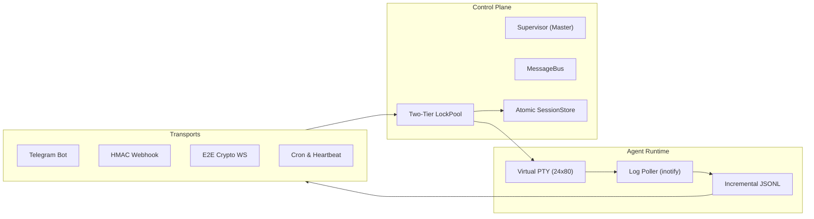

# tuner

[](https://github.com/imwoo90/tuner/actions)
[](https://opensource.org/licenses/MIT)

`tuner` supervises and orchestrates the execution of the Antigravity CLI (`agy`), providing real-time Telegram messenger integration, virtual PTY session management, idle background turn observation, webhook ingress, and multi-language localized agent sessions.

---

## 🚀 Quick Start Guide

### Step 1: Verify Antigravity CLI (`agy`)
Ensure the Antigravity CLI (`agy`) is installed and authenticated on your machine:
```bash
agy --version
```

### Step 2: Run One-Line Installer
Install the latest `tuner` release binary and required assets to `~/.tuner/bin/`:
```bash
curl -fsSL https://raw.githubusercontent.com/imwoo90/tuner/main/install.sh | bash
```

### Step 3: Run Interactive Setup & Service Registration
Launch the setup wizard to configure your Telegram bot token, allowed user IDs, and register systemd daemon:
```bash
~/.tuner/bin/tuner --setup
```

---

## 📲 Telegram Bot Setup Guide

Connecting Tuner to Telegram takes just 3 simple steps:

1. **Get Bot Token**:
   - Open Telegram and message [@BotFather](https://t.me/BotFather).
   - Create a bot (`/newbot`) and copy the **HTTP API Token**.
2. **Get Your Telegram User ID**:
   - Message [@userinfobot](https://t.me/userinfobot) to get your numerical Telegram User ID.
3. **Run Setup Wizard**:
   - Run `~/.tuner/bin/tuner --setup` and enter your Bot Token & User ID.

> 💡 **Group / Supergroup Setup**:
> If adding the bot to a group chat or topic thread, invite the bot and **promote it to Administrator** (enabling message reading) to bypass Telegram's default Privacy Mode.

<details>
<summary><b>⚙️ Manual Configuration Schema (`~/.tuner/config/config.json`)</b></summary>

```json
{
  "telegram_token": "YOUR_TELEGRAM_BOT_TOKEN",
  "allowed_user_ids": [123456789],
  "allowed_group_ids": [-100123456789],
  "provider": "antigravity",
  "model": "gemini-3.6-flash",
  "effort": "high",
  "language": "en",
  "timezone": "Asia/Seoul"
}
```
</details>

---

## 🤖 Telegram Slash Commands

| Command | Description |
|---|---|
| `/new` \| `/reset` | Clear the current conversation and start a fresh session. |
| `/status` | Generate bot health reports, agy CLI installation info, and active session model. |
| `/model` | Toggle the active LLM model for the current topic via an inline selector. |
| `/effort` | Select the reasoning effort level (high, medium, low) for the current LLM model. |
| `/lang` | Select the active session language (English, Korean, etc.) via an inline keyboard. |
| `/upgrade` | Check GitHub Releases and perform an in-place executable upgrade. |
| `/memory` | Output the current content of the workspace `MAINMEMORY.md` file. |
| `/stop` | Gracefully cancel active agent CLI processes running in the current chat topic. |
| `/abort` | Forcefully terminate all running workers and background tasks. |
| `/restart` | Request a clean restart of the `tuner` bot daemon process. |
| `/plan` | Prompt the agent to generate a structured execution plan before running. |
| `/grill_me` | Launch an interactive interview to align requirements and refine plans. |
| `/goal` | Launch a long-running, thorough task (e.g. overnight thorough execution). |
| `/learn` | Capture behavioral corrections or feedback and bind them to agent memory. |
| `/teamwork_preview` | Run a collaborative multi-agent simulation workflow. |

---

## 🤝 Development & Contribution Guide

We welcome contributions! To maintain stability between production environments and active development, we follow an isolated containerized workflow with separate Telegram bot tokens.

### 🏗️ Architecture Layout
- **Production Environment**: Runs official GitHub Releases on the Host PC/server (supervised via `systemd` or `tuner` master daemon).
- **Development Environment**: Runs inside an isolated Docker container (`tuner-sandbox`) linked to a separate Telegram Dev Bot Token, sharing host `agy` authentication and state seamlessly.

### 🛠️ Setting Up Local Development

1. **Verify Host Prerequisites**:
   Ensure `agy` CLI is installed and authenticated on your host machine:
   ```bash
   agy --version
   ```

2. **Start the Sandbox Container**:
   Launch the development sandbox container via Docker Compose (automatically maps your user ID, `$HOME`, `agy` credentials, and `~/.tuner-dev` workspace):
   ```bash
   docker compose up -d
   ```

3. **Configure Development Bot Token**:
   Set your dedicated Telegram Dev Bot Token and allowed user ID in `~/.tuner-dev/profiles/default/config/config.json`:
   ```json
   {
     "telegram_token": "YOUR_DEV_TELEGRAM_BOT_TOKEN",
     "allowed_user_ids": [123456789],
     "language": "ko",
     "model": "gemini-3.7-flash",
     "effort": "high"
   }
   ```

### 🔄 Real-Time Build & Deploy Workflow
To test changes to source code (`src/`) or assets (`_home_defaults/`) in real-time:

```bash
# Run the automated dev deployment script
bash scripts/dev_deploy.sh
```

The `dev_deploy.sh` script automatically:
1. Compiles the latest release binary (`cargo build --release`).
2. Syncs the binary & `_home_defaults` asset folder to `tuner-sandbox`.
3. Auto-restarts the container worker daemon (`tuner --worker default`).

### 🔀 Submitting Contributions (Pull Requests)
1. Fork the repository and create a feature branch (`git checkout -b feature/my-feature`).
2. Ensure all tests pass: `cargo test`.
3. Verify live behavior in the dev container with `bash scripts/dev_deploy.sh`.
4. Push your branch to your fork and submit a **Pull Request (PR)** targeting the `main` branch.

### 🚀 Maintainer Release Workflow
*(For repository maintainers only)*
To publish an official release:
1. Update version numbers in `Cargo.toml` and run `cargo check` to update `Cargo.lock`.
2. Commit with release notes: `git commit -m "bump: release v0.1.x"`
3. Push `main` to the `release` branch:
   ```bash
   git push origin main:release
   ```
   GitHub Actions will automatically verify the build, generate tag `v0.1.x`, and publish binaries to GitHub Releases.

---

## 🏛️ System Architecture & Invariants

`tuner` is built as an **Industrial-Grade Asynchronous Agent Gateway & Virtual TTY Multiplexer**. It resolves the fundamental operating-system challenges of bridging synchronous CLI agent binaries (such as Google Antigravity `agy`, Claude Code CLI, etc.) to asynchronous remote communication channels.


```mermaid
graph LR
    subgraph Ingress["Transports"]
        TG["Telegram Bot"]
        WH["HMAC Webhook"]
        WS["E2E Crypto WS"]
        Cron["Cron & Heartbeat"]
    end

    subgraph Core["Control Plane"]
        Super["Supervisor (Master)"]
        Bus["MessageBus"]
        Lock["Two-Tier LockPool"]
        Store["Atomic SessionStore"]
    end

    subgraph Runtime["Agent Runtime"]
        PTY["Virtual PTY (24x80)"]
        Poller["Log Poller (inotify)"]
        Parser["Incremental JSONL"]
    end

    Ingress --> Lock
    Lock --> Store
    Lock --> PTY
    PTY --> Poller
    Poller --> Parser
    Parser --> Ingress
```

### 🛡️ Core Architectural Pillars & Invariants

1. **Virtual PTY Runtime (`openpty`, `24x80`, `setsid`)**:
   - Eliminates C stdio block-buffering deadlocks (`_IOFBF`) and `isatty(3)` layout panics.
   - Sets child process group leadership (`PGID = PID`) with `-pgid SIGKILL` and master-close `SIGHUP` cascade for zero-leak process reclamation.
2. **Two-Tier Synchronization Hierarchy (`LockPool`)**:
   - Forum topics execute concurrently with $O(1)$ parallelism (`chat_rwlock.read()`), while chat-wide broadcasts serialize safely (`chat_rwlock.write()`).
   - Single-Lock Discipline guarantees provable mathematical deadlock freedom ($P(\text{Deadlock}) = 0$).
3. **Dual-Path Streaming & Invariant Polling**:
   - Streaming is decoupled from PTY stdout and tails on-disk structured logs (`transcript_full.jsonl`) via inotify + adaptive interval ticks.
   - Log cursor advances strictly to complete newline (`\n`) horizons, guaranteeing zero byte cleavage and zero dropped tool calls.
4. **Resilient Liveness Contract (Sliding Inactivity Window)**:
   - Replaces crude wall-clock timeouts with a 180s inactivity contract, honoring deep reasoning and long-running compilations without premature termination.
5. **Two-Phase Crash-Proof Persistence**:
   - Sibling temporary writes (`path.with_extension("tmp")`) + `rename(2)` + physical `file.sync_all()` guarantee atomic state persistence immune to cross-device `EXDEV` errors.

📖 **For the full, publication-grade architectural specification, mathematical proofs, shadow plane security, and second-order failure mode analyses, see [ARCHITECTURE.md](ARCHITECTURE.md).**

---

## 🧪 Testing

`tuner` features an extensive test suite verifying 385+ test cases to ensure stability:

```bash
# Run all unit and integration tests
cargo test
```

---

## 📄 License
This project is licensed under the [MIT License](LICENSE).
