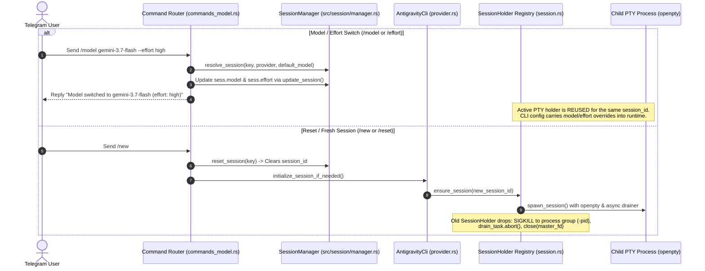
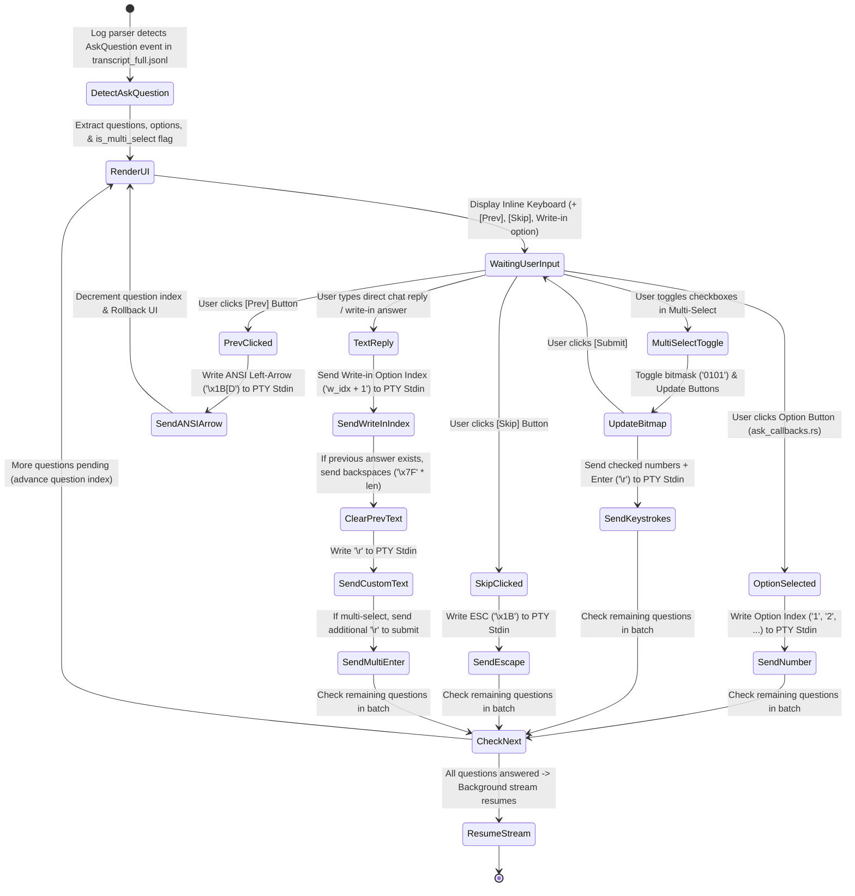
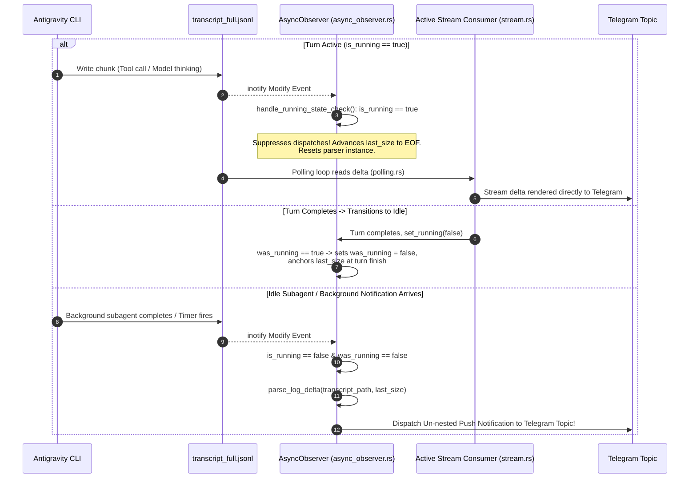

# tuner

[](https://github.com/imwoo90/tuner/actions)
[](https://opensource.org/licenses/MIT)

`tuner` supervises and orchestrates the execution of the Antigravity CLI (`agy`), providing real-time Telegram messenger integration, virtual PTY session management, idle background turn observation, webhook ingress, and multi-language localized agent sessions.

---

## 🚀 Quick Start Guide

### Step 1: Verify Antigravity CLI (`agy`)
Ensure the Antigravity CLI (`agy`) is installed and authenticated on your machine:
```bash
agy --version
```

### Step 2: Run One-Line Installer
Install the latest `tuner` release binary and required assets to `~/.tuner/bin/`:
```bash
curl -fsSL https://raw.githubusercontent.com/imwoo90/tuner/main/install.sh | bash
```

### Step 3: Run Interactive Setup & Service Registration
Launch the setup wizard to configure your Telegram bot token, allowed user IDs, and register systemd daemon:
```bash
~/.tuner/bin/tuner --setup
```

---

## 📲 Telegram Bot Setup Guide

Connecting Tuner to Telegram takes just 3 simple steps:

1. **Get Bot Token**:
   - Open Telegram and message [@BotFather](https://t.me/BotFather).
   - Create a bot (`/newbot`) and copy the **HTTP API Token**.
2. **Get Your Telegram User ID**:
   - Message [@userinfobot](https://t.me/userinfobot) to get your numerical Telegram User ID.
3. **Run Setup Wizard**:
   - Run `~/.tuner/bin/tuner --setup` and enter your Bot Token & User ID.

> 💡 **Group / Supergroup Setup**:
> If adding the bot to a group chat or topic thread, invite the bot and **promote it to Administrator** (enabling message reading) to bypass Telegram's default Privacy Mode.

<details>
<summary><b>⚙️ Manual Configuration Schema (`~/.tuner/config/config.json`)</b></summary>

```json
{
  "telegram_token": "YOUR_TELEGRAM_BOT_TOKEN",
  "allowed_user_ids": [123456789],
  "allowed_group_ids": [-100123456789],
  "provider": "antigravity",
  "model": "gemini-3.6-flash",
  "effort": "high",
  "language": "en",
  "timezone": "Asia/Seoul"
}
```
</details>

---

## 🤖 Telegram Slash Commands

| Command | Description |
|---|---|
| `/new` \| `/reset` | Clear the current conversation and start a fresh session. |
| `/status` | Generate bot health reports, agy CLI installation info, and active session model. |
| `/model` | Toggle the active LLM model for the current topic via an inline selector. |
| `/effort` | Select the reasoning effort level (high, medium, low) for the current LLM model. |
| `/lang` | Select the active session language (English, Korean, etc.) via an inline keyboard. |
| `/upgrade` | Check GitHub Releases and perform an in-place executable upgrade. |
| `/memory` | Output the current content of the workspace `MAINMEMORY.md` file. |
| `/stop` | Gracefully cancel active agent CLI processes running in the current chat topic. |
| `/abort` | Forcefully terminate all running workers and background tasks. |
| `/restart` | Request a clean restart of the `tuner` bot daemon process. |
| `/plan` | Prompt the agent to generate a structured execution plan before running. |
| `/grill_me` | Launch an interactive interview to align requirements and refine plans. |
| `/goal` | Launch a long-running, thorough task (e.g. overnight thorough execution). |
| `/learn` | Capture behavioral corrections or feedback and bind them to agent memory. |
| `/teamwork_preview` | Run a collaborative multi-agent simulation workflow. |

---

## 🤝 Development & Contribution Guide

We welcome contributions! To maintain stability between production environments and active development, we follow an isolated containerized workflow with separate Telegram bot tokens.

### 🏗️ Architecture Layout
- **Production Environment**: Runs official GitHub Releases on the Host PC/server (supervised via `systemd` or `tuner` master daemon).
- **Development Environment**: Runs inside an isolated Docker container (`tuner-sandbox`) linked to a separate Telegram Dev Bot Token, sharing host `agy` authentication and state seamlessly.

### 🛠️ Setting Up Local Development

1. **Verify Host Prerequisites**:
   Ensure `agy` CLI is installed and authenticated on your host machine:
   ```bash
   agy --version
   ```

2. **Start the Sandbox Container**:
   Launch the development sandbox container via Docker Compose (automatically maps your user ID, `$HOME`, `agy` credentials, and `~/.tuner-dev` workspace):
   ```bash
   docker compose up -d
   ```

3. **Configure Development Bot Token**:
   Set your dedicated Telegram Dev Bot Token and allowed user ID in `~/.tuner-dev/profiles/default/config/config.json`:
   ```json
   {
     "telegram_token": "YOUR_DEV_TELEGRAM_BOT_TOKEN",
     "allowed_user_ids": [123456789],
     "language": "ko",
     "model": "gemini-3.7-flash",
     "effort": "high"
   }
   ```

### 🔄 Real-Time Build & Deploy Workflow
To test changes to source code (`src/`) or assets (`_home_defaults/`) in real-time:

```bash
# Run the automated dev deployment script
bash scripts/dev_deploy.sh
```

The `dev_deploy.sh` script automatically:
1. Compiles the latest release binary (`cargo build --release`).
2. Syncs the binary & `_home_defaults` asset folder to `tuner-sandbox`.
3. Auto-restarts the container worker daemon (`tuner --worker default`).

### 🔀 Submitting Contributions (Pull Requests)
1. Fork the repository and create a feature branch (`git checkout -b feature/my-feature`).
2. Ensure all tests pass: `cargo test`.
3. Verify live behavior in the dev container with `bash scripts/dev_deploy.sh`.
4. Push your branch to your fork and submit a **Pull Request (PR)** targeting the `main` branch.

### 🚀 Maintainer Release Workflow
*(For repository maintainers only)*
To publish an official release:
1. Update version numbers in `Cargo.toml` and run `cargo check` to update `Cargo.lock`.
2. Commit with release notes: `git commit -m "bump: release v0.1.x"`
3. Push `main` to the `release` branch:
   ```bash
   git push origin main:release
   ```
   GitHub Actions will automatically verify the build, generate tag `v0.1.x`, and publish binaries to GitHub Releases.

---

<details>
<summary><b>🔑 Key Features & Architecture Specifications</b></summary>

### 🏛️ System Architecture Overview & Mental Models

`tuner` is an asynchronous, high-concurrency orchestration supervisor and daemon for the Google Antigravity CLI (`agy`). It bridges external messaging channels (Telegram Long Polling), asynchronous cron engines, and HTTP webhooks with interactive agent pseudo-terminals (PTYs), managing continuous state persistence, interactive multi-turn question handling (`ask_question`), task-local internationalization, and idle background push notifications.

```
┌────────────────────────────────────────────────────────────────────────────────────────────────────────┐
│                                       TIER 1: MESSENGER INGRESS                                        │
│  Telegram Bot (Teloxide)  │  Media Ingestion (telegram_files/)  │  Webhook HTTP Ingress (Axum Engine) │
└───────────────────────────────────────────────────┬────────────────────────────────────────────────────┘
                                                    │
┌───────────────────────────────────────────────────▼────────────────────────────────────────────────────┐
│                                  TIER 2: CORE ORCHESTRATION & BUS                                      │
│  Session Lock Pool        │  JSON Session State Registry        │  System Event Message Bus (Bus)      │
│  Workspace Synchronizer   │  Cron & Heartbeat Schedulers        │  Security Sandbox & Path Traversal   │
│  Process Supervisor       │  Storage Cleanup Observer           │  Multi-Language i18n Catalog Engine  │
└───────────────────────────────────────────────────┬────────────────────────────────────────────────────┘
                                                    │
┌───────────────────────────────────────────────────▼────────────────────────────────────────────────────┐
│                                 TIER 3: CLI & VIRTUAL PTY ENGINE                                       │
│  PTY Process Spawner (openpty) │ Non-blocking Async Drainer     │ Log Delta Parser (transcript_full)   │
│  Interactive Prompt Feeder     │ Real-time ask_question UI Loop │ Continuous Session Async Observer    │
└────────────────────────────────────────────────────────────────────────────────────────────────────────┘
```

---

### 🔍 1. Model Switching & Provider Session Isolation

#### 1.1 PTY Session Holder Invalidation vs. Reuse Lifecycle
Interactive execution with Antigravity is anchored in virtual pseudo-terminals managed by [`SessionManager`](src/cli/antigravity/session.rs) and [`SessionHolder`](src/cli/antigravity/pty_spawner.rs).


```mermaid
sequenceDiagram
    autonumber
    actor User as Telegram User
    participant Cmd as Command Router (commands_model.rs)
    participant SM as SessionManager (src/session/manager.rs)
    participant CLI as AntigravityCli (provider.rs)
    participant SH as SessionHolder Registry (session.rs)
    participant PTY as Child PTY Process (openpty)

    alt Model / Effort Switch (/model or /effort)
        User->>Cmd: Send /model gemini-3.7-flash --effort high
        Cmd->>SM: resolve_session(key, provider, default_model)
        Cmd->>SM: Update sess.model & sess.effort via update_session()
        Cmd-->>User: Reply "Model switched to gemini-3.7-flash (effort: high)"
        Note over SH,PTY: Active PTY holder is REUSED for the same session_id.<br/>CLI config carries model/effort overrides into runtime.
    else Reset / Fresh Session (/new or /reset)
        User->>Cmd: Send /new
        Cmd->>SM: reset_session(key) -> Clears session_id
        Cmd->>CLI: initialize_session_if_needed()
        CLI->>SH: ensure_session(new_session_id)
        SH->>PTY: spawn_session() with openpty & async drainer
        Note over SH: Old SessionHolder drops: SIGKILL to process group (-pid),<br/>drain_task.abort(), close(master_fd)
    end
```

- **Model & Effort Modification Without Invalidation**: When a user issues `/model` or `/effort`, [`handle_model_command_switch`](src/messenger/telegram/commands_model.rs) updates `sess.model` and `sess.effort` in [`SessionData`](src/session/data.rs) and persists via [`update_session`](src/session/manager.rs). When [`ensure_session`](src/cli/antigravity/session.rs) executes, if the child process is alive, it **reuses the existing SessionHolder**, refreshing `h.last_active = Instant::now()`.
- **Deterministic Termination & Holder Dropping**: In [`SessionHolder::drop`](src/cli/antigravity/pty_spawner.rs), Tuner aborts the drain task, sends `SIGKILL` to `-pgid` (`nix::unistd::Pid::from_raw(-(pid as i32))`), and closes the master file descriptor.

#### 1.2 Provider Session Partitioning & Metric Aggregation
Tuner supports multiple AI providers (e.g. `antigravity`, `claude`, `codex`) within the same chat topic by isolating metrics inside a `HashMap<String, ProviderSessionData>` in [`SessionData`](src/session/data.rs).

- **Provider Independence**: Switching `config.provider` allows each provider to retain its own `session_id`, conversation history, token counters, and USD cost accumulation without wiping other providers.
- **Atomic Preservation**: [`preserve_session_identity`](src/session/manager.rs) iterates through `session.provider_sessions`, merging counts with `cur_data.message_count.max(data.message_count)` and `total_cost_usd.max(data.total_cost_usd)`.
- **Turn Updates**: [`update_session`](src/session/manager.rs) increments metrics strictly for the active provider.

---

### ⚡ 2. Concurrent Event Interleaving (Cron, Webhook vs. User Turns & `AskState`)

#### 2.1 Mutex Lock Contention in `LockPool` (Queueing vs. Timeouts)
All ingress channels—Telegram updates, Webhook executions, Cron executions, and Message Bus injections—coordinate through [`LockPool`](src/bus/lock_pool.rs).

```mermaid
flowchart TD
    A[Incoming Ingress Event] --> B{Source Type}
    B -->|Telegram Message| C[handler.rs: lock_pool.get(chat_id, topic_id)]
    B -->|Webhook Ingress| D[session_loop.rs: lock_pool.get(chat_id, topic_id)]
    B -->|Cron / MessageBus| E[bus.rs: LockMode::Required -> lock_pool.get(key)]
    
    C --> F[TokioMutex::lock().await]
    D --> F
    E --> F
    
    F -->|Contention / Active Turn Running| G[Asynchronous Tokio FIFO Wait Queue<br/>Non-blocking to worker threads, No Timeout Dropping]
    F -->|Lock Acquired| H[Execute Turn / Stream / Bus Injection]
    H --> I[Drop MutexGuard -> Next Queued Event Awakes]
```

- **Memory-Safe Weak References**: [`LockPool::get`](src/bus/lock_pool.rs) stores `Weak<TokioMutex<()>>` inside a standard sync mutex and calls `locks.retain(|_, weak| weak.strong_count() > 0)` on every lookup, guaranteeing automatic memory reclamation when locks are released.
- **Fair Asynchronous Queueing**: Contending tasks await `lock.lock().await`. They do not drop or time out; Tokio places them into an asynchronous FIFO wait queue, ensuring zero CLI state corruption or PTY stdin interleaving.

#### 2.2 Interactive `ask_question` Loop & ANSI Ingress Injection

When the agent requires user clarification or tool confirmation via `ask_question`, Tuner transitions the session into an interactive state machine without blocking the underlying runtime:


```mermaid
stateDiagram-v2
    [*] --> DetectAskQuestion: Log parser detects AskQuestion event in transcript_full.jsonl
    DetectAskQuestion --> RenderUI: Extract questions, options, & is_multi_select flag
    RenderUI --> WaitingUserInput: Display Inline Keyboard (+ [Prev], [Skip], Write-in option)

    WaitingUserInput --> OptionSelected: User clicks Option Button (ask_callbacks.rs)
    OptionSelected --> SendNumber: Write Option Index ('1', '2', ...) to PTY Stdin
    
    WaitingUserInput --> MultiSelectToggle: User toggles checkboxes in Multi-Select
    MultiSelectToggle --> UpdateBitmap: Toggle bitmask ('0101') & Update Buttons
    UpdateBitmap --> WaitingUserInput: User clicks [Submit]
    UpdateBitmap --> SendKeystrokes: Send checked numbers + Enter ('\r') to PTY Stdin

    WaitingUserInput --> PrevClicked: User clicks [Prev] Button
    PrevClicked --> SendANSIArrow: Write ANSI Left-Arrow ('\x1B[D') to PTY Stdin
    SendANSIArrow --> RenderUI: Decrement question index & Rollback UI

    WaitingUserInput --> SkipClicked: User clicks [Skip] Button
    SkipClicked --> SendEscape: Write ESC ('\x1B') to PTY Stdin

    WaitingUserInput --> TextReply: User types direct chat reply / write-in answer
    TextReply --> SendWriteInIndex: Send Write-in Option Index ('w_idx + 1') to PTY Stdin
    SendWriteInIndex --> ClearPrevText: If previous answer exists, send backspaces ('\x7F' * len)
    ClearPrevText --> SendCustomText: Write '<current_text>\r' to PTY Stdin
    SendCustomText --> SendMultiEnter: If multi-select, send additional '\r' to submit

    SendNumber --> CheckNext: Check remaining questions in batch
    SendKeystrokes --> CheckNext: Check remaining questions in batch
    SendEscape --> CheckNext: Check remaining questions in batch
    SendMultiEnter --> CheckNext: Check remaining questions in batch

    CheckNext --> RenderUI: More questions pending (advance question index)
    CheckNext --> ResumeStream: All questions answered -> Background stream resumes
    ResumeStream --> [*]
```

- **Interactive Interception**: In [`process_text_with_files`](src/messenger/telegram/mod.rs), incoming messages are checked with `feed_active_session_if_running`.
- **Write-In Feeder**: In [`send_write_in_input`](src/messenger/telegram/ask_helpers.rs), write-in submissions handle index selection, backspace clearing (`\x7F` * len), text injection, and carriage returns.

#### 2.3 `AsyncObserver` Transcript Disambiguation (Idle Subagents vs. Active Turns)

[`AsyncObserver`](src/messenger/telegram/async_observer.rs) continuously monitors `transcript_full.jsonl` using both Linux `inotify` and a 4-second fallback interval:


```mermaid
sequenceDiagram
    autonumber
    participant CLI as Antigravity CLI
    participant File as transcript_full.jsonl
    participant Obs as AsyncObserver (async_observer.rs)
    participant Stream as Active Stream Consumer (stream.rs)
    participant User as Telegram Topic

    alt Turn Active (is_running == true)
        CLI->>File: Write chunk (Tool call / Model thinking)
        File-->>Obs: inotify Modify Event
        Obs->>Obs: handle_running_state_check(): is_running == true
        Note over Obs: Suppresses dispatches! Advances last_size to EOF.<br/>Resets parser instance.
        File->>Stream: Polling loop reads delta (polling.rs)
        Stream->>User: Stream delta rendered directly to Telegram
    else Turn Completes -> Transitions to Idle
        Stream->>Obs: Turn completes, set_running(false)
        Obs->>Obs: was_running == true -> sets was_running = false,<br/>anchors last_size at turn finish
    else Idle Subagent / Background Notification Arrives
        CLI->>File: Background subagent completes / Timer fires
        File-->>Obs: inotify Modify Event
        Obs->>Obs: is_running == false & was_running == false
        Obs->>Obs: parse_log_delta(transcript_path, last_size)
        Obs->>User: Dispatch Un-nested Push Notification to Telegram Topic!
    end
```

---

### 🌐 3. Async i18n Task-Local Scoping & Thread-Local Bleed Mitigation

In Tokio's multi-threaded runtime, asynchronous tasks suspend at `.await` yield points and may resume on different OS worker threads:

```
❌ The Thread-Local Bleed Hazard (std::thread_local!):
[Tokio Worker Thread #1] -> Runs Task A (Korean) -> Sets thread_local("ko") -> .await (Task A yields)
[Tokio Worker Thread #1] -> Picks up Task B (English) -> Reads thread_local("ko") 💥 POLLUTION!
[Tokio Worker Thread #2] -> Resumes Task A (Korean) -> Reads thread_local(None) 💥 CONTEXT LOST!

✅ The Task-Local Solution (tokio::task_local!):
[Task A (Korean)]  -- TaskContext { TASK_ACTIVE_LANG = "ko" } follows Task A across any thread!
[Task B (English)] -- TaskContext { TASK_ACTIVE_LANG = "en" } follows Task B across any thread!
```

Tuner defines `tokio::task_local! { pub static TASK_ACTIVE_LANG: String; }` in [`src/i18n/mod.rs`](src/i18n/mod.rs). In [`handle_message`](src/messenger/telegram/handler.rs), every incoming update resolves the topic's configured language and executes inside `TASK_ACTIVE_LANG.scope(active_lang, async move { ... })`, completely eliminating cross-thread context bleeding.

---

### 🐳 4. Dev Docker Sandbox vs. Host Production Daemon Coexistence

#### 4.1 Antigravity State Sharing & Conversation UUID Namespace Isolation
The development sandbox container (`tuner-sandbox`) runs side-by-side with the host production daemon using [`docker-compose.yml`](docker-compose.yml):

```
Host Production Daemon                                Docker Sandbox (tuner-sandbox)
┌──────────────────────────────────────┐              ┌──────────────────────────────────────┐
│ Base Directory: ~/.tuner             │              │ Container Persistent: ~/.tuner-dev   │
│ Config: ~/.tuner/config/config.json  │              │ Config: ~/.tuner-dev/config/config.json
│ Telegram Token: PROD_BOT_TOKEN       │              │ Telegram Token: DEV_BOT_TOKEN        │
│ Workspace: ~/.tuner/.../workspace    │              │ Workspace: /workspace                │
└──────────────────┬───────────────────┘              └──────────────────┬───────────────────┘
                   │                                                     │
                   ▼                                                     ▼
     sessions.json (Host Keys)                             sessions.json (Dev Keys)
                   │                                                     │
                   └───────────────────┬─────────────────────────────────┘
                                       │
                                       ▼ Shared Volume Mount: ~/.gemini
                   ┌──────────────────────────────────────┐
                   │ ~/.gemini/antigravity-cli/           │
                   │ ├── OAuth Tokens & Credential State  │
                   │ └── brain/<conversation-uuid>/       │
                   │     ├── .system_generated/logs/      │
                   │     └── ...                          │
                   └──────────────────────────────────────┘
```

- **Shared Authentication**: Mount point `${HOME}/.gemini:${HOME}/.gemini` enables the dev sandbox to invoke authenticated `agy` CLI operations instantly without re-authenticating.
- **UUID Namespace Isolation**: Every conversation created by `agy` is assigned a unique UUID in `brain/<uuid>`. Because session storage keys and `sessions.json` reside in `~/.tuner` (host) vs `~/.tuner-dev` (container), session IDs never collide.
- **Telegram Bot Token 409 Conflict Prevention**: Separate configuration paths (`~/.tuner` vs `~/.tuner-dev`) guarantee that production and development daemons never share a bot token, preventing Long Polling HTTP 409 collisions.
- **UID 1000 & Atomic Deploy**: Container runs as non-root `user: "${UID:-1000}:${GID:-1000}"`. In [`scripts/dev_deploy.sh`](scripts/dev_deploy.sh), binaries are updated via atomic `mv -f tuner.new tuner` before restarting workers.

---

### 📦 5. Complete 20-Module Reference Index

| # | Module / Subsystem | Architectural Role & Core Responsibilities | Verified Code Evidence |
|---|---|---|---|
| 1 | **`src/messenger/telegram`** | Teloxide long polling, ingress dispatcher, topic routing, media ingestion. | [`runner.rs:L85-L113`](src/messenger/telegram/runner.rs)<br>[`handler.rs:L242-L271`](src/messenger/telegram/handler.rs) |
| 2 | **`src/messenger/telegram/stream.rs`** | Debounces streaming stdout chunks (2s interval), parses markdown to HTML, message splitting. | [`stream.rs:L78-L118`](src/messenger/telegram/stream.rs)<br>[`stream.rs:L152-L208`](src/messenger/telegram/stream.rs) |
| 3 | **`src/messenger/telegram/ask_*.rs`** | Interactive dialog state machine (`AskState`), keyboard builder, ANSI key injection, write-in input feeder. | [`ask_process.rs:L69-L142`](src/messenger/telegram/ask_process.rs)<br>[`ask_callbacks.rs:L52-L175`](src/messenger/telegram/ask_callbacks.rs)<br>[`ask_helpers.rs:L51-L75`](src/messenger/telegram/ask_helpers.rs) |
| 4 | **`src/messenger/telegram/async_observer.rs`** | Continuous session transcript watcher (`notify`) monitoring `transcript_full.jsonl` for idle background completions. | [`async_observer.rs:L18-L41`](src/messenger/telegram/async_observer.rs)<br>[`async_observer.rs:L128-L198`](src/messenger/telegram/async_observer.rs) |
| 5 | **`src/cli/antigravity`** | Antigravity CLI driver, environment variable propagation, session resolution, error parsing. | [`provider.rs:L21-L37`](src/cli/antigravity/provider.rs)<br>[`provider.rs:L47-L92`](src/cli/antigravity/provider.rs)<br>[`session.rs:L118-L149`](src/cli/antigravity/session.rs) |
| 6 | **`src/cli/antigravity/pty_spawner.rs`** | Spawns agent child processes in pseudo-terminals (`openpty`), disables echo, manages non-blocking async master fd draining. | [`pty_spawner.rs:L25-L66`](src/cli/antigravity/pty_spawner.rs)<br>[`pty_spawner.rs:L85-L175`](src/cli/antigravity/pty_spawner.rs) |
| 7 | **`src/cli/antigravity/log_parser.rs`** | Incremental JSON log parser extracting thinking blocks, tool calls, and `ask_question` events. | [`log_parser.rs:L16-L62`](src/cli/antigravity/log_parser.rs)<br>[`log_parser.rs:L100-L160`](src/cli/antigravity/log_parser.rs) |
| 8 | **`src/cli/antigravity/polling.rs`** | Coordinates live transcript polling loops, inotify watchers, and completion detection. | [`polling.rs:L62-L113`](src/cli/antigravity/polling.rs)<br>[`polling.rs:L180-L257`](src/cli/antigravity/polling.rs) |
| 9 | **`src/session`** | JSON-based session state persistence (`sessions.json`), provider partitioning, token/cost metric accumulation, daily reset rules. | [`manager.rs:L59-L93`](src/session/manager.rs)<br>[`manager.rs:L101-L180`](src/session/manager.rs)<br>[`data.rs:L15-L102`](src/session/data.rs) |
| 10 | **`src/bus`** | Central message bus (`MessageBus`), chat/topic lock pools (`LockPool`), prompt injection hooks. | [`bus.rs:L94-L149`](src/bus/bus.rs)<br>[`lock_pool.rs:L15-L74`](src/bus/lock_pool.rs)<br>[`envelope.rs:L10-L45`](src/bus/envelope.rs) |
| 11 | **`src/background`** | Background task executor (`BackgroundObserver`) enforcing chat task concurrency limits (`MAX_TASKS = 5`) and timeout guards. | [`observer.rs:L84-L143`](src/background/observer.rs)<br>[`observer.rs:L238-L288`](src/background/observer.rs) |
| 12 | **`src/cron`** | Background cron scheduler evaluating cron expressions, timezone offsets, and quiet hours. | [`scheduler.rs:L62-L146`](src/cron/scheduler.rs)<br>[`manager.rs:L12-L40`](src/cron/manager.rs) |
| 13 | **`src/heartbeat`** | Periodic daemon telemetry loop checking idle health, evaluating quiet hours, routing bus alerts. | [`scheduler.rs:L82-L124`](src/heartbeat/scheduler.rs)<br>[`scheduler.rs:L126-L193`](src/heartbeat/scheduler.rs) |
| 14 | **`src/cleanup`** | Storage maintenance observer performing scheduled purges of expired media in `telegram_files/` and `output_to_user/`. | [`observer.rs:L43-L95`](src/cleanup/observer.rs)<br>[`observer.rs:L118-L145`](src/cleanup/observer.rs) |
| 15 | **`src/webhook`** | Axum HTTP server hosting `/health` and `/hooks/:hook_id`, validating Bearer tokens and HMAC-SHA256 signatures. | [`server.rs:L59-L134`](src/webhook/server.rs)<br>[`auth.rs:L14-L80`](src/webhook/auth.rs) |
| 16 | **`src/workspace`** | Workspace path resolver (`DuctorPaths`), rules deployment (`CLAUDE.md`, `GEMINI.md`), skills synchronization. | [`paths.rs:L13-L215`](src/workspace/paths.rs)<br>[`sync.rs:L76-L124`](src/workspace/sync.rs) |
| 17 | **`src/security`** | File path traversal sandbox validator (`validate_file_path`, `is_path_safe`) enforcing root directory confinement. | [`paths.rs:L40-L77`](src/security/paths.rs)<br>[`paths.rs:L80-L117`](src/security/paths.rs) |
| 18 | **`src/i18n`** | Thread-safe TOML translation catalog for 9 languages with scoped task-local context (`TASK_ACTIVE_LANG`). | [`mod.rs:L38-L83`](src/i18n/mod.rs)<br>[`mod.rs:L201-L235`](src/i18n/mod.rs) |
| 19 | **`src/supervisor.rs`** | Process supervisor managing profile workers, handling SIGTERM signals, exponential backoff restarts. | [`supervisor.rs:L33-L66`](src/supervisor.rs)<br>[`supervisor.rs:L68-L96`](src/supervisor.rs) |
| 20 | **`src/upgrade.rs`** | Self-upgrade engine querying GitHub Releases, downloading archives, performing atomic in-place executable replacement. | [`upgrade.rs:L29-L71`](src/upgrade.rs)<br>[`upgrade.rs:L105-L171`](src/upgrade.rs) |
</details>

---

## 🧪 Testing

`tuner` features an extensive test suite verifying 385+ test cases to ensure stability:

```bash
# Run all unit and integration tests
cargo test
```

---

## 📄 License
This project is licensed under the [MIT License](LICENSE).
