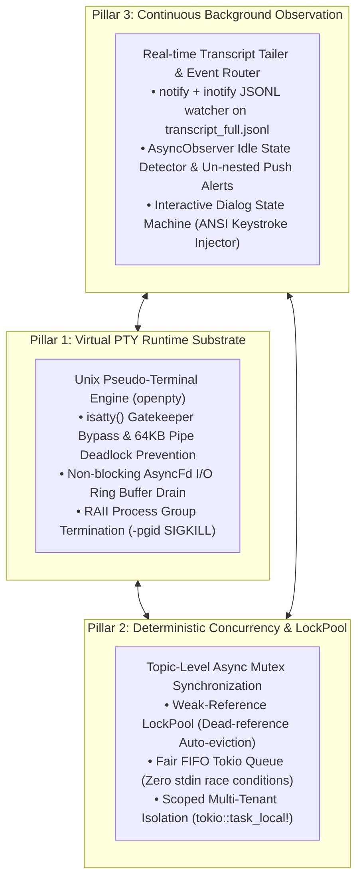

# tuner

[](https://github.com/imwoo90/tuner/actions)
[](https://opensource.org/licenses/MIT)

`tuner` supervises and orchestrates the execution of the Antigravity CLI (`agy`), providing real-time Telegram messenger integration, virtual PTY session management, idle background turn observation, webhook ingress, and multi-language localized agent sessions.

---

## 🚀 Quick Start Guide

### Step 1: Verify Antigravity CLI (`agy`)
Ensure the Antigravity CLI (`agy`) is installed and authenticated on your machine:
```bash
agy --version
```

### Step 2: Run One-Line Installer
Install the latest `tuner` release binary and required assets to `~/.tuner/bin/`:
```bash
curl -fsSL https://raw.githubusercontent.com/imwoo90/tuner/main/install.sh | bash
```

### Step 3: Run Interactive Setup & Service Registration
Launch the setup wizard to configure your Telegram bot token, allowed user IDs, and register systemd daemon:
```bash
~/.tuner/bin/tuner --setup
```

---

## 📲 Telegram Bot Setup Guide

Connecting Tuner to Telegram takes just 3 simple steps:

1. **Get Bot Token**:
   - Open Telegram and message [@BotFather](https://t.me/BotFather).
   - Create a bot (`/newbot`) and copy the **HTTP API Token**.
2. **Get Your Telegram User ID**:
   - Message [@userinfobot](https://t.me/userinfobot) to get your numerical Telegram User ID.
3. **Run Setup Wizard**:
   - Run `~/.tuner/bin/tuner --setup` and enter your Bot Token & User ID.

> 💡 **Group / Supergroup Setup**:
> If adding the bot to a group chat or topic thread, invite the bot and **promote it to Administrator** (enabling message reading) to bypass Telegram's default Privacy Mode.

<details>
<summary><b>⚙️ Manual Configuration Schema (`~/.tuner/config/config.json`)</b></summary>

```json
{
  "telegram_token": "YOUR_TELEGRAM_BOT_TOKEN",
  "allowed_user_ids": [123456789],
  "allowed_group_ids": [-100123456789],
  "provider": "antigravity",
  "model": "gemini-3.6-flash",
  "effort": "high",
  "language": "en",
  "timezone": "Asia/Seoul"
}
```
</details>

---

## 🤖 Telegram Slash Commands

| Command | Description |
|---|---|
| `/new` \| `/reset` | Clear the current conversation and start a fresh session. |
| `/status` | Generate bot health reports, agy CLI installation info, and active session model. |
| `/model` | Toggle the active LLM model for the current topic via an inline selector. |
| `/effort` | Select the reasoning effort level (high, medium, low) for the current LLM model. |
| `/lang` | Select the active session language (English, Korean, etc.) via an inline keyboard. |
| `/upgrade` | Check GitHub Releases and perform an in-place executable upgrade. |
| `/memory` | Output the current content of the workspace `MAINMEMORY.md` file. |
| `/stop` | Gracefully cancel active agent CLI processes running in the current chat topic. |
| `/abort` | Forcefully terminate all running workers and background tasks. |
| `/restart` | Request a clean restart of the `tuner` bot daemon process. |
| `/plan` | Prompt the agent to generate a structured execution plan before running. |
| `/grill_me` | Launch an interactive interview to align requirements and refine plans. |
| `/goal` | Launch a long-running, thorough task (e.g. overnight thorough execution). |
| `/learn` | Capture behavioral corrections or feedback and bind them to agent memory. |
| `/teamwork_preview` | Run a collaborative multi-agent simulation workflow. |

---

## 🤝 Development & Contribution Guide

We welcome contributions! To maintain stability between production environments and active development, we follow an isolated containerized workflow with separate Telegram bot tokens.

### 🏗️ Architecture Layout
- **Production Environment**: Runs official GitHub Releases on the Host PC/server (supervised via `systemd` or `tuner` master daemon).
- **Development Environment**: Runs inside an isolated Docker container (`tuner-sandbox`) linked to a separate Telegram Dev Bot Token, sharing host `agy` authentication and state seamlessly.

### 🛠️ Setting Up Local Development

1. **Verify Host Prerequisites**:
   Ensure `agy` CLI is installed and authenticated on your host machine:
   ```bash
   agy --version
   ```

2. **Start the Sandbox Container**:
   Launch the development sandbox container via Docker Compose (automatically maps your user ID, `$HOME`, `agy` credentials, and `~/.tuner-dev` workspace):
   ```bash
   docker compose up -d
   ```

3. **Configure Development Bot Token**:
   Set your dedicated Telegram Dev Bot Token and allowed user ID in `~/.tuner-dev/profiles/default/config/config.json`:
   ```json
   {
     "telegram_token": "YOUR_DEV_TELEGRAM_BOT_TOKEN",
     "allowed_user_ids": [123456789],
     "language": "ko",
     "model": "gemini-3.7-flash",
     "effort": "high"
   }
   ```

### 🔄 Real-Time Build & Deploy Workflow
To test changes to source code (`src/`) or assets (`_home_defaults/`) in real-time:

```bash
# Run the automated dev deployment script
bash scripts/dev_deploy.sh
```

The `dev_deploy.sh` script automatically:
1. Compiles the latest release binary (`cargo build --release`).
2. Syncs the binary & `_home_defaults` asset folder to `tuner-sandbox`.
3. Auto-restarts the container worker daemon (`tuner --worker default`).

### 🔀 Submitting Contributions (Pull Requests)
1. Fork the repository and create a feature branch (`git checkout -b feature/my-feature`).
2. Ensure all tests pass: `cargo test`.
3. Verify live behavior in the dev container with `bash scripts/dev_deploy.sh`.
4. Push your branch to your fork and submit a **Pull Request (PR)** targeting the `main` branch.

### 🚀 Maintainer Release Workflow
*(For repository maintainers only)*
To publish an official release:
1. Update version numbers in `Cargo.toml` and run `cargo check` to update `Cargo.lock`.
2. Commit with release notes: `git commit -m "bump: release v0.1.x"`
3. Push `main` to the `release` branch:
   ```bash
   git push origin main:release
   ```
   GitHub Actions will automatically verify the build, generate tag `v0.1.x`, and publish binaries to GitHub Releases.

---

<details open>
<summary><b>🏛️ System Architecture & Engineering Specifications</b></summary>

### 💡 High-Level Mental Model: The 3 Core Pillars

Tuner bridges messaging interfaces (Telegram, Webhooks, WebSocket API) to interactive CLI-based AI agent runtimes (Google Antigravity `agy`, Claude Code, Codex) via three foundational architectural pillars:


```mermaid
flowchart TD
    subgraph P1 ["Pillar 1: Virtual PTY Runtime Substrate"]
        A1["Unix Pseudo-Terminal Engine (openpty)<br/>• isatty() Gatekeeper Bypass & 64KB Pipe Deadlock Prevention<br/>• Non-blocking AsyncFd I/O Ring Buffer Drain<br/>• RAII Process Group Termination (-pgid SIGKILL)"]
    end

    subgraph P2 ["Pillar 2: Deterministic Concurrency & LockPool"]
        A2["Topic-Level Async Mutex Synchronization<br/>• Weak-Reference LockPool (Dead-reference Auto-eviction)<br/>• Fair FIFO Tokio Queue (Zero stdin race conditions)<br/>• Scoped Multi-Tenant Isolation (tokio::task_local!)"]
    end

    subgraph P3 ["Pillar 3: Continuous Background Observation"]
        A3["Real-time Transcript Tailer & Event Router<br/>• notify + inotify JSONL watcher on transcript_full.jsonl<br/>• AsyncObserver Idle State Detector & Un-nested Push Alerts<br/>• Interactive Dialog State Machine (ANSI Keystroke Injector)"]
    end

    P1 <--> P2
    P2 <--> P3
    P3 <--> P1
```

---

### 🔄 End-to-End Agent Lifecycle State Machine

```mermaid
stateDiagram-v2
    [*] --> Idle: Daemon Booted & Schedulers Active

    state Idle {
        [*] --> WaitingForEvent
    }

    WaitingForEvent --> Authenticating : Inbound Event (Telegram / Webhook / Cron)
    
    state Authenticating {
        [*] --> CheckUserWhitelist
        CheckUserWhitelist --> CheckPathSandbox
        CheckPathSandbox --> CheckInjectionPatterns
    }

    Authenticating --> Rejected : Security / Whitelist Failure
    Rejected --> Idle : Log & Drop / Alert

    Authenticating --> LockAcquisition : Checks Passed
    
    state LockAcquisition {
        [*] --> RequestChatTopicLock: LockPool.get(chat_id, topic_id)
        RequestChatTopicLock --> LockGranted : Mutex Available
        RequestChatTopicLock --> Queued : Thread Busy (Tokio FIFO Queue)
        Queued --> LockGranted : Prior Turn Releases Lock
    }

    LockGranted --> SessionResolution : Resolve SessionKey & Model
    
    state SessionResolution {
        [*] --> CheckFreshness
        CheckFreshness --> DailyReset : Stale (>Idle Timeout or Past 4:00 AM)
        CheckFreshness --> ReuseSession : Fresh
        DailyReset --> LoadWorkspaceRules
        ReuseSession --> LoadWorkspaceRules
    }

    SessionResolution --> PTYSpawning : Launch Engine

    state PTYSpawning {
        [*] --> OpenPTYDescriptor: nix::pty::openpty (24x80)
        OpenPTYDescriptor --> DisableEcho: termios.local_flags.remove(ECHO)
        DisableEcho --> SetProcessGroup: setsid() + tcsetpgrp()
        SetProcessGroup --> WaitForPrompt: 15s Timeout Timer
    }

    PTYSpawning --> TimeoutFailure : Prompt Timeout (>15s)
    PTYSpawning --> ActiveExecution : Terminal Prompt Ready

    state ActiveExecution {
        [*] --> WritePrompt
        WritePrompt --> StreamLogDelta : Poll transcript_full.jsonl
        StreamLogDelta --> DebouncedChatEdit : 2s Rate Limiting Gate
        StreamLogDelta --> InteractiveAsk : Tool calls ask_question
        InteractiveAsk --> WaitUserButtonCallback : Render Inline Keyboard
        WaitUserButtonCallback --> WritePrompt : Button Clicked / ANSI Keystrokes Injected
    }

    ActiveExecution --> ProcessCrashed : OOM / SIGSEGV / Exit Code != 0 (try_wait detected)
    ActiveExecution --> TurnTimeout : Total Runtime > 300s
    ActiveExecution --> UserCancelled : User triggers /stop or /abort
    ActiveExecution --> TurnCompleted : Status == DONE

    state TerminatingAndCleanup {
        [*] --> HarvestMetrics: Update Tokens & USD Cost
        HarvestMetrics --> AppendHistoryLog: Atomic Write to sessions.json
        AppendHistoryLog --> ReapProcessGroup: kill(-pgid, SIGKILL)
        ReapProcessGroup --> ReleaseLock: Drop Mutex LockGuard
    }

    ProcessCrashed --> TerminatingAndCleanup : Parse Smart CLI Error
    TurnTimeout --> TerminatingAndCleanup : Format Timeout Notice
    UserCancelled --> TerminatingAndCleanup : Clean Termination
    TurnCompleted --> TerminatingAndCleanup : Deliver Final Message & Deliverables

    TerminatingAndCleanup --> Idle : Return to Ready
```

---

### 🛡️ Comprehensive Failure Recovery Matrix

| Failure Scenario | Detection Mechanism | Tuner Mitigation & Clean-up Action | Key Source Reference |
| :--- | :--- | :--- | :--- |
| **Abnormal CLI Crash / OOM / Segfault** | Non-blocking `child.try_wait()` polled on every tick in `check_completion_step` | Catches non-zero exit immediately without hanging; aborts polling, drops session holder, parses actionable suggestions. | [`cli/antigravity/polling.rs`](file:///home/wimvm/.tuner/profiles/default/workspace/projects/tuner/src/cli/antigravity/polling.rs) |
| **Silent Hang / Deadlock** | Dual-tier timeout guards (15s PTY prompt init, 300s wall-clock turn limit) | Aborts future, drops `SessionHolder`, executes process-group annihilation, and returns timeout alert. | [`cli/antigravity/provider.rs`](file:///home/wimvm/.tuner/profiles/default/workspace/projects/tuner/src/cli/antigravity/provider.rs) |
| **Orphan Sub-processes & Zombies** | Spawned child processes are placed in an isolated process group (`setsid()` + `process_group(0)`) | **RAII Drop Reaping:** `SessionHolder::drop` issues `kill(-pgid, SIGKILL)` and closes master FD, instantly reaping all compiler/tool child processes. | [`cli/antigravity/pty_spawner.rs`](file:///home/wimvm/.tuner/profiles/default/workspace/projects/tuner/src/cli/antigravity/pty_spawner.rs#L36-L46) |
| **Message Storms & Rapid /stop** | `LockPool` FIFO queue serializes chat turns; `/stop` commands call `cli.sessions.abort()` | `/stop` evicts the active `SessionHolder` from memory, immediately triggering `Drop` and terminating the running process tree. | [`bus/lock_pool.rs`](file:///home/wimvm/.tuner/profiles/default/workspace/projects/tuner/src/bus/lock_pool.rs), [`telegram/commands.rs`](file:///home/wimvm/.tuner/profiles/default/workspace/projects/tuner/src/messenger/telegram/commands.rs) |
| **Log Truncation / File Shrink** | `file_size < start_pos` check in `get_new_content_string` | Resets `start_pos = 0` and `seen_final = false`, reading clean logs from offset 0 without index out-of-bounds panics. | [`cli/antigravity/log_helpers.rs`](file:///home/wimvm/.tuner/profiles/default/workspace/projects/tuner/src/cli/antigravity/log_helpers.rs) |
| **Telegram 429 Rate Limits** | Streaming text delta debounce window (`last_edit.elapsed() >= Duration::from_secs(2)`) | Limits interim message edits to a maximum rate of 0.5 Hz; final result flushes full text immediately and splits chunks cleanly at 4000 characters. | [`telegram/stream.rs`](file:///home/wimvm/.tuner/profiles/default/workspace/projects/tuner/src/messenger/telegram/stream.rs) |
| **Supervisor Fast Crash Loop** | Master tracks worker uptime (< 10s = fast crash) | Applies exponential backoff sleep $\min(2^{\text{count}}, 30.0)\text{s}$ before respawning, protecting CPU and API limits. | [`supervisor.rs`](file:///home/wimvm/.tuner/profiles/default/workspace/projects/tuner/src/supervisor.rs#L44-L50) |

---

### 🔧 Low-Level OS Primitives & Mechanics

#### 1. Why `openpty` Over Standard Pipes (`Stdio::piped()`)?
- **`isatty()` Gatekeeper**: Interactive agent CLIs test `isatty(STDIN_FILENO)`. When attached to standard pipes, `isatty()` returns `false`, causing the CLI to disable interactive question prompts (`ask_question`), turn off ANSI formatting, or abort interactive mode.
- **64KB Pipe Buffer Deadlock Elimination**: Standard anonymous Linux pipes hold at most 64KB in kernel buffers. If a CLI emits verbose stdout/stderr while waiting for user input, the pipe buffer saturates and deadlocks the OS process. Tuner solves this by setting `O_NONBLOCK` on the master FD, wrapping it in `tokio::io::unix::AsyncFd`, and continuously draining output into a shared memory ring buffer.
- **Echo Suppression**: Local terminal echo is disabled via `tcgetattr`/`tcsetattr` (`termios.local_flags.remove(LocalFlags::ECHO)`), preventing input keystrokes from corrupting the incoming output stream.

#### 2. Interactive Checkbox Translation (`0101` Bitmask $\to$ ANSI Keystrokes)
Telegram multi-select prompts track checkbox states as a binary string (e.g. `"0101"` where items 1 and 3 are checked). When the user clicks **[Submit]**, `multi_select.rs` synthesizes physical terminal keystrokes:
```rust
let mut last_idx = 0;
for &idx in &checked_indices {
    let diff = idx - last_idx;
    keystrokes.push_str(&"j".repeat(diff)); // Cursor down
    keystrokes.push(' ');                  // Spacebar to toggle checkbox
    last_idx = idx;
}
keystrokes.push('\r');                     // Carriage return to confirm
```

#### 3. Ephemeral Memory Management in `LockPool`
`LockPool` tracks per-topic mutexes using `Weak<TokioMutex<()>>`. On every lookup (`LockPool::get`), dead references (`weak.strong_count() == 0`) are pruned dynamically via `.retain()`. Memory usage is strictly proportional to *active concurrent tasks*, scaling efficiently across thousands of Telegram topics.

---

### 🛠️ 20-Module Subsystem Reference Matrix

| Subsystem | Source Location | Core Responsibilities & Primary Structs |
|:---|:---|:---|
| **1. Master / Worker Supervisor** | [`src/supervisor.rs`](file:///home/wimvm/.tuner/profiles/default/workspace/projects/tuner/src/supervisor.rs), [`src/main.rs`](file:///home/wimvm/.tuner/profiles/default/workspace/projects/tuner/src/main.rs) | Master/worker process model, exit code 42 hot restarts, fast-crash exponential backoff (`Supervisor`). |
| **2. Configuration Engine** | [`src/config.rs`](file:///home/wimvm/.tuner/profiles/default/workspace/projects/tuner/src/config.rs) | `CliConfig`, multi-profile JSON loading, default overrides, placeholder token filtering. |
| **3. Setup Wizard & Service Installer** | [`src/setup.rs`](file:///home/wimvm/.tuner/profiles/default/workspace/projects/tuner/src/setup.rs) | Interactive onboarding CLI, `.env` parser, user-level systemd service generator (`tuner.service`). |
| **4. Binary Self-Upgrade Engine** | [`src/upgrade.rs`](file:///home/wimvm/.tuner/profiles/default/workspace/projects/tuner/src/upgrade.rs) | GitHub release polling, semantic version check, `.tar.gz` stream extraction, atomic binary replacement. |
| **5. Workspace Paths SSOT** | [`src/workspace/paths.rs`](file:///home/wimvm/.tuner/profiles/default/workspace/projects/tuner/src/workspace/paths.rs) | `DuctorPaths`: Single Source of Truth for profiles, workspaces, tools, memory, and deliverable storage. |
| **6. Workspace Lifecycle & Rules Sync** | [`src/workspace/sync.rs`](file:///home/wimvm/.tuner/profiles/default/workspace/projects/tuner/src/workspace/sync.rs) | Workspace initialization, legacy migrations, multi-agent identity notices, runtime environment injection. |
| **7. Dynamic Rule Selector** | [`src/workspace/rules.rs`](file:///home/wimvm/.tuner/profiles/default/workspace/projects/tuner/src/workspace/rules.rs) | Auto-detects CLI authentication (Claude, Codex, Gemini, Antigravity) and deploys `CLAUDE.md`, `GEMINI.md`, `AGENTS.md`. |
| **8. Skill Discovery & Synchronizer** | [`src/workspace/skills.rs`](file:///home/wimvm/.tuner/profiles/default/workspace/projects/tuner/src/workspace/skills.rs) | Validates `SKILL.md` YAML frontmatter, creates provider symlink trees, and prunes broken links. |
| **9. Path Traversal Sandbox** | [`src/security/paths.rs`](file:///home/wimvm/.tuner/profiles/default/workspace/projects/tuner/src/security/paths.rs) | `validate_file_path`: Canonicalizes paths, blocks null bytes (`\0`) and control chars, enforces `allowed_roots`. |
| **10. Content & Prompt Filter** | [`src/security/content.rs`](file:///home/wimvm/.tuner/profiles/default/workspace/projects/tuner/src/security/content.rs) | Regex scanning for prompt injection, role hijacking, special tokens (`<\|im_start\|>`), and fullwidth Unicode folding. |
| **11. Unified Message Bus** | [`src/bus/bus.rs`](file:///home/wimvm/.tuner/profiles/default/workspace/projects/tuner/src/bus/bus.rs), [`src/bus/envelope.rs`](file:///home/wimvm/.tuner/profiles/default/workspace/projects/tuner/src/bus/envelope.rs) | `MessageBus`: Event broker, standardized `Envelope` routing, delivery modes (`Unicast`/`Broadcast`), fallback cascades. |
| **12. Bus LockPool Concurrency** | [`src/bus/lock_pool.rs`](file:///home/wimvm/.tuner/profiles/default/workspace/projects/tuner/src/bus/lock_pool.rs) | Ephemeral mutex pool keyed on `(chat_id, topic_id)` with `Weak<TokioMutex<()>>` dead-reference garbage collection. |
| **13. Domain Event Adapters** | [`src/bus/adapters.rs`](file:///home/wimvm/.tuner/profiles/default/workspace/projects/tuner/src/bus/adapters.rs) | Converts Cron, Webhook, Heartbeat, and Background outputs into unified `Envelope` models. |
| **14. Session & Identity Manager** | [`src/session/manager.rs`](file:///home/wimvm/.tuner/profiles/default/workspace/projects/tuner/src/session/manager.rs), [`src/session/data.rs`](file:///home/wimvm/.tuner/profiles/default/workspace/projects/tuner/src/session/data.rs) | `SessionData`, `ProviderSessionData`, atomic `sessions.json` persistence, daily reset rules (4:00 AM). |
| **15. Agent CLI & PTY Spawner** | [`src/cli/antigravity/pty_spawner.rs`](file:///home/wimvm/.tuner/profiles/default/workspace/projects/tuner/src/cli/antigravity/pty_spawner.rs) | Native Unix pseudo-terminal allocation (`openpty`), echo suppression, `AsyncFd` non-blocking drain, `-pgid SIGKILL`. |
| **16. Transcript Poller & Log Parser** | [`src/cli/antigravity/polling.rs`](file:///home/wimvm/.tuner/profiles/default/workspace/projects/tuner/src/cli/antigravity/polling.rs), [`src/cli/antigravity/log_parser.rs`](file:///home/wimvm/.tuner/profiles/default/workspace/projects/tuner/src/cli/antigravity/log_parser.rs) | Watches `transcript_full.jsonl` via `notify`, parses thought chains, tool calls, and `ask_question` dialogs. |
| **17. Telegram Bot Dispatcher** | [`src/messenger/telegram/runner.rs`](file:///home/wimvm/.tuner/profiles/default/workspace/projects/tuner/src/messenger/telegram/runner.rs), [`src/messenger/telegram/handler.rs`](file:///home/wimvm/.tuner/profiles/default/workspace/projects/tuner/src/messenger/telegram/handler.rs) | Teloxide event loop, access control whitelist, first-user auto-registration, slash commands, task-local i18n binding. |
| **18. Formatting & Streaming Engine** | [`src/messenger/telegram/stream.rs`](file:///home/wimvm/.tuner/profiles/default/workspace/projects/tuner/src/messenger/telegram/stream.rs), [`src/messenger/telegram/formatting.rs`](file:///home/wimvm/.tuner/profiles/default/workspace/projects/tuner/src/messenger/telegram/formatting.rs) | 2s rate-limited streaming edits, HTML tag-balanced 4000-character chunk splitter, inline quick-reply buttons. |
| **19. Cron Scheduler & Engine** | [`src/cron/scheduler.rs`](file:///home/wimvm/.tuner/profiles/default/workspace/projects/tuner/src/cron/scheduler.rs), [`src/cron/manager.rs`](file:///home/wimvm/.tuner/profiles/default/workspace/projects/tuner/src/cron/manager.rs) | 5-second tick loop, timezone-aware cron evaluation, quiet-hours suppression, automatic memory context enrichment. |
| **20. Heartbeat, Cleanup & Background** | [`src/heartbeat/scheduler.rs`](file:///home/wimvm/.tuner/profiles/default/workspace/projects/tuner/src/heartbeat/scheduler.rs), [`src/cleanup/observer.rs`](file:///home/wimvm/.tuner/profiles/default/workspace/projects/tuner/src/cleanup/observer.rs), [`src/background/observer.rs`](file:///home/wimvm/.tuner/profiles/default/workspace/projects/tuner/src/background/observer.rs) | Proactive health check telemetry, 30-day storage retention purge, background concurrency limiter (max 5/chat). |
| **+A. Axum Webhook & API Server** | [`src/webhook/server.rs`](file:///home/wimvm/.tuner/profiles/default/workspace/projects/tuner/src/webhook/server.rs), [`src/webhook/auth.rs`](file:///home/wimvm/.tuner/profiles/default/workspace/projects/tuner/src/webhook/auth.rs) | Ingress HTTP REST & encrypted WebSocket server, constant-time HMAC-SHA256 verification, sliding rate limiter. |
| **+B. Internationalization (i18n)** | [`src/i18n/mod.rs`](file:///home/wimvm/.tuner/profiles/default/workspace/projects/tuner/src/i18n/mod.rs) | `tokio::task_local! static TASK_ACTIVE_LANG`, TOML translation store across 9 languages (`en`, `ko`, `de`, etc.). |
</details>

---

## 🧪 Testing

`tuner` features an extensive test suite verifying 385+ test cases to ensure stability:

```bash
# Run all unit and integration tests
cargo test
```

---

## 📄 License
This project is licensed under the [MIT License](LICENSE).
